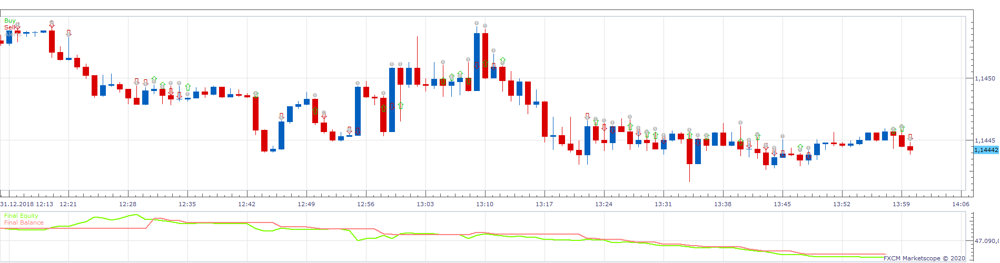
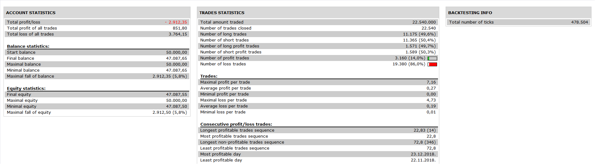

# MACD Candle Strategy

> Source: https://fxcodebase.com/code/viewtopic.php?f=31&t=69385  
> Forum: 31 · Topic 69385 · 7 post(s)

---

## MACD Candle Strategy

**Apprentice** · Wed Feb 05, 2020 10:25 am

 

Based on MACD Candle.lua
[viewtopic.php?f=17&t=60955](https://fxcodebase.com/code/viewtopic.php?f=17&t=60955)

Open Long
MACD Candle Close / Zero Line crossover.

Vice versa for Short

 [MACD Candle Strategy.lua](files/131110/MACD%20Candle%20Strategy.lua)

---

## Re: MACD Candle Strategy

**JOKER83** · Fri Feb 07, 2020 12:18 pm

VERY NICE
PLEAS MAKE ONE MORE OPPTION

ALLOWED SIDE BUY / SELL / BOTH

---

## Re: MACD Candle Strategy

**Apprentice** · Mon Feb 10, 2020 6:27 am

Your request is added to the development list.
Development reference 702.

---

## Re: MACD Candle Strategy

**Apprentice** · Tue Feb 11, 2020 7:03 am

Try it now.

---

## Re: MACD Candle Strategy

**khanatd** · Wed Oct 01, 2025 10:45 pm

plz mt4 version ea too,thanks sir

---

## Re: MACD Candle Strategy

**Apprentice** · Sat Oct 04, 2025 2:53 pm

We have added your request to the development list.
Development reference 638

---

## Re: MACD Candle Strategy

**Apprentice** · Sun Oct 12, 2025 1:49 am

MT4 version.
[https://fxcodebase.com/code/viewtopic.p ... 46#p160846](https://fxcodebase.com/code/viewtopic.php?f=38&t=76365&p=160846#p160846)
