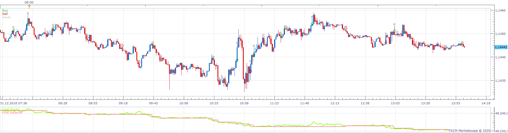
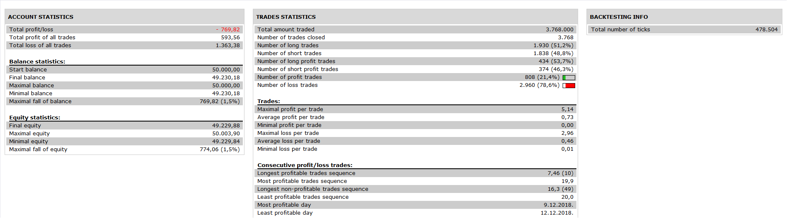

# MACD_Colored_Histogram Strategy

> Source: https://fxcodebase.com/code/viewtopic.php?f=31&t=69428  
> Forum: 31 · Topic 69428 · 9 post(s)

---

## MACD_Colored_Histogram Strategy

**Apprentice** · Thu Feb 20, 2020 10:13 am

 

Based on MACD_Colored_Histogram
[viewtopic.php?f=17&t=68624](https://fxcodebase.com/code/viewtopic.php?f=17&t=68624)

 [MACD_Colored_Histogram Strategy.lua](files/131378/MACD_Colored_Histogram%20Strategy.lua)

---

## Re: MACD_Colored_Histogram Strategy

**JOKER83** · Thu Feb 20, 2020 3:18 pm

PLEAS
can you make
HIGHLY ADAPTABLE strategy

SIGNAL no action / SELL / BUY / CLOSE TRADE

VERY THANKS

---

## Re: MACD_Colored_Histogram Strategy

**JOKER83** · Thu Feb 20, 2020 4:35 pm

PLEAS

this option
MAX NUMBER OF OPEN POSITON IN ANY DIRECTION
MAX NUMBER OF POSITON IN ONE DIRECTION

---

## Re: MACD_Colored_Histogram Strategy

**JOKER83** · Thu Feb 20, 2020 7:34 pm

Down signal make no trades
only up signal make trades open

---

## Re: MACD_Colored_Histogram Strategy

**Apprentice** · Fri Feb 21, 2020 5:36 am

Your request is added to the development list.
Development reference 759.

---

## Re: MACD_Colored_Histogram Strategy

**Apprentice** · Fri Feb 21, 2020 6:31 am

[MACD_Colored_Histogram Strategy.lua](files/131411/MACD_Colored_Histogram%20Strategy.lua)

Try this version.

---

## Re: MACD_Colored_Histogram Strategy

**JOKER83** · Thu Feb 27, 2020 7:10 pm

ITS VERY NICE
CAN YOU
NO SIGLNAL SPLIT
IN
NO SIGNAL UP
AND
NO SIGNAL DOWN

VERY THANKS

---

## Re: MACD_Colored_Histogram Strategy

**Apprentice** · Sun Mar 01, 2020 4:24 pm

Your request is added to the development list.
Development reference 802.

---

## Re: MACD_Colored_Histogram Strategy

**Apprentice** · Mon Mar 02, 2020 2:25 pm

> I need a definition of NO SIGNAL UP AND NO SIGNAL DOWN.

It is similar to a Highly adaptable strategy?
Where you have an option to chose Buy, Sell or No signal for the indication:
