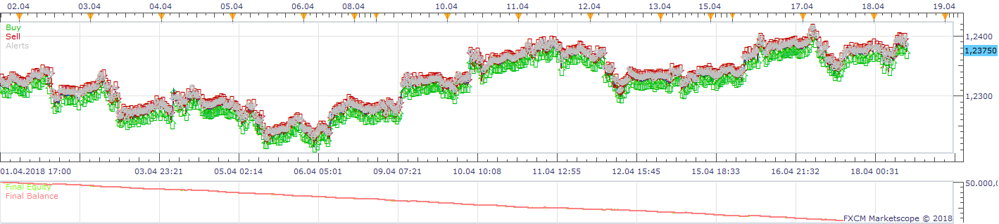
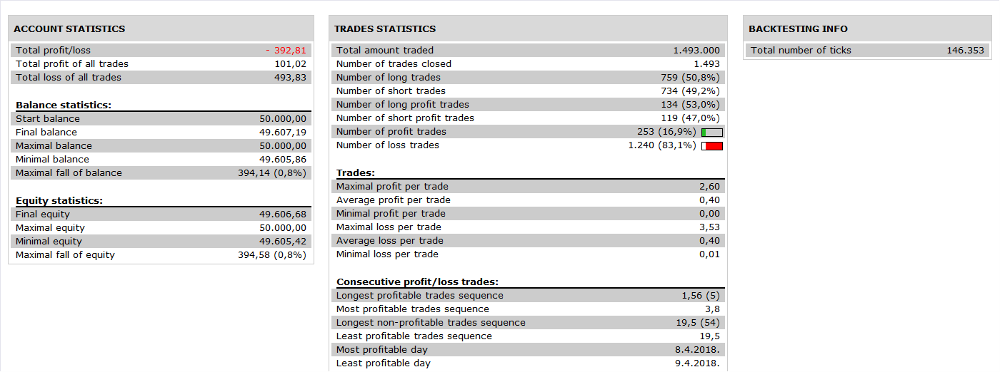

# MACD Cross Signal With NonLagMa Confirmation

> Source: https://fxcodebase.com/code/viewtopic.php?f=31&t=3752  
> Forum: 31 · Topic 3752 · 5 post(s)

---

## MACD Cross Signal With NonLagMa Confirmation

**Apprentice** · Mon Mar 28, 2011 5:04 am

 

 

This strategy generates Tredes, based on the MACD / Signal Line crossover.
But only if confirmed by the NonLagMa.

Exit signals are generated from the MACD / Signal Line Crossover and or change of trend of the NonLagMa.

 [MACD Cross Signal With NonLagMa Confirmation.lua](files/9112/MACD%20Cross%20Signal%20With%20NonLagMa%20Confirmation.lua)

For this strategy to work installed NonLagMA2 indicator from [viewtopic.php?f=17&t=2231&p=5930#p5930](https://fxcodebase.com/code/viewtopic.php?f=17&t=2231&p=5930#p5930)

---

## Re: MACD Cross Signal With NonLagMa Confirmation

**lucky777** · Tue Mar 29, 2011 8:47 pm

Hi Apprentice,
Is there any bug which does not let me load macd cross signal. It shows result error. Other indicators are working fine.
Thanks if you can help.
Regards.
Lucky777

---

## Re: MACD Cross Signal With NonLagMa Confirmation

**Apprentice** · Wed Mar 30, 2011 5:13 am

Can you tell me which error message you get.
In this way, I can not help much.

Probably it is a known bug on the platform.
Restart of the platform should fix things.

If not.
Post the exact error here.

---

## Re: MACD Cross Signal With NonLagMa Confirmation

**Apprentice** · Wed Nov 30, 2016 5:55 am

Bump up.

---

## Re: MACD Cross Signal With NonLagMa Confirmation

**Apprentice** · Sat Nov 17, 2018 9:54 am

The Strategy was revised and updated on November 17. 2018.
