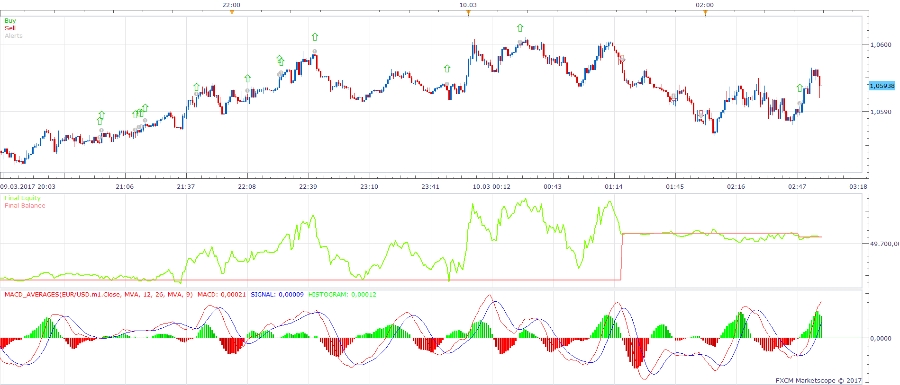
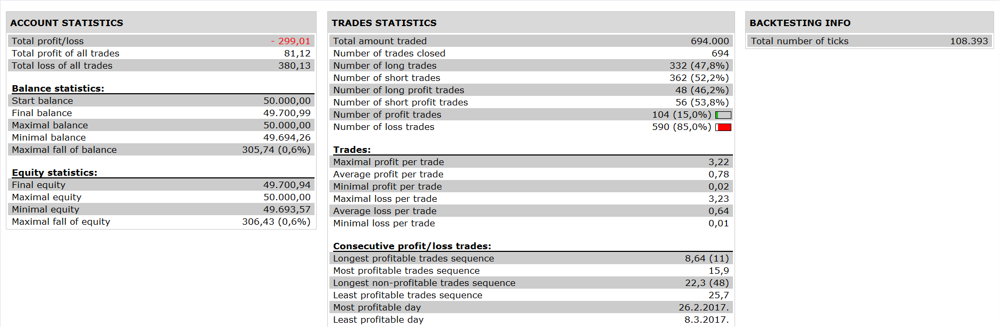

# MACD Cross with MA Filter Strategy

> Source: https://fxcodebase.com/code/viewtopic.php?f=31&t=65112  
> Forum: 31 · Topic 65112 · 1 post(s)

---

## MACD Cross with MA Filter Strategy

**Apprentice** · Sat Sep 23, 2017 5:11 am

 

Open Long
Price > MA
MACD / Signal Cross Over
Open Short
Price < MA
MACD / Signal Cross Under

 [MACD Cross with MA Filter Strategy.lua](files/115063/MACD%20Cross%20with%20MA%20Filter%20Strategy.lua)

To work install 20 in 1 Moving Average Indicator a.k.a. Averages
[viewtopic.php?f=17&t=2430](https://fxcodebase.com/code/viewtopic.php?f=17&t=2430)
and MACD_AVERAGES.lua
[viewtopic.php?f=17&t=65111](https://fxcodebase.com/code/viewtopic.php?f=17&t=65111)

The Strategy was revised and updated on January 21, 2019.
