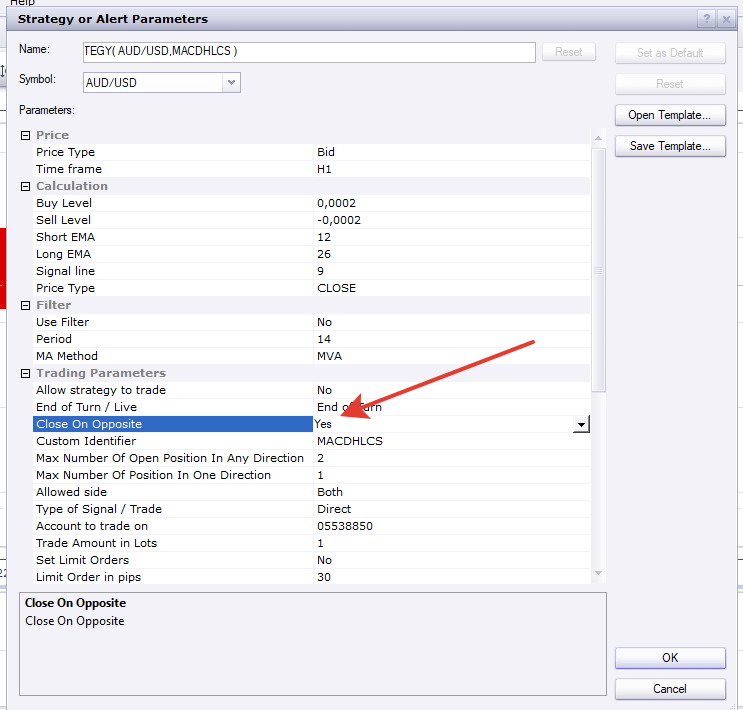

# MACD Histogram Level Cross Strategy

> Source: https://fxcodebase.com/code/viewtopic.php?f=31&t=62587  
> Forum: 31 · Topic 62587 · 17 post(s)

---

## MACD Histogram Level Cross Strategy

**Apprentice** · Wed Aug 26, 2015 9:45 am

Buy
MACD Histogram / Buy Level CrossOver
Sell
MACD Histogram / Sell Level CrossUnder

 [MACD Histogram Level Cross Strategy.lua](files/102006/MACD%20Histogram%20Level%20Cross%20Strategy.lua)

---

## Re: MACD Histogram Level Cross Strategy

**Apprentice** · Tue Dec 13, 2016 5:03 pm

Strategy was revised and updated.

---

## Re: MACD Histogram Level Cross Strategy

**SavvyStrategist** · Tue Oct 16, 2018 4:14 pm

There are many MACD strategies but I found this one to be the most accurate, while also having several price types to chose from. My only request would be to add custom time frame functionality, m3 in particular, if it is possible.

---

## Re: MACD Histogram Level Cross Strategy

**Apprentice** · Fri Oct 26, 2018 5:04 am

Your request is added to the development list under Id Number 4281

---

## Re: MACD Histogram Level Cross Strategy

**Apprentice** · Sat Oct 27, 2018 5:05 am

Try it now.

---

## Re: MACD Histogram Level Cross Strategy

**chai88888** · Thu Apr 29, 2021 9:23 am

hi there can you please add MA filter for these

buy only if above MA
sell only below MA

thanks

---

## Re: MACD Histogram Level Cross Strategy

**Apprentice** · Thu Apr 29, 2021 11:52 pm

Your request is added to the development list.
Development reference 422.

---

## Re: MACD Histogram Level Cross Strategy

**Apprentice** · Sat May 08, 2021 7:39 am

[MACD Histogram Level Cross Strategy.lua](files/141951/MACD%20Histogram%20Level%20Cross%20Strategy.lua)

Try this version.

---

## Re: MACD Histogram Level Cross Strategy

**chai88888** · Sun May 09, 2021 10:45 pm

tested it still taking a sell trade above the MA

thanks

---

## Re: MACD Histogram Level Cross Strategy

**Apprentice** · Tue May 11, 2021 3:27 am

Please set "Use Filter" to Yes...

---

## Re: MACD Histogram Level Cross Strategy

**chai88888** · Tue May 11, 2021 4:23 am

can you please add close the open trade if a opposite signal appear

example pic

---

## Re: MACD Histogram Level Cross Strategy

**Apprentice** · Wed May 12, 2021 5:11 am

Your request is added to the development list.
Development reference 469.

---

## Re: MACD Histogram Level Cross Strategy

**Apprentice** · Wed May 12, 2021 9:58 am

---

## Re: MACD Histogram Level Cross Strategy

**chai88888** · Thu May 13, 2021 1:59 am

it will only close on the opposite when a 3 level appear

i want to happen is that even there is no 3 level appear when the macd gives a opposite signal close the trade

---

## Re: MACD Histogram Level Cross Strategy

**Apprentice** · Mon May 17, 2021 8:42 am

[MACD_Histogram_Level_Cross_Strategy.lua](files/142125/MACD_Histogram_Level_Cross_Strategy.lua)

Try this version.

---

## Re: MACD Histogram Level Cross Strategy

**chai88888** · Tue May 18, 2021 12:36 am

there an error

---

## Re: MACD Histogram Level Cross Strategy

**Apprentice** · Tue May 18, 2021 8:11 am

I do not have any problems.
