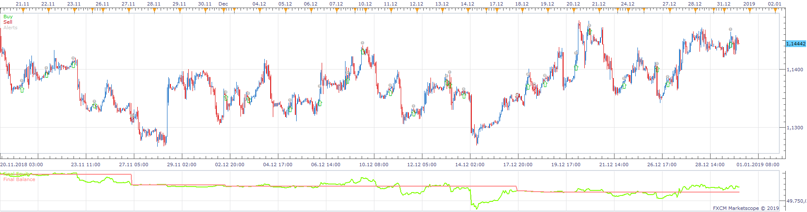
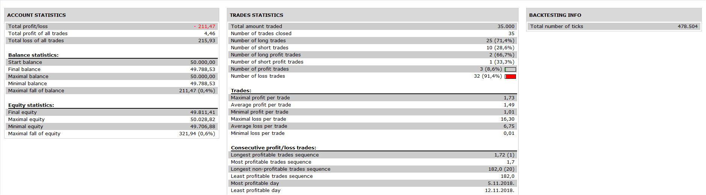

# MACD Pivot Strategy

> Source: https://fxcodebase.com/code/viewtopic.php?f=31&t=69134  
> Forum: 31 · Topic 69134 · 1 post(s)

---

## MACD Pivot Strategy

**Apprentice** · Sat Nov 16, 2019 7:04 am

 

Open Long
MACD /Signal Cross Over
MACD > Signal (Higher time frame)

Stop / Limit is based on immediate Pivot Support / Resistance

Viceversa for Short

 [MACD Pivot Strategy.lua](files/129801/MACD%20Pivot%20Strategy.lua)
