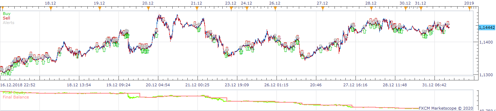
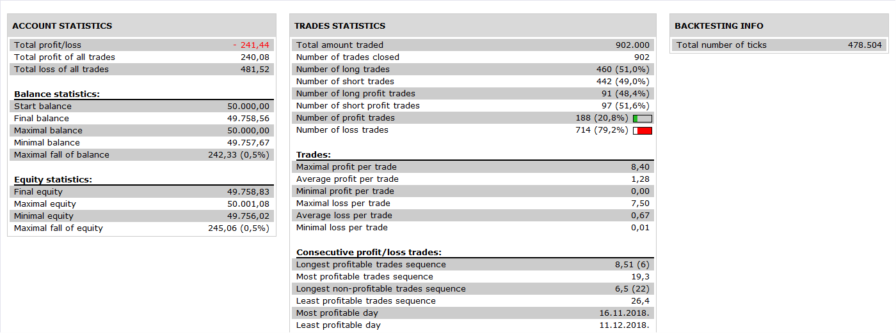

# MACD, RSI, ADX Strategy

> Source: https://fxcodebase.com/code/viewtopic.php?f=31&t=69986  
> Forum: 31 · Topic 69986 · 3 post(s)

---

## MACD, RSI, ADX Strategy

**Apprentice** · Tue Jun 09, 2020 9:41 am

 

Based on request.
[viewtopic.php?f=27&t=69981](https://fxcodebase.com/code/viewtopic.php?f=27&t=69981)

 [MACD, RSI, ADX Strategy.lua](files/134736/MACD%20RSI%20ADX%20Strategy.lua)

---

## Re: MACD, RSI, ADX Strategy

**pipos71** · Fri Jun 12, 2020 1:07 am

Thank you for the strategy built by you, but I comment that the strategy does well the market orders when the conditions of the MACD, RSI and ADX are met, but the condition of not opening a new purchase or sale order when presenting a new signal in the market if there is already an open buy or sell order, it is not fulfilled.
The strategy continues to open more than one buy or sell operation when new signals appear in the indicators.
I just want the strategy to open a single buy or sell operation at any given time.

Esperando pronta respuesta y disculpen.

---

## Re: MACD, RSI, ADX Strategy

**Apprentice** · Fri Jun 12, 2020 3:13 am

Şet "Use Position Cap" to yes.
