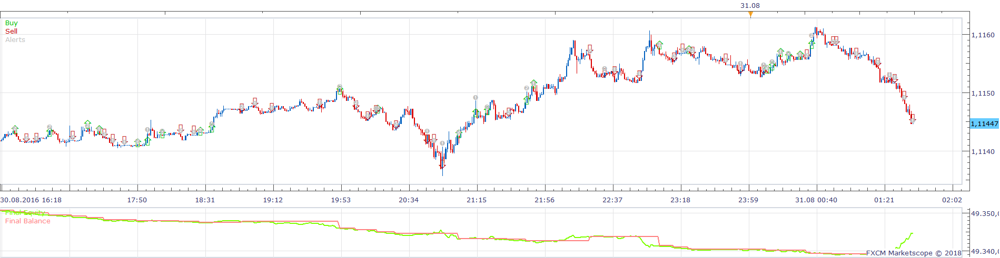
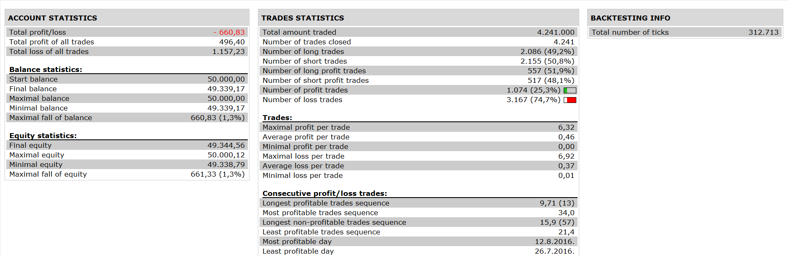

# MACD Stochastic Strategy

> Source: https://fxcodebase.com/code/viewtopic.php?f=31&t=66411  
> Forum: 31 · Topic 66411 · 2 post(s)

---

## MACD Stochastic Strategy

**Apprentice** · Mon Jul 30, 2018 1:01 pm

 

Open Long
Stochastic K / D Line CrossOver
MACD >0
Vice versa for Short

 [MACD Stochastic Strategy.lua](files/120232/MACD%20Stochastic%20Strategy.lua)

---

## Re: MACD Stochastic Strategy

**SavvyStrategist** · Thu Oct 04, 2018 1:38 pm

Is there a simple K/D line crossover strategy? Just the K/D crossover. The Marketscope default involves overbought/oversold levels and I want none of that.

EDIT: Found it.
[viewtopic.php?f=29&t=2951&p=113706&hilit=stochastic+cross#p113706](http://www.fxcodebase.com/code/viewtopic.php?f=29&t=2951&p=113706&hilit=stochastic+cross#p113706)
