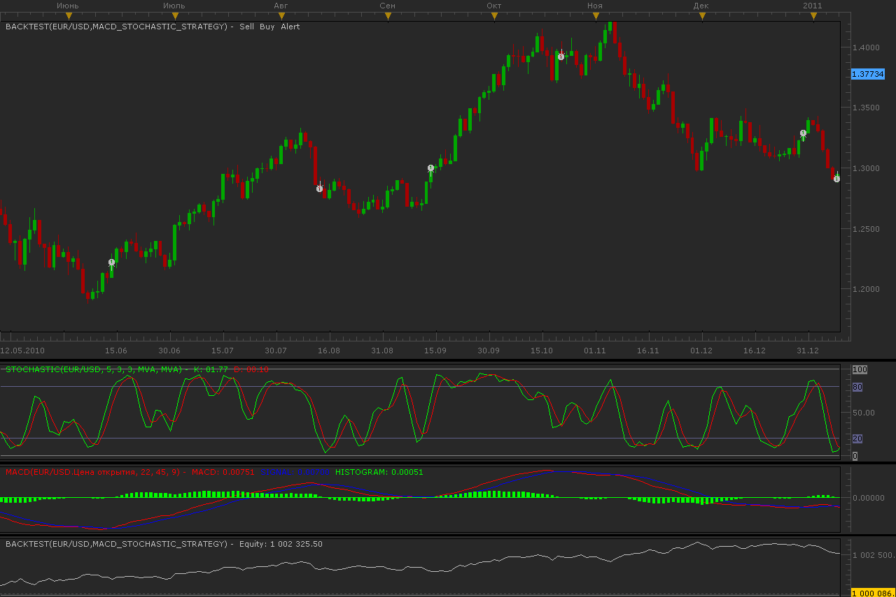

# MACD-Stochastic strategy

> Source: https://fxcodebase.com/code/viewtopic.php?f=31&t=3518  
> Forum: 31 · Topic 3518 · 6 post(s)

---

## MACD-Stochastic strategy

**Alexander.Gettinger** · Thu Feb 24, 2011 12:07 am

Strategy based on 2 indicators: MACD and stochastic.

BUY conditions:
MACD histogram crosses over 0
Stochastic D more than [Stoch level B]

SELL conditions:
MACD histogram crosses under 0
Stochastic D less than [Stoch level S]

 

Download:

 [MACD_Stochastic_Strategy.lua](files/8404/MACD_Stochastic_Strategy.lua)

The Strategy was revised and updated on December 11, 2018.

---

## Re: MACD-Stochastic strategy

**briansummy** · Wed Feb 08, 2012 8:14 pm

Great strategy! Is there any way to add the Zig Zag sentiment to this to prevent false signals?

---

## Re: MACD-Stochastic strategy

**Apprentice** · Thu Feb 09, 2012 6:17 am

Yes such a thing is possible.

---

## Re: MACD-Stochastic strategy

**NGSalohcin** · Tue Feb 03, 2015 6:37 am

Could I please ask you to make some adjustments to this strategy?

Timeframe i'm working on is 15 Minute Chart.

Long postions:

1. Red line must be outside the green histogram and long it when the
2. Stochastic goes over the oversold line

Short Positions:

1. Red line must be outside the green histogram and short it when the
2. Stachastic goes over the overbought line

Stop loss 50 points (not sure if you can code this too)
Take Profit - When the MACD has finished its trend and the red line exits the green histogram.

NB to Note - One Trade per cycle, incase it whipsaws, stops out and then meets the same conditions as above. So if a long position fails, it should only be able to take a short position - should that be in a months time or whatever.

Thanks very much man. I really appreciate it!

---

## Re: MACD-Stochastic strategy

**willholt627** · Fri Feb 06, 2015 1:38 am

---

## Re: MACD-Stochastic strategy

**Apprentice** · Sun Dec 11, 2016 12:47 pm

Strategy was revised and updated.
