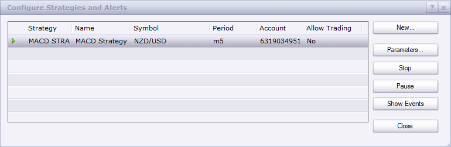

# MACD Strategy

> Source: https://fxcodebase.com/code/viewtopic.php?f=31&t=23772  
> Forum: 31 · Topic 23772 · 19 post(s)

---

## MACD Strategy

**Apprentice** · Tue Sep 25, 2012 3:57 am

Long
MACD / Signal Line Crossover
Short
MACD / Signal Line Crossunder

Exit Long (optional)
Close < MA Line
Exit Short (optional)
Close > MA Line

 [MACD Strategy.lua](files/40881/MACD%20Strategy.lua)

The Strategy was revised and updated on December 11, 2018.

---

## Re: MACD Strategy

**Apprentice** · Tue Sep 25, 2012 4:14 am

Trade if we have 1. and 2. condition satisfied.
Long
1. MACD/Signal Line Crossover
2. Close < MA + Validation Zone width (optional)
Short
1. MACD/Signal Line Crossunder
2. Close > MA - Validation Zone width (optional)

 [MACD Strategy with confirmation.lua](files/40884/MACD%20Strategy%20with%20confirmation.lua)

---

## Re: MACD Strategy

**trader969** · Fri Sep 28, 2012 8:11 am

Do any of your strategies work with mini accounts?

---

## Re: MACD Strategy

**Apprentice** · Sat Sep 29, 2012 1:39 am

In general, unless otherwise specified, all the indicators, strategies,
 work on both Standard or and Mini.

---

## Re: MACD Strategy

**trader969** · Sun Sep 30, 2012 8:27 am

I downloaded this strategy and had it running for 24 hrs in nzd/usd, on friday, I made sure that the lot size was 1, which is the lowest it goes, this is a mini account, and made sure to that it said live trading and it did not execute a single trade, during that time period, with the movement in nzd I find it hard to believe both conditions werent met to execute, is there something else I have to do?

---

## Re: MACD Strategy

**Apprentice** · Sun Sep 30, 2012 9:32 am

What Time Frame is used.
As confirmation, Add MACD indicator to chart.
Do you have MACD / Signal Cross during testing period.

---

## Re: MACD Strategy

**trader969** · Sun Sep 30, 2012 10:35 am

I put it 5 minute time frame, in backtestring it seemed to be more profitable, and yes I had the macd indicator running, I also clicked yes to dynamic trailing stops

---

## Re: MACD Strategy

**Apprentice** · Sun Sep 30, 2012 12:01 pm

Hm, I made a test and everything is fine for me.
How did you do the testing in Backtester or in live trading.
For Live trading you should have something like this.

 

Did you have an active strategy, like I have here.
If you are using MACD Strategy with confirmation,
It's entirely possible, we have a very strict filter.
You've tested over the weekend maybe?

---

## Re: MACD Strategy

**tengy yan nan** · Mon Mar 25, 2013 4:52 am

who can help me to change the cross happen when histogram=0 to [1/-1] or above or under thanks

---

## Re: MACD Strategy

**Apprentice** · Mon Mar 25, 2013 5:25 pm

Your request has been added to the development list.

---

## Re: MACD Strategy

**mashfx** · Tue Oct 21, 2014 5:16 pm

macd with confirmation is not opening a trade! please check

---

## Re: MACD Strategy 1

**ababsammma** · Wed Oct 22, 2014 2:18 pm

its not working
error

---

## Re: MACD Strategy

**Apprentice** · Thu Oct 23, 2014 3:53 am

Can you tell me more about, instrument, parameters used.
Work as expected in Backtester.

---

## Re: MACD Strategy

**Apprentice** · Sun Dec 11, 2016 9:08 am

Strategy was revised and updated.

---

## Re: MACD Strategy

**JOKER83** · Fri Jan 31, 2020 2:44 pm

HI
PLEAS
Make PARAMETER
CLOSE TRADE YES/NO
THANKS

---

## Re: MACD Strategy

**Apprentice** · Sun Feb 02, 2020 7:16 am

Do you want to add on / off logic to Exit logic?

---

## Re: MACD Strategy

**JOKER83** · Sun Feb 02, 2020 7:26 pm

YES
EXIT ON/OFF
THANKS

---

## Re: MACD Strategy

**Apprentice** · Mon Feb 10, 2020 6:31 am

Your request is added to the development list.
Development reference 705.

---

## Re: MACD Strategy

**Apprentice** · Tue Feb 11, 2020 6:42 am

It already has such an option.
