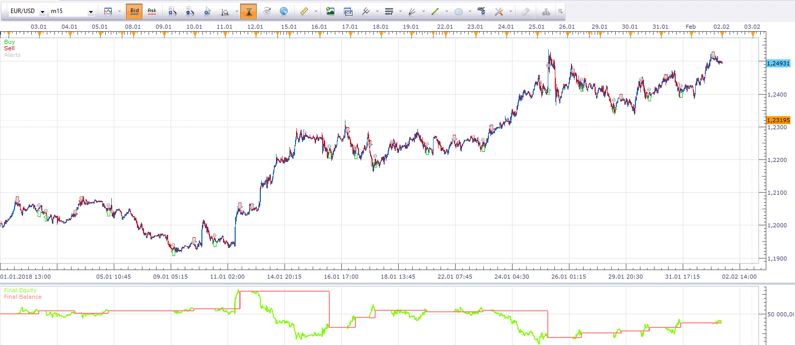
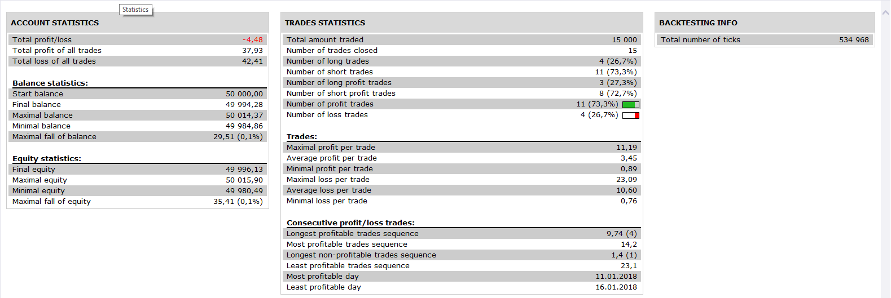

# MACD strategy with SAR filtering

> Source: https://fxcodebase.com/code/viewtopic.php?f=31&t=4201  
> Forum: 31 · Topic 4201 · 3 post(s)

---

## MACD strategy with SAR filtering

**Alexander.Gettinger** · Wed May 11, 2011 9:45 pm

This strategy is a classical MACD strategy with SAR filtering.
For BUY SAR must have a DN dots and for SELL SAR must have a UP dots.

Download:

 [MACD Sample_with_SAR.lua](files/10542/MACD%20Sample_with_SAR.lua)

 

 

The Strategy was revised and updated on November 19, 2018.

---

## Re: MACD strategy with SAR filtering

**dljohn** · Fri May 13, 2011 10:12 am

Dear Alexander.Gettinger,
Thank you for your help!

After many tests, found the "MACD WITH SAR STRATEGY" to price results not very rational. As you know the MACD SAMPLE STRATEGY has certain to price analysis functions, I think it is perhaps for this reason interference on SAR normal exertion,cause of the trend is not very sensitive.

I think this "MA_MACD STRATEGY" is better than "MACD SAMPLE STRATEGY".
I edited the "SAR MACD STRATEGY TEST" based on the "MA_MACD STRATEGY", the purpose is to write with SAR instead of MA.
Because this is my first time to writed by LUA, this strategy have problems, doesn't work.
Would you pls help me to find out the problems. I would appreciate.
By the way, I hope SAR is preferred.
Thanks again.

---

## Re: MACD strategy with SAR filtering

**Apprentice** · Wed Nov 30, 2016 5:33 am

Bump up.
