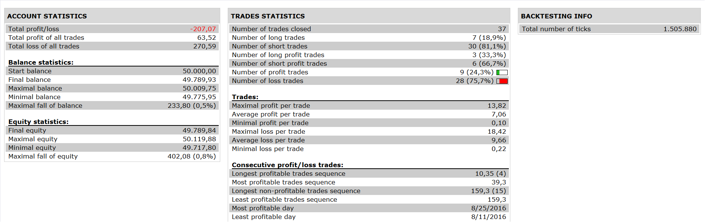

# MAHA STRATEGY

> Source: https://fxcodebase.com/code/viewtopic.php?f=31&t=63975  
> Forum: 31 · Topic 63975 · 2 post(s)

---

## MAHA STRATEGY

**Apprentice** · Sat Oct 15, 2016 6:55 am

 

Buy Rules:

Criteria #1:
Heiken Ashi candlestick has to close above the 100 period SMA
30 MA >50MA >100MA

Criteria #2: Heiken Ashi candlestick changed from red to green

Sell Rules:
Vice versa

 [MAHA STRATEGY.lua](files/108600/MAHA%20STRATEGY.lua)

Heiken_Ashi_Smoothed is available here.
[viewtopic.php?f=17&t=63347&p=105655&hilit=Heiken_Ashi_Smoothed#p105655](https://fxcodebase.com/code/viewtopic.php?f=17&t=63347&p=105655&hilit=Heiken_Ashi_Smoothed#p105655)

The Strategy was revised and updated on January 18, 2019.

---

## Re: MAHA STRATEGY

**Apprentice** · Sun Dec 18, 2016 7:03 am

Strategy was revised and updated.
