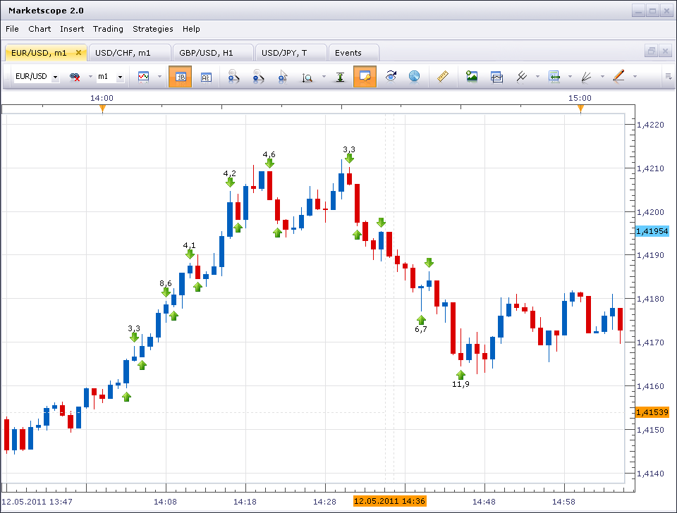

# Martingale Stochastic Scalper Strategy

> Source: https://fxcodebase.com/code/viewtopic.php?f=31&t=4380  
> Forum: 31 · Topic 4380 · 10 post(s)

---

## Martingale Stochastic Scalper Strategy

**sunshine** · Fri May 20, 2011 10:09 am

Initially the strategy is developed on [mql for Meta Trader](https://fxcodebase.com/code/viewtopic.php?f=27&t=4381&p=10877#p10875).
The strategy is based on the stochastic indicator. The first trade is opened by the conditions:

- if stochastic K line > stochastic D line, and stochastic D line is above the overbought level, then the strategy goes long;
- if stochastic K line < stochastic D line, and stochastic D line is below the oversold level, then the strategy goes short.
The following trades are opened if the currently opened trades are loosing.

This is a martingale strategy that is an amount of a trade is increased by the multiplier (the value is set in properties) after every loss. So that the first profit would recover previous losses.

The trades are closed with a profit set in pips or in an account currency in the strategy properties. By default the value is two pips. So that the strategy is scalping. The trades are also closed after loosing an amount of money set in properties.
The strategy is risky!!! That is why it is is stopped after the loss. However you can set "Pause after loss" property to "No".

 

The Strategy was revised and updated on December 18, 2018.

---

## Re: Martingale Stochastic Scalper Strategy

**R3boot** · Fri May 27, 2011 12:38 pm

dose it allow to open a hedge position after certain points?

---

## Re: Martingale Stochastic Scalper Strategy

**NID007** · Fri Jun 03, 2011 3:55 pm

Many thanks for your help Sunshine, you are a credit to the team and this site ,
thanks for your great work .

Nid007

---

## Re: Martingale Stochastic Scalper Strategy

**gsalazar5** · Fri Apr 27, 2012 9:36 am

Greetings, could tell me what are the parameters to be placed in the backtest. thanks.

---

## Re: Martingale Stochastic Scalper Strategy

**jdutchak67** · Thu May 03, 2012 8:57 am

Can you explain the following parameters

Take profit in pips.
Close with dollars.
Max loss in dollars.

Are these 3 params for every trade?
Could you add the options of

Take profit in pips
Take loss in pips
OR
Take profit in dollars
Take loss in dollars

For each trade?

This would make more sense I think. Very cool strategy

---

## Re: Martingale Stochastic Scalper Strategy

**Apprentice** · Sun May 06, 2012 4:07 am

Your request is added to the development list.

---

## Re: Martingale Stochastic Scalper Strategy

**cekodokpisang** · Sun Nov 17, 2013 11:06 pm

Hello guys,

Have any1 use it in a real account and have a good setting on the parameters..?
If there is, hope that you guys can share it in here.. I have modify the strategy and test it but still dont give a minimum loss, I know that losses is a must, but I want a acceptable amount of the loss, I have look in the youtube that this person make the equity never fall below the balance amount. Is this can be done..? Hope that you guys can help me in here..

---

## Re: Martingale Stochastic Scalper Strategy

**Kyriakos** · Tue Jun 16, 2015 2:41 am

Hi,

Can you add a maximum positions option for this strategy? Thanks

---

## Re: Martingale Stochastic Scalper Strategy

**gezisLV** · Tue Nov 10, 2015 8:02 pm

There is a problem with this strategy at least for me because it''s not taking short trades on indices

---

## Re: Martingale Stochastic Scalper Strategy

**Apprentice** · Wed Dec 14, 2016 3:28 am

Strategy was revised and updated.
