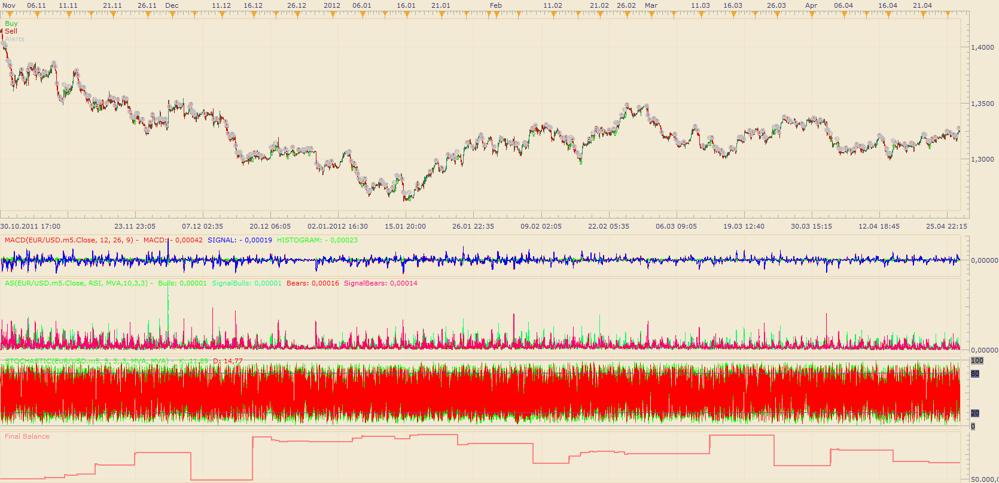

# MASS strategy

> Source: https://fxcodebase.com/code/viewtopic.php?f=31&t=17918  
> Forum: 31 · Topic 17918 · 2 post(s)

---

## MASS strategy

**Apprentice** · Mon May 07, 2012 1:16 pm

buy:

1.macd >0
2.absoulute strength satisfies
[a].bull > signal bull and
[b] bear<signal bear and
[c] bull <bear
3.stochastic k cross over oversold level 20

sell:

1.macd <0
2.absoulute strength satisfies
[a]bear>signal bear and
[b] bull<signal bull and
[c] bear< bull
3.stochatic k cross under over bought level 80

 [MASS strategy.lua](files/32444/MASS%20strategy.lua)

Absolute Strength (AB) indicator can b found here
[http://www.fxcodebase.com/code/viewtopi ... e+strength](http://www.fxcodebase.com/code/viewtopic.php?f=17&t=2987&hilit=absolute+strength)

---

## Re: MASS strategy

**Apprentice** · Mon Dec 05, 2016 5:49 am

Bump up.
