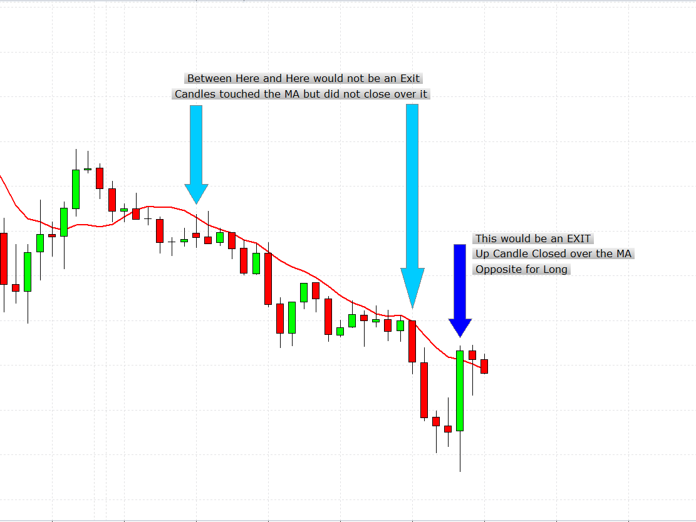

# MAStopLossStrategy

> Source: https://fxcodebase.com/code/viewtopic.php?f=31&t=66126  
> Forum: 31 · Topic 66126 · 5 post(s)

---

## MAStopLossStrategy

**Apprentice** · Thu May 17, 2018 4:47 am

[MAStopLossStrategy.lua](files/119253/MAStopLossStrategy.lua)

Based on the request.
[viewtopic.php?f=27&t=66116](https://fxcodebase.com/code/viewtopic.php?f=27&t=66116)

Short Trade
Close trade X pips in profit
On Price /MA CrossOver

Vice versa for Long

---

## Re: MAStopLossStrategy

**alienmole** · Fri May 18, 2018 4:19 am

Hi Thanks

However the strategy is not performing as intended. Currently it exits a trade when price crosses the 10 MA in the direction price is moving.

eg, at the moment if you are short and price is above the 10SMA and goes below it by the minimum amount, say 10 pips, then it exits.

What should happen is you are wanting an opposing bar type for the exit when the price is a certain amount of pips in profit, using the example of a short trade that would be a bar where the close is above the open, ie an "UP" Bar closing over the 10 MA and the opposite if you were Long.

Thanks

---

## Re: MAStopLossStrategy

**Apprentice** · Fri May 18, 2018 5:22 am

Try it now.

---

## Re: MAStopLossStrategy

**alienmole** · Fri May 18, 2018 5:33 am

Its exiting the trade on the touch of the MA, it should be a close of a bar back across the MA

Thanks

---

## Re: MAStopLossStrategy

**alienmole** · Mon May 21, 2018 6:07 am

Hi

I've attached an image which should hopefully help explain the rules

 

Thanks
