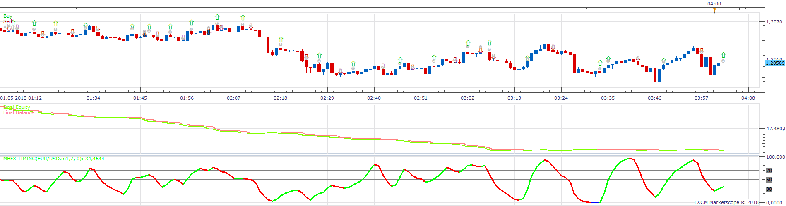
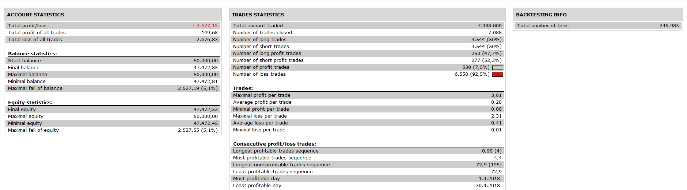

# MBFX Timing Strategy

> Source: https://fxcodebase.com/code/viewtopic.php?f=31&t=66903  
> Forum: 31 · Topic 66903 · 1 post(s)

---

## MBFX Timing Strategy

**Apprentice** · Fri Nov 09, 2018 5:52 am

 

Open Long: color change from blue to green or red to green
Open Short: Color change from blue to red or green to red

Based on MBFX Timing.lua
 [viewtopic.php?f=17&t=66902](https://fxcodebase.com/code/viewtopic.php?f=17&t=66902)

 [MBFX Timing Strategy.lua](files/122022/MBFX%20Timing%20Strategy.lua)
