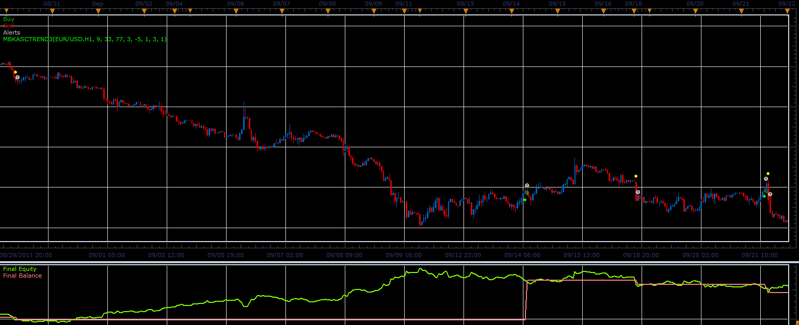

# MBKAsctrend3 strategy

> Source: https://fxcodebase.com/code/viewtopic.php?f=31&t=10449  
> Forum: 31 · Topic 10449 · 5 post(s)

---

## MBKAsctrend3 strategy

**Alexander.Gettinger** · Mon Dec 26, 2011 7:05 am

This strategy based on MBKAsctrend3 indicator: [viewtopic.php?f=17&t=10399](https://fxcodebase.com/code/viewtopic.php?f=17&t=10399)

 

Download strategy:

 [MBKAsctrend3_Strategy.lua](files/21681/MBKAsctrend3_Strategy.lua)

For this strategy must be installed MBKAsctrend3 indicator ([viewtopic.php?f=17&t=10399](https://fxcodebase.com/code/viewtopic.php?f=17&t=10399)).

---

## Re: MBKAsctrend3 strategy

**Exolon** · Fri Feb 03, 2012 7:40 pm

This throws "Index out of range" errors for every combination of parameters I try.

Unfortunately, Strategy Optimizer doesn't seem to allow copying the error message, and worse, it truncates the path strings with "..." so I can't figure out exactly which error line corresponds to which source files.

---

## Re: MBKAsctrend3 strategy

**Alexander.Gettinger** · Mon Feb 06, 2012 1:48 pm

Please, write which set the parameters you use and you may insert screenshot.

---

## Re: MBKAsctrend3 strategy

**Exolon** · Mon Feb 06, 2012 5:59 pm

Hmm, I started a new optimisation run and can't seem to replicate the problem. Seems like the parameter ranges were the same as before, but maybe I had it wrong.

Will post back if I can make it happen again

---

## Re: MBKAsctrend3 strategy

**Apprentice** · Sun Dec 04, 2016 7:58 am

Bump up.
