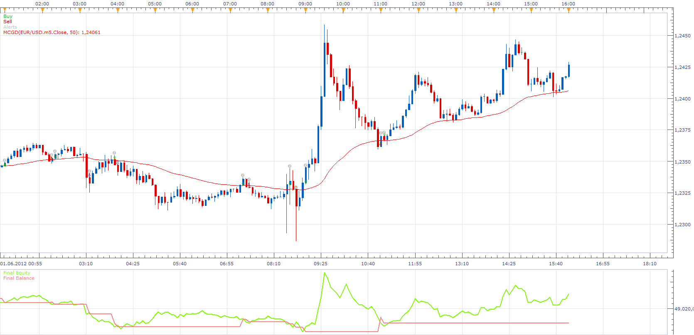

# McGinley Dynamic Strategy

> Source: https://fxcodebase.com/code/viewtopic.php?f=31&t=22644  
> Forum: 31 · Topic 22644 · 4 post(s)

---

## McGinley Dynamic Strategy

**Apprentice** · Wed Aug 22, 2012 11:12 am

Buy
Close / McGinley Dynamic CrossOver
Sell
Close / McGinley Dynamic CrossUnder

 [McGinley Dynamic Strategy.lua](files/39070/McGinley%20Dynamic%20Strategy.lua)

You have to install McGinley Dynamic for this Strategy.
Otherwise it will not work.

[viewtopic.php?f=17&t=2950&p=6752#p6752](https://fxcodebase.com/code/viewtopic.php?f=17&t=2950&p=6752#p6752)

The Strategy was revised and updated on December 09, 2018.

---

## Re: McGinley Dynamic Strategy

**kankatrader** · Mon Aug 27, 2012 6:47 am

Hi,
I want use this indicator with 1 minute chart and a period of 1000 or higher.
In this setting, an order will not be executed.
Is there a possibility of a small time frame and higher periode, which is activated signal.

Best regards,

kankatrader

---

## Re: McGinley Dynamic Strategy

**Apprentice** · Mon Aug 27, 2012 1:09 pm

If I understand you, you want to introduce the second time frame as filter.

---

## Re: McGinley Dynamic Strategy

**Apprentice** · Mon Dec 05, 2016 10:18 am

Bump up.
