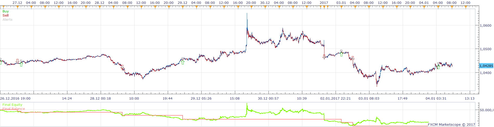
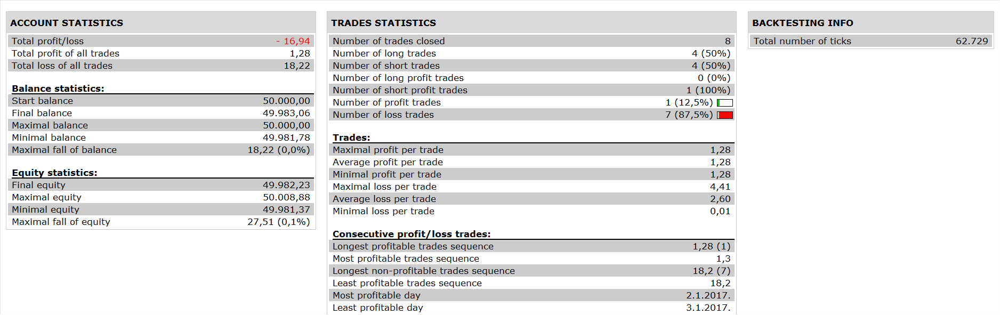

# Mean Indicator Strategy

> Source: https://fxcodebase.com/code/viewtopic.php?f=31&t=64850  
> Forum: 31 · Topic 64850 · 1 post(s)

---

## Mean Indicator Strategy

**Apprentice** · Wed Jun 28, 2017 8:33 am

 

Open Long
Mean / Prev Line Cross Over
Open Short
Mean / Prev Line Cross Under

 [Mean Indicator Strategy.lua](files/113240/Mean%20Indicator%20Strategy.lua)

Mean Calculation.lua is available here.
[viewtopic.php?f=17&t=2378&p=5130#p5130](https://fxcodebase.com/code/viewtopic.php?f=17&t=2378&p=5130#p5130)

The Strategy was revised and updated on January 19, 2019.
