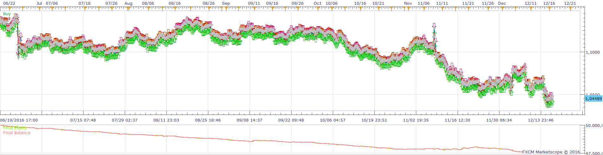
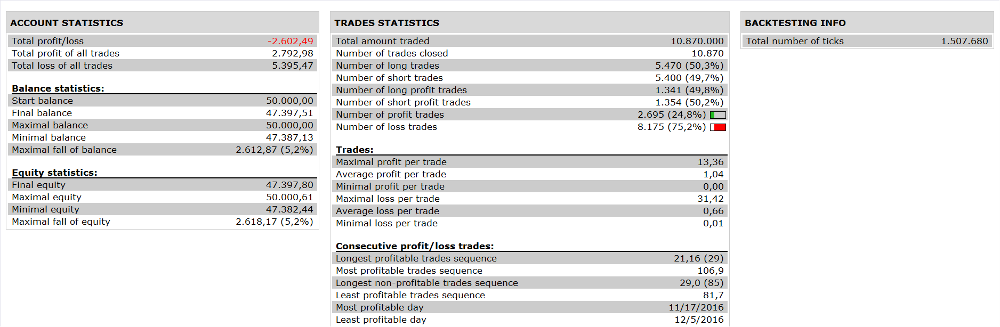

# MeanReversion Indicator Strategy

> Source: https://fxcodebase.com/code/viewtopic.php?f=31&t=64241  
> Forum: 31 · Topic 64241 · 2 post(s)

---

## MeanReversion Indicator Strategy

**Apprentice** · Thu Dec 22, 2016 1:58 pm

Open Long
DM>DN AND DM> MA AND PRICE CROSSESABOVE DM
Open Short
DM<DU AND DM< MA AND PRICE CROSSES BELOW DM

 

 [MeanReversion Indicator Strategy.lua](files/110219/MeanReversion%20Indicator%20Strategy.lua)

Based on indicator.
[viewtopic.php?f=17&t=64229](https://fxcodebase.com/code/viewtopic.php?f=17&t=64229)

---

## Re: MeanReversion Indicator Strategy

**Apprentice** · Sat Jan 27, 2018 6:18 am

The strategy was revised and updated.
