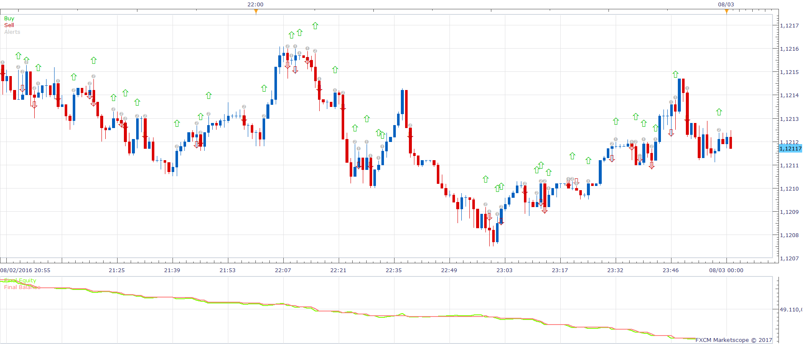
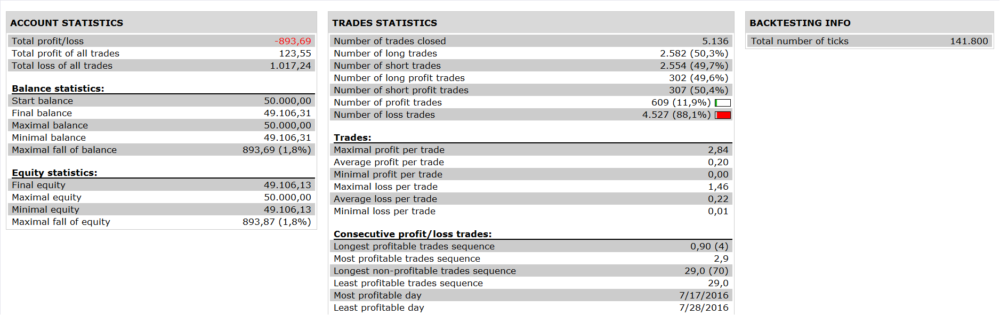

# Median NR SuperTrend Strategy

> Source: https://fxcodebase.com/code/viewtopic.php?f=31&t=64304  
> Forum: 31 · Topic 64304 · 6 post(s)

---

## Median NR SuperTrend Strategy

**Apprentice** · Mon Jan 16, 2017 4:56 am

 

Open Long
1. Median > NR_Super_Trend 2
2. NR_Super_Trend 1 > NR_Super_Trend 2

Open Short
1. Median < NR_Super_Trend 2
2. NR_Super_Trend 1 < NR_Super_Trend 2

Exit
If they both (1&2) do not agree

 [Median NR SuperTrend Strategy.lua](files/110541/Median%20NR%20SuperTrend%20Strategy.lua)

Non Repainting Supertrend Indicator is available here.
[viewtopic.php?f=17&t=41453&p=67701&hilit=NR_Super_Trend#p67701](https://fxcodebase.com/code/viewtopic.php?f=17&t=41453&p=67701&hilit=NR_Super_Trend#p67701)

---

## Re: Median NR SuperTrend Strategy

**Desrow** · Mon Jan 16, 2017 9:07 am

Apprentice,

Needs to have the option to change MVA of Median.

Thanks

---

## Re: Median NR SuperTrend Strategy

**Apprentice** · Tue Jan 17, 2017 5:04 am

Try it now.

---

## Re: Median NR SuperTrend Strategy

**Desrow** · Tue Jan 17, 2017 9:21 am

Apprentice,

How come a back-test of this Strategy does not show the same results as the attached screenshot???

Same time frame, same parameters, End of Turn.

Thanks,
Jay

---

## Re: Median NR SuperTrend Strategy

**Desrow** · Wed Jan 18, 2017 5:25 am

Apprentice,

This Strategy is not trading either "Live or End of Turn".

Am I doing something wrong???

---

## Re: Median NR SuperTrend Strategy

**Apprentice** · Sat Jan 27, 2018 6:15 am

The strategy was revised and updated.
