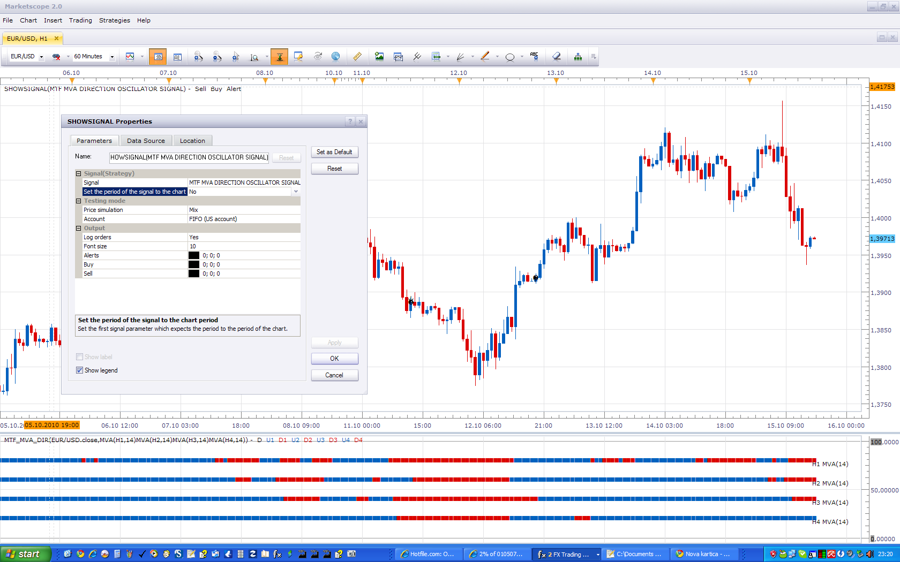

# MFT MVA Direction Oscillator Strategy

> Source: https://fxcodebase.com/code/viewtopic.php?f=31&t=2418  
> Forum: 31 · Topic 2418 · 67 post(s)

---

## MFT MVA Direction Oscillator Strategy

**Apprentice** · Fri Oct 15, 2010 4:23 pm

This strategy gives a signal when all four moving signals, time frames give the same indication.

 

This signal is used four different time frames.
For this reason, you must set Set the period of the signal to chart option to NO.

 [MTF MVA Direction Oscillator Strategy.lua](files/5251/MTF%20MVA%20Direction%20Oscillator%20Strategy.lua)

The Strategy was revised and updated on December 10, 2018.

---

## Re: MFT MVA Direction Oscillator Strategy

**cminvest** · Mon Oct 18, 2010 7:28 am

Hi Apprentice
There is a problem with this signal.
If I use Backtesting with this signal and set Set the period of the signal to chart option to No, it has very good result. If option to yes , we have very much sell and buy orders.
How can I use it for realtime trading this settings for different time frames? I found nothing.
I use this exellent Strategie today with my real account and have to many orders.

---

## Re: MFT MVA Direction Oscillator Strategy

**Apprentice** · Mon Oct 18, 2010 9:13 am

As I wrote the strategy is designed to work, can not work,
If you use a time frame chart you are using (Yes),
For this reason, when using this strategy,
Set the period of the signal to chart option to No.

Order number will be much smaller.
in future versions I'll add an option that will allow a larger number of orders.

---

## Re: MFT MVA Direction Oscillator Strategy

**kankatrader** · Fri Jan 14, 2011 6:58 am

Hi

Can someone add these function in this strategy ?

Trailing Stop: Dynamic and Fixed

Open_opposite _after_close: false/yes

max orders: Sometimes this strategy several buy signals in an uptrend or downtrend.

Thanks in advance

---

## Re: MFT MVA Direction Oscillator Strategy

**fabfxcm** · Mon Jan 17, 2011 5:56 am

Hi Apprentice,
The strategy is very interesting, open strategy in trend and often go in gain, but it close the order too late when there is a inversion of trend. Also when I set the limit and the trailing stop they does not works.
It will be wonderful add the strategy a closing indicator.
Let me know if there is anything I can do to defence when trend invert direcion!!

---

## Re: MFT MVA Direction Oscillator Strategy

**fabfxcm** · Mon Jan 17, 2011 6:03 am

Hi Apprentice
The strategy enter well in trend, but it close too late when there is an inversion of trend.
It will be wonderful to add a closing indicator to the strategy.
Let me know if there is anything I can do to close early when an inversion of trend happen!!! Maybe different combination of period???

---

## Re: MFT MVA Direction Oscillator Strategy

**fabfxcm** · Tue Jan 18, 2011 4:07 pm

I have a little problem with the strategy: comapred to the backtest (individuated by the small symbol with a arrow in the graph) the strategy opens the order about 30 minutes later. Why it happen? How can I solve the problem??

---

## Re: MFT MVA Direction Oscillator Strategy

**luciana** · Wed Jan 19, 2011 8:45 pm

Hi,
1.the name of the strategy I did load is MTF MVA Direction Oscillator Strategy I didn't get as per above the Show signal (MTF MVA Direction Oscillator Strategy ) nor the oscillator.
2.Should we change the timeframes for H1, H2, H3, H4 for the strategy to work properly? Thanks.

---

## Re: MFT MVA Direction Oscillator Strategy

**luciana** · Thu Jan 20, 2011 10:41 am

I figured it out. No bother to respond. Thanks.

---

## Re: MFT MVA Direction Oscillator Strategy

**fabfxcm** · Mon Feb 21, 2011 9:37 am

HI, the MTF strategy go almost always in the right direction, I mean enter and go quickly in positive field, but the problem is that it generally close in negative!!!
So the strategy is able to open the order in right moment, but close too late (or too early)!!!
What I think is that MTF can be a great strategy but it should be upgraded in one (or more) of the following ways:
- The best would probably be to have different strategies combinations of MTF to open e to close the orders.
- Close one order without opening a new one in the opposite direction – just close.
- Give the possibility to associate MTF with other strategy combination to close early the order.
- Add the possibility to choose among static and dynamic trailing stop.

 Do you think it will be feasible??
I think MTF is very close to be a good Autotrading!

I really appreciate your opinion.

---

## Re: MFT MVA Direction Oscillator Strategy

**Tanaka** · Tue Feb 22, 2011 1:07 am

Great strategy thank you!

I have one problem, I keep getting the following error:

[string "MTF MVA Direction Oscillator Strategy.lua"]:220: The second parameter must be a Boolean value

I have version 1.10.010311. I am using the default settings. After the above message it turns the strategy off. Does anyone know what I have done wrong?

Regards,

Tanaka

---

## Re: MFT MVA Direction Oscillator Strategy

**Blackcat2** · Tue Feb 22, 2011 2:01 am

Looks interesting!
- Where can I find the oscillator to test this visually?
- When will the strategy close a position? When the opposite signal comes out (For example, when going short, it'll close only when buy signal comes out? and vice versa)? Maybe it can be configured as soon as any of the 2 indicators disagree with each other, it'll close the position?

Thanks..
BC

---

## Re: MFT MVA Direction Oscillator Strategy

**Apprentice** · Tue Feb 22, 2011 5:00 am

Hi,

 MFT MVA Direction Oscillator can be found here.
[viewtopic.php?f=17&t=759&p=1398&hilit=MVA+Direction+Oscillator#p1398](https://fxcodebase.com/code/viewtopic.php?f=17&t=759&p=1398&hilit=MVA+Direction+Oscillator#p1398)

Current strategy, closing the position when opening a position opposite sides.
When the indication is positive for all four time frames.

---

## Re: MFT MVA Direction Oscillator Strategy

**Blackcat2** · Tue Feb 22, 2011 7:19 am

> **Apprentice wrote:**
> Hi,
>
> MFT MVA Direction Oscillator can be found here.
> [viewtopic.php?f=17&t=759&p=1398&hilit=MVA+Direction+Oscillator#p1398](https://fxcodebase.com/code/viewtopic.php?f=17&t=759&p=1398&hilit=MVA+Direction+Oscillator#p1398)
>
> Current strategy, closing the position when opening a position opposite sides.
> When the indication is positive for all four time frames.

Thanks apprentice,
Is it too much to ask, to add parameters, so that we can decide which TF used to close a position? Either the 1st one, 1st + 2nd, or 1st + 2nd + 3rd, or 1st + 2nd + 3rd + 4th...
It won't open another one again until another signal is generated...

Thanks
BC

---

## Re: MFT MVA Direction Oscillator Strategy

**Apprentice** · Tue Feb 22, 2011 1:16 pm

I'll try to offer a new version soon.

---

## Re: MFT MVA Direction Oscillator Strategy

**Blackcat2** · Tue Feb 22, 2011 6:11 pm

> **Apprentice wrote:**
> I'll try to offer a new version soon.

Thanks Apprentice
Actually, after I did some thinking about it, I think it's easier if the logic for the new parameters are this:
- How many signals required to open position, this means users can choose whether to wait until 4 signals before opening a position, or 3, or 2, or 1. It doesn't care which TF chart, as long as 3 of them signals long, then open a long position - the number of signals required is adjustable.

- How many signals required to close a position, same as the above but only for closing position.

For example, I can choose 4 signals to open, but 1 signal to close, this way I can close when it's still good, not after it reverse. After closing it'll wait until the correct number of signals to open position again..

Thanks..
BC

---

## Re: MFT MVA Direction Oscillator Strategy

**Blackcat2** · Tue Feb 22, 2011 9:29 pm

Is there a way to limit the amount of position it can open? Looks like everytime it generates a signal it opens a position regardless whether it already has a position or not..

Cheers..
BC

---

## Re: MFT MVA Direction Oscillator Strategy

**Apprentice** · Wed Feb 23, 2011 3:37 am

In the next version, I'll add this option.
It is hard to please everyone all the time.

---

## Re: MFT MVA Direction Oscillator Strategy

**Blackcat2** · Wed Feb 23, 2011 4:38 am

> **Apprentice wrote:**
> In the next version, I'll add this option.
> It is hard to please everyone all the time.

 I know... it's just a suggestion, at the end you decide whether you want to do it or not...

Thanks again for your help...
BC

---

## Re: MFT MVA Direction Oscillator Strategy

**fabfxcm** · Sat Mar 26, 2011 8:49 am

Dear Apprentice,
thanks a lot for the job you are doing on strategy and indicators.
MTF is a very interesting strategy. Would it be possible to add a fixed trailing stop and to avoid that it will open more than one position? It should be a real great improvment for the strategy.
Thanks,
fabfxcm

---

## Re: MFT MVA Direction Oscillator Strategy

**Apprentice** · Sat Mar 26, 2011 12:23 pm

Your request has been added to developmental cue.

---

## Re: MFT MVA Direction Oscillator Strategy

**fabfxcm** · Fri Apr 15, 2011 2:27 pm

HI Apprentice,
Here some suggestions for the improvement of MTF stragety:
- add a fixed trailing stop;
- avoid that it will open more than one position;
- close a position without opening a new one in the opposite direction.
I really looking forward for these improvements.
Fabio

---

## Re: MFT MVA Direction Oscillator Strategy

**Apprentice** · Sat Apr 16, 2011 9:38 am

Added to developmental cue.

---

## Re: MFT MVA Direction Oscillator Strategy

**luigipg** · Sun Apr 17, 2011 3:06 am

Thank you to all developers!!!
I have the same problem of Tanaka, getting the following error:
[string "MTF MVA Direction Oscillator Strategy.lua"]:220: The second parameter must be a Boolean value.
Also to me after the above message it turns the strategy off. Can somebody help me please.
Best Regards. Luigi!!!

---

## Re: MFT MVA Direction Oscillator Strategy

**Apprentice** · Sun Apr 17, 2011 8:19 am

Problem solved
Attempt to re-download this strategy.

---

## Re: MFT MVA Direction Oscillator Strategy

**luigipg** · Sun Apr 17, 2011 10:38 am

Yes now work very well. Thank you so much. Luigi!!!

---

## Re: MFT MVA Direction Oscillator Strategy

**Supes05** · Thu May 05, 2011 3:54 am

Ok, have downloaded the recommended patch, the .lua strategy, as well as the indicator. However it seems that the strategy (by looking at the backtest, and watching the forward test) is making its entries soley off of the first timeframe, and not going through a progression at looking at all 4 timeframes. Any ideas on what I did or didnt do wrong?

---

## Re: MFT MVA Direction Oscillator Strategy

**Apprentice** · Thu May 05, 2011 4:24 am

As i have wrote in My Post.

This signal is used four different time frames.
For this reason, you must set Set the period of the signal to chart option to NO.

You can find this option on Backtest properties Window.

As for Patch. Its installation is not needed at this time.
It was necessary at that time, I deleted this part of the post.

---

## Re: MFT MVA Direction Oscillator Strategy

**Supes05** · Thu May 05, 2011 6:46 am

Thanks Apprentice, I think this is a very good strategy! I am seeing when the program tries to initiate a trade that it says the trade could not be initiated "The command is disabled". How can I enable it so that it will start trades?

---

## Re: MFT MVA Direction Oscillator Strategy

**fabfxcm** · Tue Jun 14, 2011 9:43 am

Hi Everybody,
This strategy is very interesting, but it will be very useful to have the option to close a position without opening a new one in the opposite direction and above all to avoid multiple positions.
I hope someone will improve it.

---

## Re: MFT MVA Direction Oscillator Strategy

**Apprentice** · Wed Jun 15, 2011 6:28 am

Stop / Limit Order Fix
Allowed side / Allow Multiple option Added.

---

## Re: MFT MVA Direction Oscillator Strategy

**ezpezp** · Wed Jul 20, 2011 12:33 pm

Hi,

Is it possible to add a parameter in the options to have trades occur after the close of all the candles? The strategy currently uses most recently closed candle for smallest timeframe and active candles for the other timeframes.

Thanks in advance!

---

## Re: MFT MVA Direction Oscillator Strategy

**Apprentice** · Wed Jul 20, 2011 1:40 pm

Probably Yes.

---

## Re: MFT MVA Direction Oscillator Strategy

**ezpezp** · Thu Jul 21, 2011 2:28 am

> **Apprentice wrote:**
> Probably Yes.

I've backtested a few moving average configurations with great results that cannot be replicated in real time trading because of the active candle parameter (too many fake signals while the candle is active). Sorry for probably sounding redundant, but given your answer, is my request something you can add / have added to your developmental cue? You've created a great strategy here with a lot of potential and I want to thank you for sharing it. I'm eagerly looking forward to implementing it! Thanks again.

---

## Re: MFT MVA Direction Oscillator Strategy

**Apprentice** · Thu Jul 21, 2011 4:48 am

I already have.

But, I am on vacation until 15 August.
Currently, there are other priorities,
 such as the After Beach Party in a few hours.

---

## Re: MFT MVA Direction Oscillator Strategy

**ezpezp** · Thu Jul 21, 2011 5:00 am

> **Apprentice wrote:**
> I already have.
>
> But, I am on vacation until 15 August.
> Currently, there are other priorities,
> such as the After Beach Party in a few hours.

....if you do this for me now, instead of making me wait until the 15th, you'll be my special guest to some of the wildest beach parties on the planet in Mykonos, Greece. You choose!

---

## Re: MFT MVA Direction Oscillator Strategy

**RJH501** · Thu Jul 21, 2011 9:20 am

ENJOY THE PARTY!

When you get time - please check attached chart.

There appears to be a timing strategy between the SHOWSIGNAL for the MTF MVA and the actual alignment of the trends for a trade signal.

Is there a reason for this? Is there a problem?

Regards

RJH

---

## Re: MFT MVA Direction Oscillator Strategy

**RJH501** · Thu Jul 21, 2011 9:59 am

Disregard, I see that averages are different between SHOWSIGNAL & STRATEGY.

RJH

---

## Re: MFT MVA Direction Oscillator Strategy

**ezpezp** · Fri Jul 22, 2011 2:33 am

> **Apprentice wrote:**
> I already have.
>
> But, I am on vacation until 15 August.
> Currently, there are other priorities,
> such as the After Beach Party in a few hours.

If you make this change for me within the next day or two, I'll send you VIP passes to the best beach parties on Mykonos in Greece for the summer! (Its where I'm from....) {and please, not jokes on the countries bankruptcy issues }

---

## Re: MFT MVA Direction Oscillator Strategy

**pwadsy** · Tue Aug 02, 2011 7:09 am

Hi
Also, another slight bug, is that the option to choose one particular side of entry does not seem to work.
FYI
Thanks

---

## Re: MFT MVA Direction Oscillator Strategy

**ezpezp** · Mon Aug 22, 2011 2:13 am

I last caught Aprenctice on his way out for vacation when I requested to add a parameter to this strategy that allows you the options to have trades occur after the **close** of all the candles. In case it's been forgotten, I'd like to remind him of the request if he's back (hope you had a great break). Thanks!

---

## Re: MFT MVA Direction Oscillator Strategy

**fabfxcm** · Mon Oct 10, 2011 3:28 am

Hi apprentice and everybody uses MTF.
I would like to let you know that there is a problem in the strategy. When multiple positions are allowed and a limit is set, the strategy close the first position correctly at the limit indicated, while in the second position place a limit much higher than the the indicated one!! Why it's happen? It's possible to solve this problem?

---

## Re: MFT MVA Direction Oscillator Strategy

**chiragvanecha** · Thu Dec 08, 2011 11:19 pm

nice strategy, but anyone can make it to close position when any 2 or 3 of 4 streams or timeframe changes from red to green or green to red

---

## Re: MFT MVA Direction Oscillator Strategy

**Apprentice** · Sun Dec 11, 2011 5:49 am

Added developers cue.

---

## Re: MFT MVA Direction Oscillator Strategy

**virgilio** · Sun Dec 11, 2011 7:34 pm

Why is it that when the strategy is running if two of the 4 lines change colors it closes the previous signal and opens another? For example, I had a buy position already established by this strategy and then 2 lines changed from green to red and the strategy closed the buy and opened the sell.
Isn't the strategy supposed to trigger a position only when all 4 lines change color?
Any explanation will be really appreciated.
Thank you!

---

## Re: MFT MVA Direction Oscillator Strategy

**virgilio** · Wed Dec 14, 2011 5:57 pm

Hello Apprentice,

So that we all know how to trade this strategy, could you please explain when a position is closed/open? It appears that when all 4 lines are green, many times when two change colors thena new position is open...?
Thanks,
V.

---

## Re: MFT MVA Direction Oscillator Strategy

**chiragvanecha** · Mon Jan 02, 2012 11:16 pm

please, can you add mtf macd with this strategy

---

## Re: MFT MVA Direction Oscillator Strategy

**Apprentice** · Wed Jan 04, 2012 7:02 am

You wanted MTF MACD strategy.
Or to add a MACD MTF, on, MFT MVA Direction Oscillator Strategy, as a filter?

---

## Re: MFT MVA Direction Oscillator Strategy

**macogi37** · Sat Mar 31, 2012 1:38 pm

Ciao Apprentice, i tried the Fractal Stop4 for trading manual, it seems to me an excellent tool as an alternative to the classic fixed stop and trailing, it works with logic on the basis of what is happening gradually. I thought that if it could put how to stop in the various strategies, it would be great.

In this regard, I would like to know if you can join the strategy MTF MVA Direction Oscillator and the strategy Fractal Stop? Or better, MTF MVA Direction Oscillator Strategy with the stop fractal instead that the stop classic ...
I thank you in advance, I offer you my greetings

---

## Re: MFT MVA Direction Oscillator Strategy

**macogi37** · Sat Mar 31, 2012 1:46 pm

I forgot ...
As the strategy provides for the opening of multiple positions, it would be great to allow strategy to open a new operation after the stop operated by fractal, in such a way to continue a possible trend stopped momentarily.
I hope we can do! However, you're very experienced and know what the best thing is to enhance this strategy that guess fairly precise inputs of trend!

---

## Re: MFT MVA Direction Oscillator Strategy

**Apprentice** · Mon Apr 02, 2012 4:40 am

This blending is possible.

---

## Re: MFT MVA Direction Oscillator Strategy

**macogi37** · Mon Apr 02, 2012 10:31 am

Great ...Apprentice for president!!!!
now i expect that you create a strategy to try, perhaps after an optimization, so we can find a setting best, thing we cannot do with the separate strategies ...

I have also tried FBSR Strategy, on the graph H1, i think it is very powerful, and saw that open positions to the exceedance of fractals, i inserted the strategy Fractal Stop4 however, always as trading manual without being able to make the optimization to see if they can find a better combination, i think it is good also try this combination that is giving me good results ...

I hope you will be able to create both.
Always i thank you in advance, I send you my warmest greetings ...

---

## Re: MFT MVA Direction Oscillator Strategy

**JoMa78** · Sun Feb 10, 2013 12:07 pm

Because this strategy is only suitable for longer periods of time, I would like to know what happens on weekends when the FXCM server are down. Knows the strategy about its opened positions and provides to support them again from sunday evening?

---

## Re: MFT MVA Direction Oscillator Strategy

**Apprentice** · Mon Feb 11, 2013 6:19 pm

Strategy will continue trading after, start of trading.

---

## Re: MFT MVA Direction Oscillator Strategy

**Soniania** · Sun Jul 28, 2013 9:40 am

Great tool ! Could you add an email alert please ?

> **Apprentice wrote:**
>
>
> MTF MVA Direction Oscillator Strategy.png
>
>
> This strategy gives a signal when all four moving signals, time frames give the same indication.
>
>
> mtf.PNG
>
>
> This signal is used four different time frames.
> For this reason, you must set Set the period of the signal to chart option to NO.
>
>
> MTF MVA Direction Oscillator Strategy.lua

---

## Re: MFT MVA Direction Oscillator Strategy

**Apprentice** · Sun Jul 28, 2013 1:19 pm

Email Option Added.

---

## Re: MFT MVA Direction Oscillator Strategy

**Soniania** · Fri Aug 23, 2013 1:34 am

(back from vacation) thanks . I will use it.

---

## Re: MFT MVA Direction Oscillator Strategy

**Soniania** · Fri Aug 23, 2013 3:51 am

Unfortunately e-mails are not sent.
(my mails parameters are ok, and alert mails work well on other strategies)
Could you check the programming?
Thank you very much

---

## Re: MFT MVA Direction Oscillator Strategy

**Soniania** · Sat Aug 24, 2013 10:11 am

...alert work well, but mail not
Thanks for your reply.

---

## Re: MFT MVA Direction Oscillator Strategy

**Apprentice** · Sun Aug 25, 2013 6:44 am

I have one bug in my coding.
Re Download.

---

## Re: MFT MVA Direction Oscillator Strategy

**Soniania** · Sun Aug 25, 2013 9:31 am

I'll redownload it. Thanks

---

## Re: MFT MVA Direction Oscillator Strategy

**jay1994** · Sun Aug 25, 2013 1:32 pm

Is there an MT4 version of this indicator?

---

## Re: MFT MVA Direction Oscillator Strategy

**Apprentice** · Mon Aug 26, 2013 2:18 am

Are you interested in strategy/robot or indicator.
I ask because this topic is dedicated to strategy.

---

## Re: MFT MVA Direction Oscillator Strategy

**jay1994** · Mon Aug 26, 2013 11:36 pm

No, just the MTF_MVA_DIR indicator will satisfy my needs.

---

## Re: MFT MVA Direction Oscillator Strategy

**Apprentice** · Tue Aug 27, 2013 2:36 am

Your request is added to the development list.

---

## Re: MFT MVA Direction Oscillator Strategy

**Soniania** · Thu Aug 29, 2013 1:01 am

FXCM version works well. Thanks for your development.

---

## Re: MFT MVA Direction Oscillator Strategy

**Apprentice** · Fri Dec 09, 2016 7:11 am

Strategy was revised and updated.
