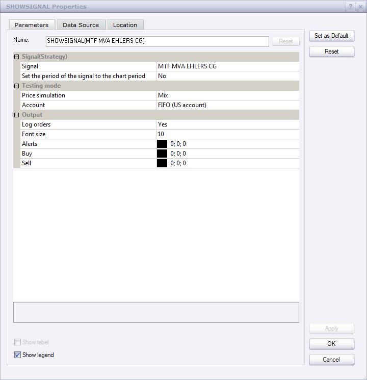
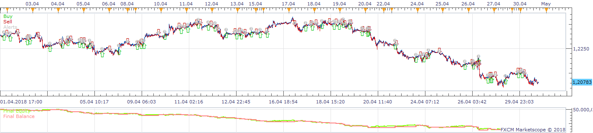
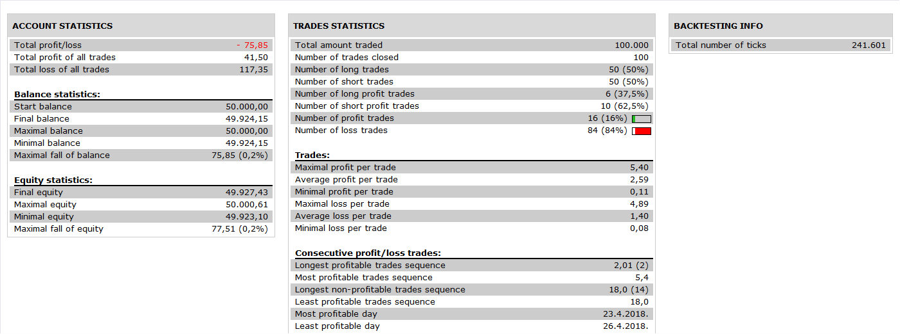

# MFT MVA EHLERS CG Strategy

> Source: https://fxcodebase.com/code/viewtopic.php?f=31&t=2420  
> Forum: 31 · Topic 2420 · 3 post(s)

---

## MFT MVA EHLERS CG Strategy

**Apprentice** · Fri Oct 15, 2010 6:22 pm

This strategy gives a signal when all four moving signals, time frames give the same indication for both indicators.

 

 

 

This signal is used four different time frames.
For this reason, you must set Set the period of the signal to chart option to NO.

 [MTF MVA Ehlers CG.lua](files/5253/MTF%20MVA%20Ehlers%20CG.lua)

Download and Install Ehlers CG Oscillator
[viewtopic.php?f=17&t=1262&p=2398&hilit=ehlers#p2398](https://fxcodebase.com/code/viewtopic.php?f=17&t=1262&p=2398&hilit=ehlers#p2398)

---

## Re: MFT MVA EHLERS CG Strategy

**Apprentice** · Wed Nov 30, 2016 5:24 am

Bump up.

---

## Re: MFT MVA EHLERS CG Strategy

**Apprentice** · Tue Nov 13, 2018 8:48 am

The Strategy was revised and updated on November 13. 2018.
