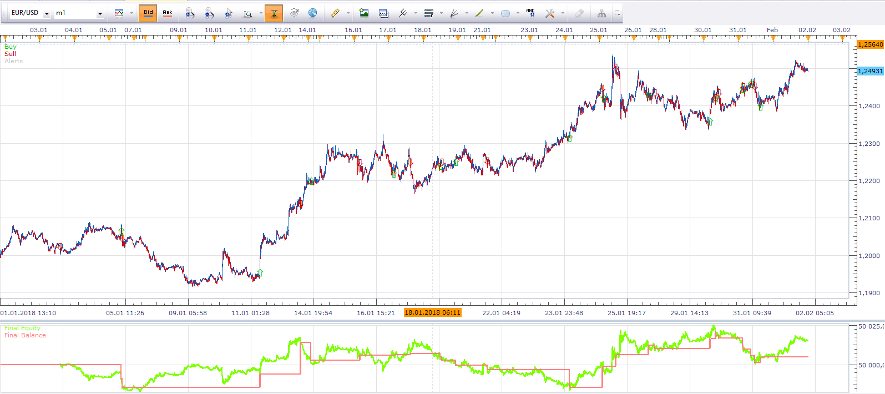
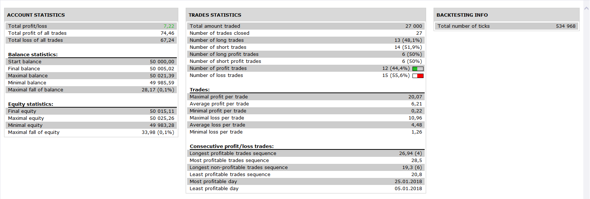

# Momentum trade strategy

> Source: https://fxcodebase.com/code/viewtopic.php?f=31&t=2771  
> Forum: 31 · Topic 2771 · 18 post(s)

---

## Momentum trade strategy

**Alexander.Gettinger** · Tue Nov 23, 2010 3:35 am

Rules for a Long Trade
1) Look for currency pair to be trading below the MA and MACD to be negative
2) Wait for price to cross above the MA, make sure that MACD is either in the process of crossing from negative to positive or have crossed into positive territory no longer than [MACD_Cross_Distance] bars ago
3) Go long [Open_Distance] pips above the MA

Rules for a Short Trade
1) Look for currency pair to be trading above the MA and MACD to be positive
2) Wait for price to cross below the MA, make sure that MACD is either in the process of crossing from positive to negative or have crossed into negative territory no longer than [MACD_Cross_Distance] bars ago
3) Go short [Open_Distance] pips below the MA

For this strategy must be installed indicator Averages ([viewtopic.php?f=17&t=2430](https://fxcodebase.com/code/viewtopic.php?f=17&t=2430)).

 

 

 [MomentumTradeStrategy v2.lua](files/6306/MomentumTradeStrategy%20v2.lua)

---

## Re: Momentum trade strategy

**virgilio** · Thu Jan 27, 2011 11:37 am

Why is it that when I try to use the Backtest Strategy I always get this message:
Marketscope 2.0
[string "MomentumTradeStrategy.lua"]:141:Unsupported

Can anyone help me with this?

---

## Re: Momentum trade strategy

**d10gen3** · Thu Jan 27, 2011 1:44 pm

I have te same problem as Virgilio, is there a way to fix it? Looks like many core functins return null.

---

## Re: Momentum trade strategy

**a0007002** · Sun Jan 30, 2011 1:57 pm

I too got this same error. Needs something to be fixed. The Averages indicator is installed and works on other strategies requiring it.

---

## Re: Momentum trade strategy

**sunshine** · Tue Feb 01, 2011 8:36 am

> **a0007002 wrote:**
> I too got this same error. Needs something to be fixed. The Averages indicator is installed and works on other strategies requiring it.

The problem you describe appears in the current version, and our team will do everything to resolve the issue as soon as possible. Thank you for pointing to this problem.

If you restart your Trading Station, the error shouldn't appear.

---

## Re: Momentum trade strategy

**a0007002** · Wed Feb 02, 2011 1:30 pm

Closing the program after loading the strategy into the list then re-launching Tradestation worked.
thanks

P.S. - what I did notice tho was that the stop and limit functions didn't seem to work. Not sure if they were supposed to.

---

## Re: Momentum trade strategy

**TMos1124** · Thu Apr 28, 2011 5:37 pm

If I change the code at the stop and limit (default is 1) to 5 that would change the order amount correct? If so, can I just save and run? Is there any way I can edit the trailing stop parameters? Again, your help is invaluable.

---

## Re: Momentum trade strategy

**Apprentice** · Fri Apr 29, 2011 5:30 am

If you open an indicator using Notpad.
You can edit the line 57-62 according to your preferences.

Code: [Select all](https://fxcodebase.com/code/)
`strategy.parameters:addInteger("Amount", "Trade Amount in Lots", "", 1, 1, 100);
    strategy.parameters:addBoolean("SetLimit", "Set Limit Orders", "", false);
    strategy.parameters:addInteger("Limit", "Limit Order in pips", "", 30, 1, 10000);
    strategy.parameters:addBoolean("SetStop", "Set Stop Orders", "", false);
    strategy.parameters:addInteger("Stop", "Stop Order in pips", "", 30, 1, 10000);
    strategy.parameters:addBoolean("TrailingStop", "Trailing stop order", "", false);`

If wants to increase Trade Amount in Lots to 5 Edit line 57 to

Code: [Select all](https://fxcodebase.com/code/)
`strategy.parameters:addInteger("Amount", "Trade Amount in Lots", "", 5, 1, 100);`

---

## Re: Momentum trade strategy

**Blackcat2** · Fri Apr 29, 2011 7:24 am

Can anyone recommend parameters for 15M and 1H TF?

Thanks..
BC

---

## Re: Momentum trade strategy

**TMos1124** · Mon May 16, 2011 8:24 am

Thank you very much, I would also like to know how to edit line 59. I want the limit to be .5 to the total trade amount. If I were to buy 20 for example, I wish for the limit order to be 10 lots.

---

## Re: Momentum trade strategy

**Apprentice** · Wed Nov 30, 2016 5:30 am

Bump up.

---

## Re: Momentum trade strategy

**fallingangel** · Tue Jul 14, 2020 2:45 pm

Dear Friends

Is it possible to add to this strategy position cap, trading lots as risk % of equity and breakeven features?

Thank you

---

## Re: Momentum trade strategy

**Apprentice** · Wed Jul 15, 2020 10:03 am

Your request is added to the development list.
Development reference 1698.

---

## Re: Momentum trade strategy

**Apprentice** · Thu Jul 16, 2020 5:43 am

Try MomentumTradeStrategy v2.lua

---

## Re: Momentum trade strategy

**billkokobill** · Mon Apr 19, 2021 5:29 am

dear sir
could you add the option ''multiple position '' ?
for example when the macd is at negative area, every time the the price cross the ma20 up , to open onother one buy position.
when the macd is at positive area , every time the price cross down the ma20 , to open another sell position.
thanks a lot
gongrats for the nice work.

---

## Re: Momentum trade strategy

**billkokobill** · Tue Apr 20, 2021 5:15 am

good morning sir.
can you add the parameter ''multiple positions''
when then macd is at positive positions, every time the price crosses down the ma, open another one sell position.
the same for the oposite.
thanks a lot

---

## Re: Momentum trade strategy

**Apprentice** · Tue Apr 20, 2021 3:36 pm

Your request is added to the development list.
Development reference 377.

---

## Re: Momentum trade strategy

**Apprentice** · Wed Apr 21, 2021 11:50 am

Try this version.

 [MomentumTradeStrategy_v3.lua](files/141645/MomentumTradeStrategy_v3.lua)
