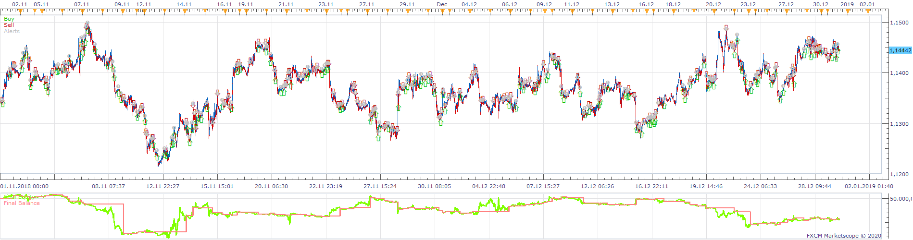
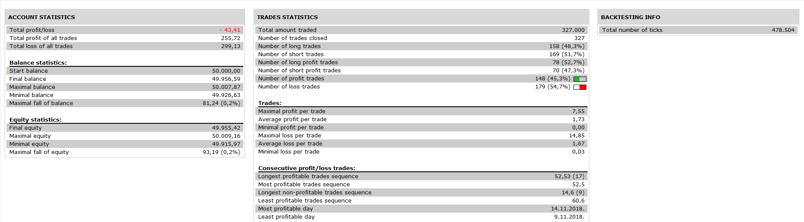

# MovAvg Adaptive Fltr

> Source: https://fxcodebase.com/code/viewtopic.php?f=31&t=69416  
> Forum: 31 · Topic 69416 · 1 post(s)

---

## MovAvg Adaptive Fltr

**Apprentice** · Mon Feb 17, 2020 7:32 am

 

Based on Stocks & Commodities V16:3 (156-158): Traders’ Tips
S&C 1998-03
You can download Adaptive_MA.lua and Adaptive_MA Filter.lua here.
[viewtopic.php?f=17&t=69415&p=131312#p131312](https://fxcodebase.com/code/viewtopic.php?f=17&t=69415&p=131312#p131312)

 [MovAvg Adaptive Fltr.lua](files/131314/MovAvg%20Adaptive%20Fltr.lua)
