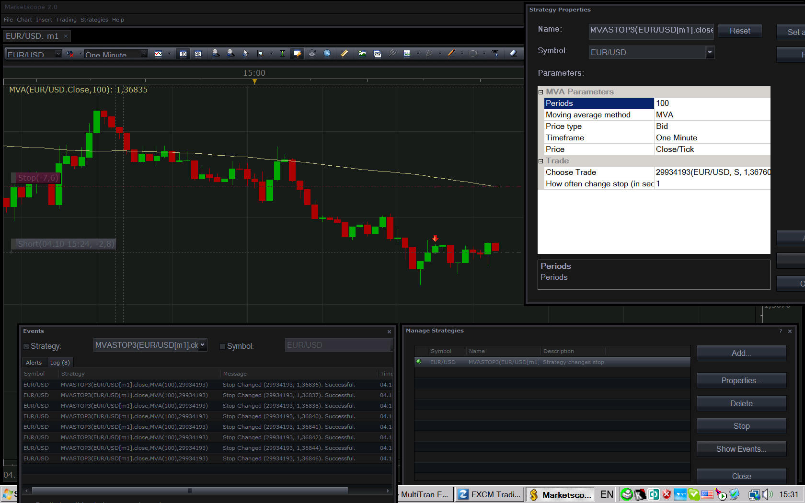

# Moving-average based stop order [new] + FIFO now!

> Source: https://fxcodebase.com/code/viewtopic.php?f=31&t=2339  
> Forum: 31 · Topic 2339 · 32 post(s)

---

## Moving-average based stop order [new] + FIFO now!

**Nikolay.Gekht** · Mon Oct 04, 2010 2:40 pm

This is an update for Moving-Average based stop order published here: [viewtopic.php?f=31&t=2209](https://fxcodebase.com/code/viewtopic.php?f=31&t=2209)

The strategy moves stop level of the chosen position exactly on the chosen Moving Average Value. The recommended settings are in range 100-200 for hourly or higher time frame.

Unlike the previous version, this strategy:
a) Starts to work immediately, without waiting for the first tick on chosen instrument.
b) Checks the the most recent MVA value every chosen period (1 second by default) and updates stop if MVA is changed more than for 1/10 of pip.
c) Stops automatically when trade disappears.
d) With "autotrading patch" does not show annoying "Event Log" window every time when stop order is changed. So, if you switched "Don't show this window on next event" to avoid "stop order changed events" you can switch it back, so, other alerts will not skipped anymore.

 



Because this strategy manages the regular stop order, it **CANNOT** be used on FIFO accounts (any accounts opened in US broker). For US accounts please use
[net stop version](https://fxcodebase.com/code/viewtopic.php?f=31&t=2339&p=5388#p5388) of the strategy.

Download signal:

 [mvastop3.lua](files/4997/mvastop3.lua)

The Strategy was revised and updated on December 11, 2018.

---

## Re: Moving-average based stop order [new version]

**Nikolay.Gekht** · Mon Oct 18, 2010 12:48 pm

Wonderful instruction by Jason Rodgers on how to use the strategy can be found here:
[http://www.informedtrades.com/blogs/jas ... -loss.html](http://www.informedtrades.com/blogs/jason-rogers/2510-using-moving-average-stop-loss.html)

---

## FIFO (net stop) version

**Nikolay.Gekht** · Wed Oct 20, 2010 6:14 pm

If your account is opened in FXCM US or other US-based broker, you cannot use the regular stop and limit orders due to NFA regulation (google for "NFA rule 2-43(b)") which prohibits selective positions management. In other words - you must close first the older positions on the same account for the same instruments. The mvastop3 strategy in the first post of this topic cannot be used as well.

However, the Trading Station provides a good alternative for stop orders - the net stop orders. You can set up them via "Summary" view for chosen account and instrument. If you recognize the whole amount of particular instrument on particular account as one netting position this orders works good enough for risk management.

So, please find the netting stop MVA-based order below. Unlike the strategy above, this strategy is attached to the instrument and the account (instead of the instrument and the trade). Everything else is the same - if the set of positions is long and chosen MVA value is below the market - the strategy creates and then tracks the order according MVA value. And, in opposite case - if the set of positions is short and chosen MVA value is above the market...

The strategy creates the stop order only in case the position exist. If position is closed, the strategy **does not stop**, but waits until the next position is created.

Please **DO NOT** use this strategy on non-FIFO (for example FXCM UK or dbFX accounts)!

Download:

 [mvastop4.lua](files/5388/mvastop4.lua)

---

## Re: Moving-average based stop order [new] + FIFO now!

**alepan72** · Wed May 04, 2011 5:46 am

Hi Nikolay!
I love this strategy (mvastop3). I use it for all of my trades. I want to write the code in my strategies, but I have a big problem and I wonder if you can help me...
If I write the code in a tick strategy (like orders) everything is OK. When I include the mvastop strategy into a candle strategy, mvastop3 stop the trade when the price hit an EMA but on close of current candle. Can you tell me how I must write the code, so strategy open a trade on a close candle (e.g. MA_advisor or RSI_strategy) but the mvastop work on tick?
I am grateful if you can me help with the code or if it exists somewhere a document - guide to read.
Best regards!
Thanks in advance

---

## Re: Moving-average based stop order [new] + FIFO now!

**Nikolay.Gekht** · Wed May 04, 2011 7:47 am

> **alepan72 wrote:**
> Hi Nikolay!
> I love this strategy (mvastop3). I use it for all of my trades. I want to write the code in my strategies, but I have a big problem and I wonder if you can help me...
> If I write the code in a tick strategy (like orders) everything is OK. When I include the mvastop strategy into a candle strategy, mvastop3 stop the trade when the price hit an EMA but on close of current candle. Can you tell me how I must write the code, so strategy open a trade on a close candle (e.g. MA_advisor or RSI_strategy) but the mvastop work on tick?
> I am grateful if you can me help with the code or if it exists somewhere a document - guide to read.
> Best regards!
> Thanks in advance

Do you use helper.lua in your strategy? (It is just a slightly different approach in case it is used or not).

---

## Re: Moving-average based stop order [new] + FIFO now!

**alepan72** · Wed May 04, 2011 9:28 am

Thanks for direct correspondence

Yes, I use helper.lua

---

## Re: Moving-average based stop order [new] + FIFO now!

**Nikolay.Gekht** · Thu May 05, 2011 10:56 am

With helper Lua:

1) Add a subscribtion for ticks:

```lua
bid = ExtSubscribe(id, nil, "t1", true, "close");
-- or
ask = ExtSubscribe(id, nil, "t1", false, "close");
```

where id is an integer number which is different from the subscribtion id used for other collections you subscribed.

2) Add the case into ExtUpdate(id, source, period)

```lua
if id == _your_bar_history_id_ then
   ...
elseif id == _your_tick_history_id_ then
   --
   -- this case will work on every tick!
   --

   -- calc stop level here
   ...
   -- apply stop level here
   ...
end
```

---

## Re: Moving-average based stop order [new] + FIFO now!

**alepan72** · Thu May 05, 2011 1:33 pm

Thanx a lot
Your services are so helpfull!

Keep coding

---

## Re: Moving-average based stop order [new] + FIFO now!

**bguguen** · Tue May 10, 2011 3:48 pm

Hey hey, im absolutely loving this feature, found it very useful however, just couple of question, is it possible to add a feature to it so i get to ADD more positions into the strategy?? because if im understanding correctly this strategy can only manage 1 trade at a time using the parameteres set, but what if i keep adding positions with the same purpose of having the SL following the EMA and eventually they will all Stop out as trend changes, and some will hit SL with a BE Positive win...

yea thats about it...

---

## Re: Moving-average based stop order [new] + FIFO now!

**spinemaligna** · Mon Apr 23, 2012 4:26 am

hi all,
Is it possible, and if so, could you add the facility to offset the value of the average by a number of pips.

Many thanks,
Ross

---

## Re: Moving-average based stop order [new] + FIFO now!

**Apprentice** · Tue Apr 24, 2012 2:40 am

Yes this is possible.

---

## Re: Moving-average based stop order [new] + FIFO now!

**dell123** · Sun Aug 05, 2012 2:04 pm

I like the mvastop4.lua, but to many times price will come back to mva touch and then take off again. I hope you can add another option with it that would stop out at the brake and close of the mva. So #1 keep your touch of mva as opption 1 and add option 2 brake and close of mva,sma,or ema.

Thanks for your time

---

## Re: Moving-average based stop order [new] + FIFO now!

**sho-me-pips** · Mon Aug 06, 2012 11:08 am

> **dell123 wrote:**
> I like the mvastop4.lua, but to many times price will come back to mva touch and then take off again. I hope you can add another option with it that would stop out at the brake and close of the mva. So #1 keep your touch of mva as opption 1 and add option 2 brake and close of mva,sma,or ema.

One way to prevent stop out on a bounce short term, till strategy can be modified. Set trailing mva price to high (going short) or low (going long) instead of close.

---

## Re: Moving-average based stop order [new] + FIFO now!

**spinemaligna** · Thu Aug 16, 2012 4:42 am

You have replied saying it is possible to offset the stop level by a user defined number of pips. Could you please either tell me how to do this or modify the strategy to achieve this.

Many thanks in anticipation,

Ross

---

## Re: Moving-average based stop order [new] + FIFO now!

**spinemaligna** · Fri Jan 11, 2013 12:05 pm

Happy New year to all,

I have been experimenting with Wilders Moving Average offset by + or - 20 pips as a trailing stop strategy. On a 1H timeframe it seems a good compromise for maximising profit.
Could you please modify this moving average stop order to accommodate this.

Ross

---

## Re: Moving-average based stop order [new] + FIFO now!

**Apprentice** · Sun Jan 13, 2013 6:37 am

Your request is added to the development list.

---

## Re: Moving-average based stop order [new] + FIFO now!

**dell123** · Tue Jan 15, 2013 7:21 pm

Last Aug 5, 2012 I put up a post asking if another option could be added to the mvastop4.lua FIFO, but have not heard or seen anything yet, so here is another post that may help. I hope you can add another option that would stop out at the brake and close of the MA. So, # 1. keep your touch of MA as opption 1 and add option 2 brake and close of the MA, and option 3 brake and close of the MA by a set number of bars or you could just set it to two.

Thanks for your time

---

## Re: Moving-average based stop order [new] + FIFO now!

**Outside_The_Box** · Thu Nov 07, 2013 12:18 am

This would be perfect if the Averages indicator were used so we could use a wider variety of MA's to use as the stop level. *crosses his fingers*

---

## Re: Moving-average based stop order [new] + FIFO now!

**Apprentice** · Thu Nov 07, 2013 5:13 am

Your request is added to the development list.

---

## Re: Moving-average based stop order [new] + FIFO now!

**cmpblsmith** · Sun Nov 10, 2013 11:29 pm

Hello, I am wondering if there are any stop loss strategies that only exit on a close of a candle below a certain level in order to avoid stop hunts and fake outs. If any one is aware of a strategy that is able to do that or is interested in developing could you please let me know.
Thank you,
Campbell

---

## Re: Moving-average based stop order [new] + FIFO now!

**Apprentice** · Mon Nov 11, 2013 5:01 am

It is difficult to reconcile this two world.
Some traders prefer instant execution, others prefer to watch and wait.

Live will use tick time frame, End of Turn will use chart time frame.

I can not think of any right now.
But I'm sure they exist.

The only difference, look at this hypothetical situation.

- Live

if source.close [period]> MA.DATA [period] then
Close ();
end

- End of Turn

if source.close [period-1]> MA.DATA [period-1] then
Close ();
end

---

## Re: Moving-average based stop order [new] + FIFO now!

**dell123** · Sun Nov 17, 2013 2:42 pm

I hope you can add another option that would stop out at the candle brake and close of the MA.

---

## Re: Moving-average based stop order [new] + FIFO now!

**gfozmo** · Sun Nov 24, 2013 4:33 pm

> **Outside_The_Box wrote:**
> This would be perfect if the Averages indicator were used so we could use a wider variety of MA's to use as the stop level. *crosses his fingers*

I would also like to see this. KAMA or PPMA if possible.

---

## Re: Moving-average based stop order [new] + FIFO now!

**gfozmo** · Sun Nov 24, 2013 5:50 pm

I keep getting a "unsupported order type" whenever I try this. I'm running Trading Station on an MT4 server. Could that be the problem?

---

## Re: Moving-average based stop order [new] + FIFO now!

**Apprentice** · Mon Nov 25, 2013 3:20 am

There are several versions of this strategy.
Exactly which version you use.
Furthermore, Are you using the FIFO accounts (accounts opened in any U.S. broker).
As stressed this version will not work for this accounts.

---

## Re: Moving-average based stop order [new] + FIFO now!

**gfozmo** · Mon Nov 25, 2013 11:35 am

I used the MVASTOP4.
I get this error message on each attempt by the strategy to set the stop. "Failed create/change stop" with the comment "unsupported order type"

I know the MT4 server is set up a little different then Trading Station servers in the way it handles stops. For example it won't let me set trailing stops.

Oh well thanks for the help. It looked like it was just what I needed to complete the strategy I am running.

---

## Re: Moving-average based stop order [new] + FIFO now!

**Valeria** · Wed Nov 27, 2013 5:16 am

Hi gfozmo,

We have investigated the issue, most likely it is due to the MT4 server. Please use the other type of account.

---

## Re: Moving-average based stop order [new] + FIFO now!

**Apprentice** · Sun Dec 11, 2016 5:36 am

Strategy was revised and updated.

---

## Re: Moving-average based stop order [new] + FIFO now!

**sho-me-pips** · Sun Dec 11, 2016 11:00 am

Would you make a MT4 version of Moving Average stop for FIFO accounts.

---

## Re: Moving-average based stop order [new] + FIFO now!

**Apprentice** · Sun Dec 11, 2016 12:31 pm

Your request is added to the development list, Under Id Number 3691
 If someone is interested to do this task, please contact me.

---

## Re: Moving-average based stop order [new] + FIFO now!

**LoneWolf** · Tue Jan 01, 2019 11:11 am

I like this indicator so much.
I have only one little question.

Is it possible to remove the limitation of the MA ( max.200 ) ?

---

## Re: Moving-average based stop order [new] + FIFO now!

**Apprentice** · Fri Jan 04, 2019 7:16 am

Try it now.
