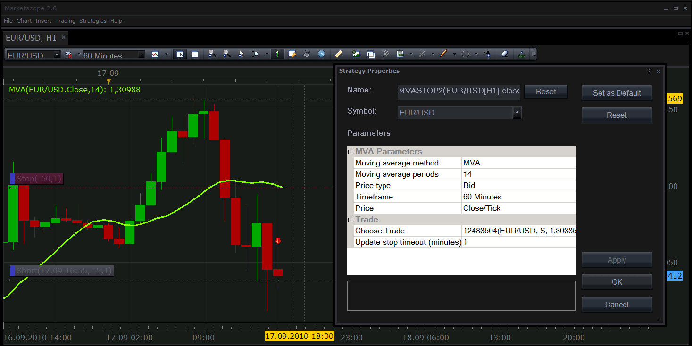

# Moving-average based stop order

> Source: https://fxcodebase.com/code/viewtopic.php?f=31&t=2209  
> Forum: 31 · Topic 2209 · 13 post(s)

---

## Moving-average based stop order

**Nikolay.Gekht** · Fri Sep 17, 2010 11:06 am

[A new version of this strategy exists. Please check it first!](https://fxcodebase.com/code/viewtopic.php?f=31&t=2339)

The strategy sets the stop order on the chosen trade using moving average value.

You can apply any of the existing moving average indicator of any price (open, close, high, low, median, typical or weighted) of any time frame and choose the interval in minutes how often the stop order shall be changed.

The strategy starts on the first tick after it's applied, loads the data and starts to watch moving average value. In case moving value value is changed and the stop is changed more than (chosen interval) ago, the new stop value is set. If there is no stop order - the new stop order is created.

The strategy uses the most recent bar of the chosen timeframe, not the already closed bar.

In case moving average is on the wrong side (above the price for a long position or below the price for a short position) the strategy does not set or change the order.

The strategy works for non-FIFO (aka U.S. accounts) only.

**Note**. The strategy works on 091010 version of the Trading Station **only**. Do not try to use it on 082610 or older version!!!. To update your trading station up to 091010 version, please, download the most recent installation package from your broker's site download page and install it. FXCM UK download page is [http://www.fxcm.co.uk/forex-software-download.jsp](http://www.fxcm.co.uk/forex-software-download.jsp)

Screenshot:

 

Download:

 [mvastop2.lua](files/4596/mvastop2.lua)

p.s. The setting stop order by true timer (i.e. every one minute exact, without waiting for a tick) will be possible in the upcoming Trading Station release.

The Strategy was revised and updated on December 10, 2018.

---

## Re: Moving-average based stop order

**shlomohalevi** · Wed Oct 27, 2010 6:52 pm

I am seeking an indicator which will alert me when price hits the 200 ema
on the 5 minute chart. Does such an indicator exist ?

Thanks for any help you can offer.

Best,
Shlomo

---

## Re: Moving-average based stop order

**alepan72** · Thu Feb 24, 2011 2:11 pm

Hi Nikolay!
It's a great strategy and I use it on most of my trades.
I wonder, if it's possible to use a similar strategy for profit.
e.g. When price is above the EMA and I am short, close the position if price hit the EMA.
Thanx a lot!
Kisses from Greece!!!

---

## Re: Moving-average based stop order

**alepan72** · Fri Feb 25, 2011 1:34 pm

> **shlomohalevi wrote:**
> I am seeking an indicator which will alert me when price hits the 200 ema
> on the 5 minute chart. Does such an indicator exist ?
>
> Thanks for any help you can offer.
>
> Best,
> Shlomo

Take a look at this link below....
[http://fxcodebase.com/code/viewtopic.php?f=29&t=2386&hilit=price+ma](https://fxcodebase.com/code/viewtopic.php?f=29&t=2386&hilit=price+ma)

---

## Re: Moving-average based stop order

**arstechnica** · Thu Nov 01, 2012 1:19 am

I open trades manually with a stop and take profit imposted in the platform. I have TS 01.11.011212

Then apply the MVASTOP3 to the trade, but it doesn't work.

It doen't move stops to MVA
Is my TS version compatible? Or i need a patch?

---

## Re: Moving-average based stop order

**Apprentice** · Thu Nov 01, 2012 2:50 am

Hm, this needs to be tested.
One question, are you using this, or new version posted by Nikolay.
Alo do you have US FIFO or Non FIFO account.

---

## Re: Moving-average based stop order

**arstechnica** · Thu Nov 01, 2012 5:04 am

I have an accountwith FXCM Italy in EUR.

I used the first version on non fifo account

---

## Re: Moving-average based stop order

**arstechnica** · Sun Nov 04, 2012 1:42 am

Dear Nick,

How can I introduce this stop inside an existing strategy?

I need it as an option for stop.

Could you please attach the code I have to copy inside the existing strategy?

Thanks

---

## Re: Moving-average based stop order

**Apprentice** · Sun Nov 04, 2012 7:44 am

We can write new strategy that uses this algorithm.
Unfortunately this is not Copy / Paste Job.

---

## Re: Moving-average based stop order

**luigipg** · Sun Nov 04, 2012 2:54 pm

Hi, can anyone adds to this strategy "distance in pips" from Moving-average? so the stop loss move n pips overside the MA. Thanks. Luigi!!!

---

## Re: Moving-average based stop order

**guangho** · Thu Dec 06, 2012 1:02 pm

This strategy requires a position to set, ask to be amended to breed as object?

Because I have a lot of positions in the setting of this strategy was in trouble.

thank you !

---

## Re: Moving-average based stop order

**Apprentice** · Fri Dec 07, 2012 5:39 am

Can you give clear instructions.
I do not understand you.

---

## Re: Moving-average based stop order

**Apprentice** · Thu Dec 08, 2016 3:00 pm

Strategy has been revised and updated.
