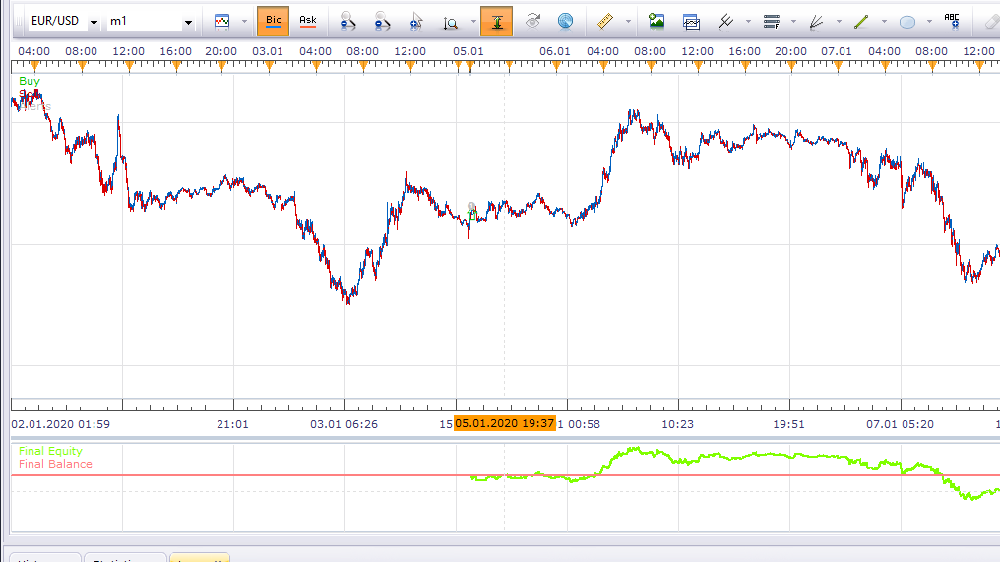

# Moving Average Slow Stochastic Strategy

> Source: https://fxcodebase.com/code/viewtopic.php?f=31&t=70230  
> Forum: 31 · Topic 70230 · 22 post(s)

---

## Moving Average Slow Stochastic Strategy

**Apprentice** · Mon Jul 27, 2020 4:04 pm

Based on request.
[viewtopic.php?f=27&t=70218](https://fxcodebase.com/code/viewtopic.php?f=27&t=70218)

 [Moving Average Slow Stochastic Strategy.lua](files/136327/Moving%20Average%20Slow%20Stochastic%20Strategy.lua)

---

## Re: Moving Average Slow Stochastic Strategy

**minifire18** · Tue Jul 28, 2020 5:27 am

Hi Guys
Thanks for the quick turn around
I seemed to be getting alerts for sells when the buy conditions are met, and buy alerts when the sell conditions are met, can this be checked can you also add two more timeframes to check if the moving average on those timeframes are biased to the signal created. Rules for strategy as follows
**For sells**
Price to be below the MA *on the price chart*
Stochastics K line to have crossed below D line or be already below
Current candle to close lower than previous open *create signal*
**For buys**
Price to be above the MA*on the price chart*
Stochastics K line to have crossed above D line or be already above
Current candle to close higher than previous open *create signal*
Thanks in advance
Minifire

---

## Re: Moving Average Slow Stochastic Strategy

**Apprentice** · Sun Aug 02, 2020 9:04 am

Your request is added to the development list.
Development reference 1818.

---

## Re: Moving Average Slow Stochastic Strategy

**Apprentice** · Mon Aug 03, 2020 11:16 am

[Moving Average Slow Stochastic Strategy.lua](files/136548/Moving%20Average%20Slow%20Stochastic%20Strategy.lua)

Try this version.

---

## Re: Moving Average Slow Stochastic Strategy

**minifire18** · Mon Aug 03, 2020 2:47 pm

Hey Apprentice
Thanks for looking into the alerts seems to be getting the correct alerts now, Can you add a filter in the way of x2 timeframes and moving average for example
trigger chart = 1Hr confirmation timeframe 1 =1D confirmation timeframe 2=4Hr
trigger chart = 1Hr confirmation timeframe 1 =1D confirmation timeframe 2=15min
the conformation timeframes should be biased to the trade, price all to be either above the timeframe moving average for long or price to be below the timeframe moving average for short
thanks in advance
Minifire

---

## Re: Moving Average Slow Stochastic Strategy

**Apprentice** · Fri Aug 07, 2020 4:52 am

Your request is added to the development list.
Development reference 1856.

---

## Re: Moving Average Slow Stochastic Strategy

**Apprentice** · Mon Aug 10, 2020 8:29 am

[Moving Average Slow Stochastic Strategy v3.lua](files/136746/Moving%20Average%20Slow%20Stochastic%20Strategy%20v3.lua)

Try this version.

---

## Re: Moving Average Slow Stochastic Strategy

**carolyne** · Thu Aug 13, 2020 3:19 am

Hello Apprentice
Great addition to the have multiply time frames for confirmation. Can I ask for an adjustment instead of using the MA on the conformation time frames can you take data from the slow stochastic on the confirmation timeframe, the K line to be biased to the strategy timeframe so
For long signals the K line to be above the D line on both confirmation timeframe and
For short signal the K line to be below the D line on both confirmation timeframe
Hope you can help with this request

Thanks

Carolyne

---

## Re: Moving Average Slow Stochastic Strategy

**Apprentice** · Thu Aug 13, 2020 6:15 am

Your request is added to the development list.
Development reference 1884.

---

## Re: Moving Average Slow Stochastic Strategy

**Apprentice** · Tue Sep 01, 2020 3:39 am

[Moving Average Slow Stochastic Strategy v4.lua](files/137213/Moving%20Average%20Slow%20Stochastic%20Strategy%20v4.lua)

Try this version.

---

## Re: Moving Average Slow Stochastic Strategy

**susan61** · Thu Sep 03, 2020 8:10 am

[quote="Apprentice"]

Moving Average Slow Stochastic Strategy v3.lua

Hi Apprentice & Team hope all are safe and well,
Can you add a filter to the Moving Average Slow Stochastics Strategy v3.lua in the way of
 X-RSIOMA  http://fxcodebase.com/code/download/file.php?id=29128
Conditions to be added to strategy timeframe not confirmation timeframes, as well as set conditions already in strategy to add the 
Marsioma to be below the RSI for sells and
Marsioma to be above the RSI for buys.
Thanks in advance Susan

---

## Re: Moving Average Slow Stochastic Strategy

**Apprentice** · Fri Sep 04, 2020 1:56 am

Your request is added to the development list.
Development reference 1972.

---

## Re: Moving Average Slow Stochastic Strategy

**Apprentice** · Mon Sep 07, 2020 3:06 am

[Moving Average Slow Stochastic susan61 Strategy.lua](files/137373/Moving%20Average%20Slow%20Stochastic%20susan61%20Strategy.lua)

Try this version.

---

## Re: Moving Average Slow Stochastic Strategy

**susan61** · Mon Sep 07, 2020 6:56 am

Hi Apprentice & Team,
Thanks for adding the filter but not getting and signals on live charts gives signals and data on back test can you look into this please
Thanks in advance
Susan

---

## Re: Moving Average Slow Stochastic Strategy

**susan61** · Tue Sep 08, 2020 3:12 am

Hi Apprentice
I made a mistake the conditions
Marsioma to be above the RSI for sells
Marsioma to be below the RSI for buys
Sorry for the typo if you can adjust please
Susan

---

## Re: Moving Average Slow Stochastic Strategy

**susan61** · Thu Sep 17, 2020 1:39 am

Hi Apprentice
Can this task be fixed as per conditions
RSI to be below the Marsioma for sells
RSI to be above Marsioma for buys

 as no signals are coming through
thanks in advance
Susan

---

## Re: Moving Average Slow Stochastic Strategy

**Apprentice** · Fri Sep 18, 2020 3:03 am

Your request is added to the development list.
Development reference 2057.

---

## Re: Moving Average Slow Stochastic Strategy

**Apprentice** · Mon Sep 21, 2020 1:18 pm

[Moving Average Slow Stochastic susan61 Strategy.lua](files/137780/Moving%20Average%20Slow%20Stochastic%20susan61%20Strategy.lua)

Try this version.

---

## Re: Moving Average Slow Stochastic Strategy

**susan61** · Mon Sep 28, 2020 2:41 am

Hey Guys,
Still not getting any signals
Susan

---

## Re: Moving Average Slow Stochastic Strategy

**Apprentice** · Mon Sep 28, 2020 4:09 am

Your request is added to the development list.
Development reference 2117.

---

## Re: Moving Average Slow Stochastic Strategy

**Apprentice** · Tue Sep 29, 2020 5:51 am

It trades quite rarely, but it does trade

---

## Re: Moving Average Slow Stochastic Strategy

**susan61** · Wed Sep 30, 2020 3:20 am

Hi Apprentice,
Can you confirm that the X-RSIOMA condition is ONLY on the trigger chart? and not the conformation charts. As when watching live price I can see where i should have had signals
thanks, Susan
