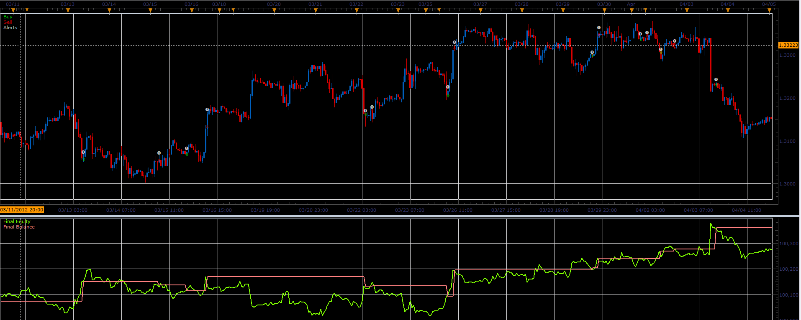

# Moving averages with different timeframes strategy

> Source: https://fxcodebase.com/code/viewtopic.php?f=31&t=16210  
> Forum: 31 · Topic 16210 · 6 post(s)

---

## Moving averages with different timeframes strategy

**Alexander.Gettinger** · Tue Apr 17, 2012 1:19 pm

Strategy based on moving averages with different timeframes ([viewtopic.php?f=17&t=15881](https://fxcodebase.com/code/viewtopic.php?f=17&t=15881)).

BUY condition:
MA with bigger (secondary) timeframe (dots)>MA with current (master) timeframe (line).

SELL condition:
MA with bigger (secondary) timeframe (dots)<MA with current (master) timeframe (line).

 

Download strategy:

 [Diff_TF_MA_Strategy.lua](files/30248/Diff_TF_MA_Strategy.lua)

For this strategy must be installed Averages indicator ([viewtopic.php?f=17&t=2430](https://fxcodebase.com/code/viewtopic.php?f=17&t=2430)).

---

## Re: Moving averages with different timeframes strategy

**luigipg** · Wed Apr 18, 2012 12:31 am

Please give us the possibility to choose the period of both MA (master and secondary). Thank you. Luigi!!!

---

## Re: Moving averages with different timeframes strategy

**Apprentice** · Thu Apr 19, 2012 1:37 am

Your request is added to the development list.

---

## Re: Moving averages with different timeframes strategy

**Alexander.Gettinger** · Wed Jun 13, 2012 10:44 am

> **luigipg wrote:**
> Please give us the possibility to choose the period of both MA (master and secondary). Thank you. Luigi!!!

Please, see this strategy.

Download:

 [Diff_TF_MA_Strategy2.lua](files/35469/Diff_TF_MA_Strategy2.lua)

---

## Re: Moving averages with different timeframes strategy

**luigipg** · Wed Jun 13, 2012 11:59 am

Thanks a lot. All you are very kind. Luigi!!!

---

## Re: Moving averages with different timeframes strategy

**Apprentice** · Mon Dec 05, 2016 9:46 am

Bump up.
