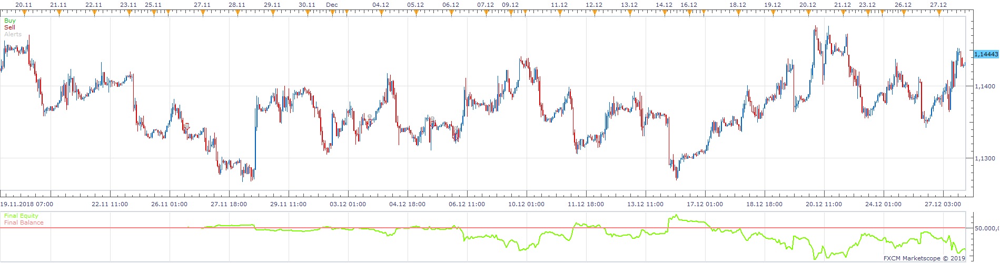

# MTF 3_MA_Cross Strategy

> Source: https://fxcodebase.com/code/viewtopic.php?f=31&t=67322  
> Forum: 31 · Topic 67322 · 4 post(s)

---

## MTF 3_MA_Cross Strategy

**Apprentice** · Mon Feb 04, 2019 10:51 am

Based on request.
[viewtopic.php?f=27&t=11427](https://fxcodebase.com/code/viewtopic.php?f=27&t=11427)

Open Long:
1. ema period 7 > ema period 14> ema period 21 in time frame H4 and
2. ema period 7 > ema period 14> ema period 21 in time frame H8 and
3. ema period 7 > ema period 14> ema period 21 in time frame D1 and
4.ema period 7 cross over ema period 14 and ema period 14 > ema period 21 in H1
Vice versa for Short.

 [MTF 3_MA_Cross Strategy.lua](files/123699/MTF%203_MA_Cross%20Strategy.lua)

---

## Re: MTF 3_MA_Cross Strategy

**MC. Trend Trader** · Wed Feb 06, 2019 8:04 am

Hello,
The strategy gives very many entry signals after the first signal. and I do not want to control it via the Use Position Cap

Open Buy position:
For example, the strategy should only be allowed to open one position when a buy signal is generated, but only if the previous signal was a sell signal.

Open Sell Position:
For example, the strategy should only be allowed to open one position if a sell signal is generated, but only if the previous signal was a buy signal.

I do not want the strategy before a turnaround comes another position opens

Many greetings

---

## Re: MTF 3_MA_Cross Strategy

**Apprentice** · Fri Feb 08, 2019 6:24 am

Your request is added to the development list under Id Number 4463

---

## Re: MTF 3_MA_Cross Strategy

**Apprentice** · Sat Feb 09, 2019 4:57 am

Try this version.

 [MTF 3_MA_Cross Strategy v2.lua](files/123799/MTF%203_MA_Cross%20Strategy%20v2.lua)
