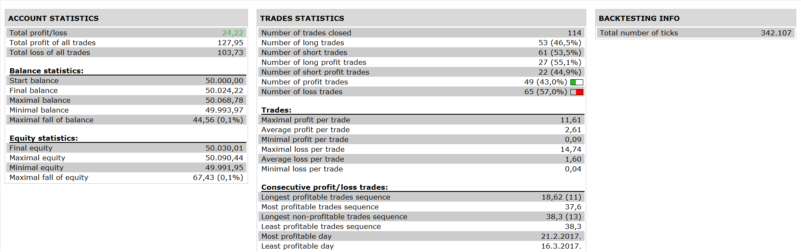

# MTF ADX MACD SF Strategy

> Source: https://fxcodebase.com/code/viewtopic.php?f=31&t=64986  
> Forum: 31 · Topic 64986 · 1 post(s)

---

## MTF ADX MACD SF Strategy

**Apprentice** · Sun Aug 13, 2017 3:56 am

 

Based on the request.
[viewtopic.php?f=27&t=64984](https://fxcodebase.com/code/viewtopic.php?f=27&t=64984)

Open Long
adx > entry level
and signal < buy level
and macd cross over signal
and snake force force up>snake force resistance down

Open Short
adx > entry level
and signal > sell level
and macd cross under signal
and snake force force down < snake force resistance up

 [MTF ADX MACD SF Strategy.lua](files/114134/MTF%20ADX%20MACD%20SF%20Strategy.lua)

SF.lua is available here.
[http://www.fxcodebase.com/code/viewtopi ... 17&t=20166](http://www.fxcodebase.com/code/viewtopic.php?f=17&t=20166)

The Strategy was revised and updated on January 21, 2019.
