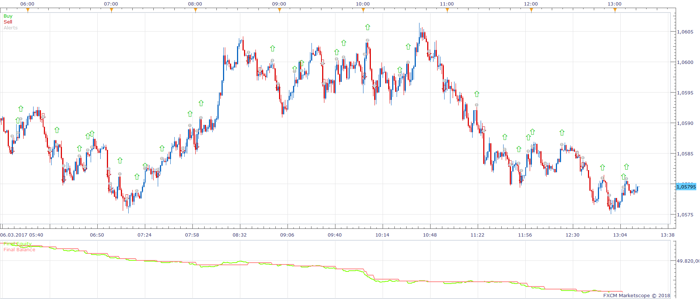
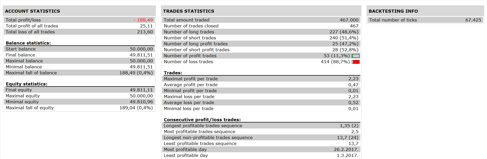

# MTF ANN Strategy Indicator Strategy

> Source: https://fxcodebase.com/code/viewtopic.php?f=31&t=65799  
> Forum: 31 · Topic 65799 · 1 post(s)

---

## MTF ANN Strategy Indicator Strategy

**Apprentice** · Sun Mar 04, 2018 7:19 am

 

Open Long
All three timeframes have Buy indication.
Close Long
First Two timeframes have Sell indication.
Vice Versa for Short

 [MTF ANN Strategy Indicator Strategy.lua](files/117998/MTF%20ANN%20Strategy%20Indicator%20Strategy.lua)

 [Modified ANN Strategy Indicator Strategy.lua](files/117998/Modified%20ANN%20Strategy%20Indicator%20Strategy.lua)

ANN Strategy Indicator.lua is available here.
[viewtopic.php?f=17&t=65182](https://fxcodebase.com/code/viewtopic.php?f=17&t=65182)
