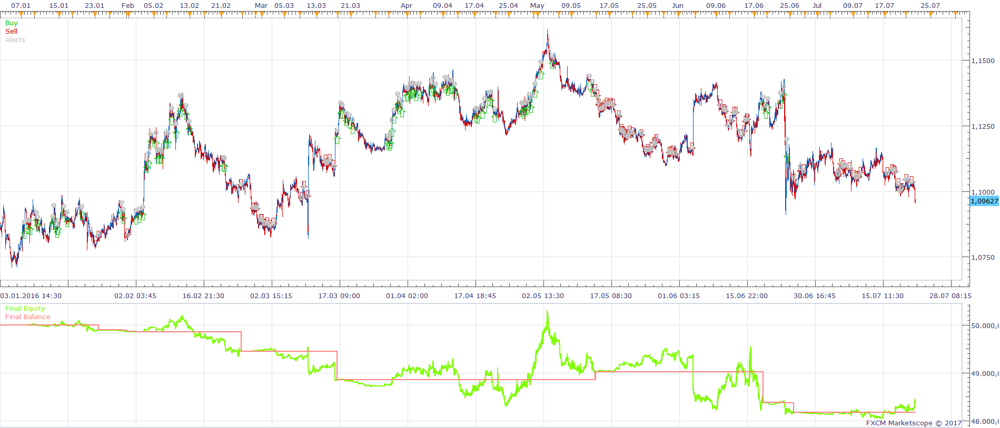
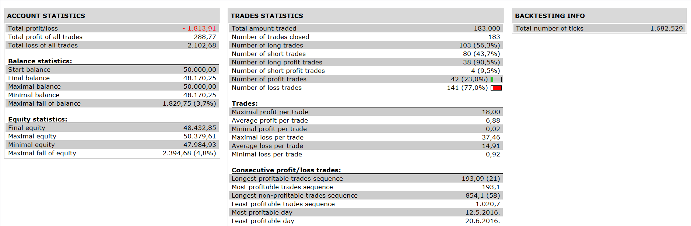

# MTF Bulls bears strategy

> Source: https://fxcodebase.com/code/viewtopic.php?f=31&t=64615  
> Forum: 31 · Topic 64615 · 5 post(s)

---

## MTF Bulls bears strategy

**Apprentice** · Sun Apr 23, 2017 3:22 pm

 

Open Long
bull and bear indicator> 0 in h4 and d1 and it cross over 0 in m15

Open Short
bull and bear indicator< 0 in h4 and d 1 and it cross under 0 in m15

 [MTF Bulls bears strategy.lua](files/112107/MTF%20Bulls%20bears%20strategy.lua)

Bulls bears indicator is available here.
[viewtopic.php?f=17&t=64613](https://fxcodebase.com/code/viewtopic.php?f=17&t=64613)

The Strategy was revised and updated on January 19, 2019.

---

## Re: MTF Bulls bears strategy

**fxlion** · Sun Apr 23, 2017 9:30 pm

THANKS APPRENDICE.
KINDLY UPLOAD THE STRATEGY.

---

## Re: MTF Bulls bears strategy

**Apprentice** · Mon Apr 24, 2017 3:46 am

Added.

---

## Re: MTF Bulls bears strategy

**fxlion** · Mon Apr 24, 2017 8:44 am

I AM GETTING FOLLOWIG ERROR MESSAGE WHEN RUNNING THE STRATEGY

C:/Program Files/Candleworks/FXTS2/strategies/standard/include/helperAlert.lua:86: attempt to index local 'source' (a nil value)

---

## Re: MTF Bulls bears strategy

**Apprentice** · Mon Apr 24, 2017 12:37 pm

I failed to reproduce,
I used Backtester & Simulator.
