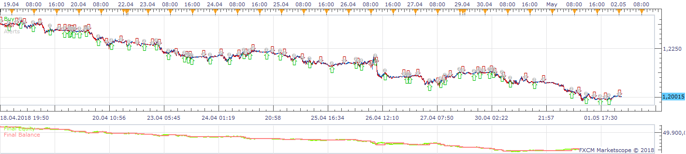
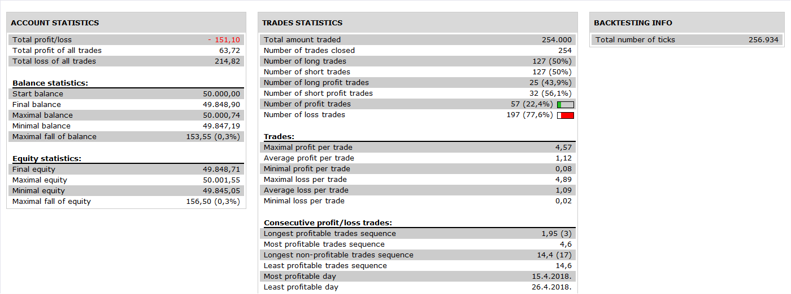
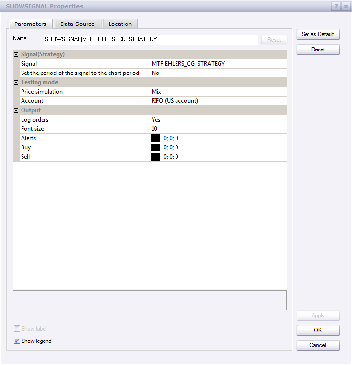

# MTF Ehlers_CG Strategy

> Source: https://fxcodebase.com/code/viewtopic.php?f=31&t=2419  
> Forum: 31 · Topic 2419 · 8 post(s)

---

## MTF Ehlers_CG Strategy

**Apprentice** · Fri Oct 15, 2010 5:27 pm

 

 

This strategy gives a signal when four time frame MTF Ehlers_CG give the same indication.

 

This signal is used four different time frames.
For this reason, you must set Set the period of the signal to chart option to NO.

Also download Ehlers CG Oscillator
[viewtopic.php?f=17&t=1262&p=2398&hilit=ehlers#p2398](https://fxcodebase.com/code/viewtopic.php?f=17&t=1262&p=2398&hilit=ehlers#p2398)

 [MTF EHLERS_CG Strategy.lua](files/5252/MTF%20EHLERS_CG%20Strategy.lua)

---

## Re: MTF Ehlers_CG Strategy

**raychan** · Sun May 29, 2011 6:52 pm

I like this strategy and am using it. However, there seems a bug that I can't use sound alert. Can you please fix it? Thanks.

---

## Re: MTF Ehlers_CG Strategy

**Apprentice** · Mon May 30, 2011 11:54 am

Problem solved.

---

## Re: MTF Ehlers_CG Strategy

**raychan** · Mon May 30, 2011 6:14 pm

Many thanks. Its fixed and working great.

---

## Re: MTF Ehlers_CG Strategy

**mosesnobleraj** · Sat Jun 04, 2011 6:59 am

Sir,
can you add email alert with this golden strategy

---

## Re: MTF Ehlers_CG Strategy

**MartinMyster** · Mon Jun 06, 2011 5:36 am

Hi All,

How did you get the heat map ?

BR

---

## Re: MTF Ehlers_CG Strategy

**Apprentice** · Wed Nov 30, 2016 8:18 am

Bump up.

---

## Re: MTF Ehlers_CG Strategy

**Apprentice** · Sun Nov 18, 2018 9:36 am

The Strategy was revised and updated on November 18. 2018.
