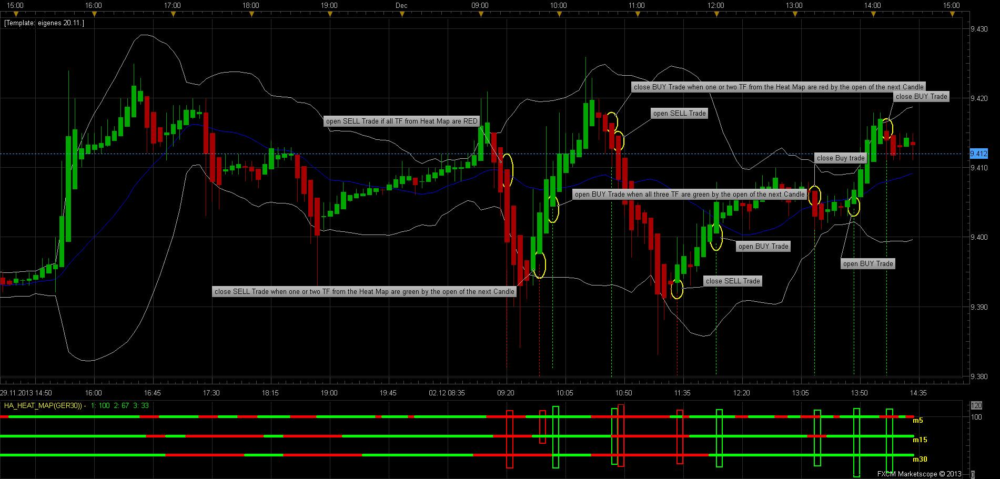

# MTF HA Strategy

> Source: https://fxcodebase.com/code/viewtopic.php?f=31&t=24198  
> Forum: 31 · Topic 24198 · 24 post(s)

---

## MTF HA Strategy

**Apprentice** · Mon Oct 08, 2012 11:24 am

Long
All Selected Time Frames must have Long indication.
Short
All Selected Time Frames must have Short indication.

Exit (optinal)

Cumulative (All Selected)
Exit Long
If the sum of opposite indication, for all selected time frames, greater than or equal to Long Exit Limit .

Exit Short
If the sum of opposite indication, for all selected time frames, greater than or equal to Short Exit Limit .

Single Time Frame (Any Selected)
Exit Long
If Any selected time frame have oposite indication.
Exit Short
If Any selected time frame have oposite indication.

 [MTF HA Strategy.lua](files/41632/MTF%20HA%20Strategy.lua)

---

## Re: MTF HA Strategy

**efoxlau** · Sat Nov 24, 2012 7:19 am

Hi,

Thanks for the nice job. Would you please explain what is "Long Exit Limit"?

Thanks

William

---

## Re: MTF HA Strategy

**Apprentice** · Sun Nov 25, 2012 5:44 am

if "Long Exit Limit" is set to one.
behaves as a Single Time Frame Exit.

If it is a set of two
Two time frames, must be contradictory to Long.
and so on.

---

## Re: MTF HA Strategy

**lisa_baby_xx** · Tue Nov 27, 2012 10:59 am

I wish to trade on H1 charts while using MTF HA Strategy to place trades.

The problem is the strategy does not reflect what the indicator is displaying.
If you could take a look I would be most great-full.
I have attached a screenshot, I hope it will help.

Much Love.
X
lisa.

---

## Re: MTF HA Strategy

**amazon1a** · Fri Nov 30, 2012 12:16 pm

Hi Apprentice, I really like this Strategy. I trade the Daily and H4 TFs. Is it possible to modify the choice for Multiple trades to allow for more than 1 but fewer than 5(or more?) trades so that we are opening new trades at the beginning of the move and not towards the end? Also, is it possible to combine this Strategy with another simple Trend filter - perhaps MVA or RSI etc? Whichever would be the easiest to put together.

---

## Re: MTF HA Strategy

**Apprentice** · Sat Dec 01, 2012 5:14 am

Your request is added to the development list.

---

## Re: MTF HA Strategy

**cengineer** · Mon Apr 15, 2013 3:16 pm

Hi Apprentice

i like this strategy, too.

it would be great, if the entries and exits were at the moment when the selected timeframes
changes the direction (red/green)for the first time (close).

at my tests the entries and exits were often to late.....(selected timeframes green or red over 4-8candles)

much thanks and sorry for my bad english
cengineer

---

## Re: MTF HA Strategy

**Apprentice** · Wed Apr 17, 2013 2:04 am

Your request is added to the development list.

---

## Re: MTF HA Strategy

**coldplay70** · Mon Dec 02, 2013 9:13 am

Hello Apprentice, this is a nice strategy, but the results on my Backtesting were very bad! I think the fault is in the Backtesting Settings! I only can change the Timeframes from the Heat Map, but not the Timeframe I see on my Chart! For Example: If I have opened my chart in Timeframe 5 Minutes, I could insert the Heat Map in Timeframes 5, 15,30,H1, D1 Minutes and so on. I have attached a Screenshot with an example how the strategy could show some better results. Here are the Parameters for my Strategy:

Conditions for a BUY Trade:
1. All selected Timeframes (5,15,30) in the Heikin Ashi Heat Map are changed into green.
2. Enter a BUY Trade, with the opening Price of the next Candle.
2. Exit a BUY Trade, if the First (5 Minutes) Timeframe in the HA Heat Map has closed in red when the next Candle opened or all selected Timframes has closed in red when the next Candle opened.

Conditions for a SELL Trade:
1. All selected Timeframes (5,15,30) in the Heikin Ashi Heat Map are changed into red.
2. Enter a SELL Trade, with the opening Price of the next Candle.
2. Exit a SELL Trade, if the First (5 Minutes) Timeframe in the HA Heat Map has closed in green when the next Candle opened or all selected Timframes has closed in green when the next Candle opened.

The advantage of these Entry/Exit Rules are:
1. The Strategy enters Trades first, when they are confirmed by the HA Heat Map.
2. The Heat Map could work so as a Filter.
3. I hope the quality of the signals are much better and the Performance Results in Backtesting are much better.

For example, please see the attached Screenshot!Ihope you change these Parameters and I could work with it for sucessfull trading.

Best regards
Coldplay70

 

---

## Re: MTF HA Strategy

**Apprentice** · Tue Dec 03, 2013 3:47 am

Your request is added to the development list.

---

## Re: MTF HA Strategy

**amazon1a** · Wed Jan 22, 2014 10:23 pm

Hi Apprentice,

Could you add features to this strategy that would:

1) Permit a limit to the number of trades in either direction

2) Provide for a Trend filter

Reference: [viewtopic.php?f=31&t=31552](https://fxcodebase.com/code/viewtopic.php?f=31&t=31552)

Thanks, AG

---

## Re: MTF HA Strategy

**Apprentice** · Sat Jan 25, 2014 3:52 am

Your request is added to the development list.

---

## Re: MTF HA Strategy

**Jacques** · Thu Jan 30, 2014 9:33 pm

Hi Apprentice.

Thanks for such awesome strategy. I'd like to request a HA Heat Map indicator based on this strategy with up to 5 selectable time frame. Seems like I can't depend on bot too much and want to try analyze manually.

Thanks for your help.

Best regards,
Jacques

---

## Re: MTF HA Strategy

**Jacques** · Thu Jan 30, 2014 9:45 pm

Seems like there's a HA Heat Map already. PLease ignore my previous post requesting HA Heat Map. Sorry for the trouble.

Best regards,
Jacques

---

## Re: MTF HA Strategy

**moomoofx** · Mon Feb 17, 2014 6:06 am

Hi All,

- Added a "Position Limit" parameter which restricts the number of positions in each direction. Zero for unlimited. Make sure Allow Multiple is on.
- Added an moving average Trend Filter that can have a custom timeframe if required.

Cheers,
MooMooFX

---

## Re: MTF HA Strategy

**amazon1a** · Tue Mar 04, 2014 10:44 am

Hi MooMoo,

Could you add a Custom ID to this strategy as I would like to be able to run more than one instance on the same instrument if possible.

Also, can you add the option to choose an Entry vs Market order with pips selected as in:

Reference: viewtopic.php?f=31&t=31552. Now when I fill in the Custom ID field, it stops taking orders beyond my specified limit - thanks so much.

Many thanks for all your good work, AG

---

## Re: MTF HA Strategy

**Apprentice** · Thu Mar 06, 2014 3:02 am

Your request is added to the development list.

---

## Re: MTF HA Strategy

**moomoofx** · Sat May 31, 2014 1:21 am

Hi,

New version.

 [MTF HA Strategy.lua](files/94223/MTF%20HA%20Strategy.lua)

Changes:
- Fixed Sell Signal alert when AllowTrade is false.
- Added CustomID parameter
- Added CloseOnOpposite
- Added Entry Order or Market Order support.

All functionality ported over from Highly Adaptable RSI Strategy ([viewtopic.php?f=31&t=31552](https://fxcodebase.com/code/viewtopic.php?f=31&t=31552))

Cheers,
MooMooFX

---

## Re: MTF HA Strategy

**zoltanh** · Fri Dec 05, 2014 6:10 am

Hi MooMoo,

this strategy is great!
I just wonder if a version could be created which works the same way but using Heikin Ashi Smoothed (HASM) instead of the normal HA indicator?

thanks in advance,
zoltan

---

## Re: MTF HA Strategy

**moomoofx** · Fri Dec 05, 2014 9:52 pm

Added to the to-do list.

Cheers,
MMFX

---

## Re: MTF HA Strategy

**Apprentice** · Wed Jan 31, 2018 9:40 am

The strategy was revised and updated.

---

## Re: MTF HA Strategy

**Reymondpolanco** · Sun May 12, 2019 11:40 am

> **moomoofx wrote:**
> Hi,
>
> New version.
>
>
>
> MTF HA Strategy.lua
>
>
>
> Changes:
> - Fixed Sell Signal alert when AllowTrade is false.
> - Added CustomID parameter
> - Added CloseOnOpposite
> - Added Entry Order or Market Order support.
>
> All functionality ported over from Highly Adaptable RSI Strategy ([viewtopic.php?f=31&t=31552](https://fxcodebase.com/code/viewtopic.php?f=31&t=31552))
>
> Cheers,
> MooMooFX

Can you add the option to put the trades in breakeven when reach X quatity of points?

---

## Re: MTF HA Strategy

**Apprentice** · Tue May 21, 2019 9:06 am

Your request is added to the development list under Id Number 4672

---

## Re: MTF HA Strategy

**Apprentice** · Wed May 22, 2019 3:46 am

Try this version.

 [MTF HA Strategy_2.lua](files/126475/MTF%20HA%20Strategy_2.lua)
