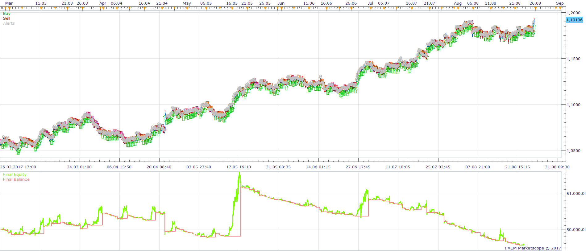
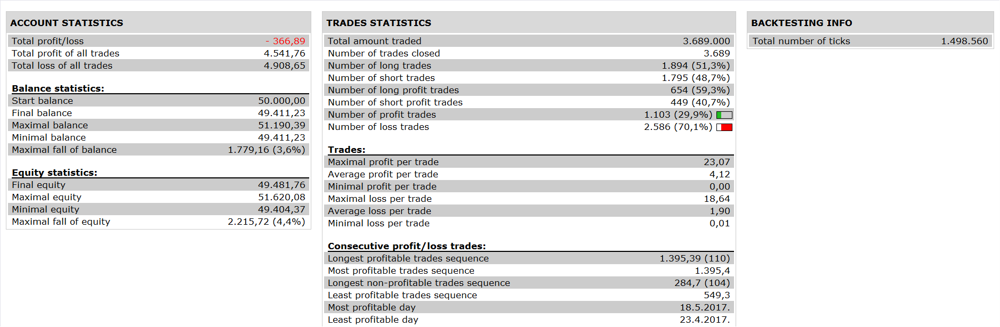

# MTF MVA PSAR STRATEGY

> Source: https://fxcodebase.com/code/viewtopic.php?f=31&t=65352  
> Forum: 31 · Topic 65352 · 3 post(s)

---

## MTF MVA PSAR STRATEGY

**Apprentice** · Fri Nov 10, 2017 6:19 am

 

Based on the request.
[viewtopic.php?f=27&t=65350](https://fxcodebase.com/code/viewtopic.php?f=27&t=65350)

Open Long:
1. price > psar(m5)
2.ema 5(m5) > ema 11(m5)
3.ema 50(h1)>ema 200(h1)
4.price cross over ema 5(m5)

Open Short
1. price < psar(m5)
2.ema 5(m5) < ema 11(m5)
3.ema 50(h1) < ema 200(h1)
4.price cross under ema 5(m5)

 [MTF MVA PSAR STRATEGY.lua](files/115984/MTF%20MVA%20PSAR%20STRATEGY.lua)

The Strategy was revised and updated on January 21, 2019.

---

## Re: MTF MVA PSAR STRATEGY

**cash4u** · Fri Nov 10, 2017 11:20 am

hi appredice ,

thanks for creating strategy..
i am getting following error
, MTFMVAPSARS	C:/Program Files/Candleworks/FXTS2/strategies/standard/include/helperAlert.lua:86: attempt to index local 'source' (a nil value)	11/10/2017 09:27:13

---

## Re: MTF MVA PSAR STRATEGY

**Apprentice** · Sat Nov 11, 2017 1:22 am

Fixed.
