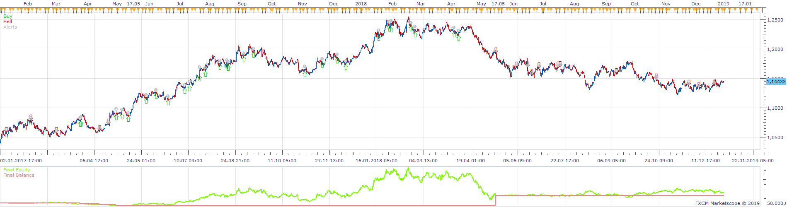
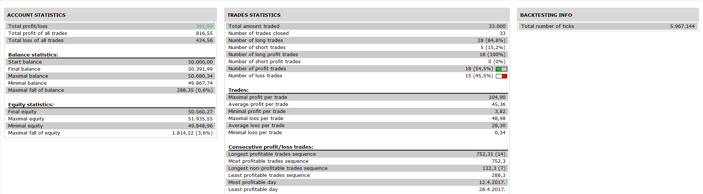

# MTF RSI CCI Strategy

> Source: https://fxcodebase.com/code/viewtopic.php?f=31&t=68324  
> Forum: 31 · Topic 68324 · 1 post(s)

---

## MTF RSI CCI Strategy

**Apprentice** · Fri Apr 12, 2019 7:01 am

 

Based on request.
[viewtopic.php?f=27&t=68319](https://fxcodebase.com/code/viewtopic.php?f=27&t=68319)

Open Long
RSI above 50
CCI cross over oversold
Price[CCI cross over oversold] > Price [CCI cross under oversold ]
ADX > ADX Level
Rex > Signal
Viceversa for Short

 [MTF RSI CCI Strategy.lua](files/125692/MTF%20RSI%20CCI%20Strategy.lua)

You can download Rex.lua here.
[viewtopic.php?f=17&t=24005](https://fxcodebase.com/code/viewtopic.php?f=17&t=24005)
