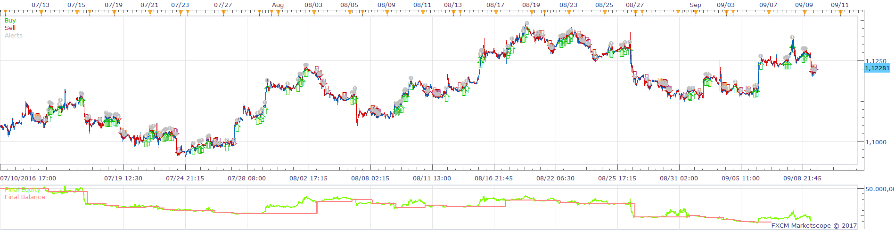
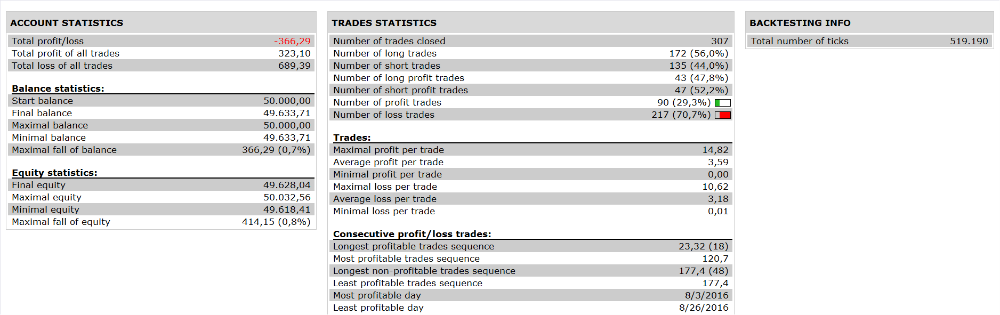

# MTF Shadow TSI Strategy

> Source: https://fxcodebase.com/code/viewtopic.php?f=31&t=64294  
> Forum: 31 · Topic 64294 · 2 post(s)

---

## MTF Shadow TSI Strategy

**Apprentice** · Fri Jan 13, 2017 6:51 am

 

Open Long
1.tsi > ma1 and ma1> ma 2 and ma2> buy level in h1
2. ma2> buy level in m15 and ma1<ma2 and tsi cross over ma1

Open Short
1 tsi < ma1 and ma1<ma2 and ma2< sell level in h1
2. ma2< sell in m15 and ma1>ma2 and tsi cross under ma1

 [MTF Shadow TSI Strategy.lua](files/110499/MTF%20Shadow%20TSI%20Strategy.lua)

Shadow TSI is available here.
[viewtopic.php?f=17&t=63466](https://fxcodebase.com/code/viewtopic.php?f=17&t=63466)

---

## Re: MTF Shadow TSI Strategy

**Apprentice** · Wed Jan 31, 2018 6:40 am

The strategy was revised and updated.
