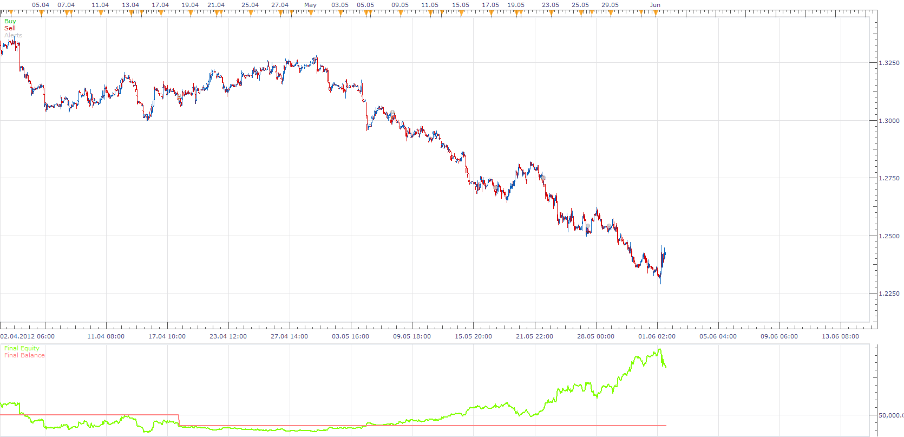

# MTF SNAKE FORCE STRATEGY

> Source: https://fxcodebase.com/code/viewtopic.php?f=31&t=23619  
> Forum: 31 · Topic 23619 · 6 post(s)

---

## MTF SNAKE FORCE STRATEGY

**Apprentice** · Thu Sep 20, 2012 1:12 pm

Long
FORCE UP >TOP LEVEL on H1
AND RESISTANCE DOWN CROSS OVER BOTTOM LEVEL on H1
AND 2.FORCE UP > TOP LEVEL on D1
AND RESISTANCE DOWN = 0 on D1

Short
FORCE DOWN <BOTTOM LEVEL on H1
AND RESISTANCE UP CROSS UNDER TOP LEVEL on H1
AND FORCE DOWN < BOTTOM LEVEL on D1
AND RESISTANCE UP =0 on D1

 [MTF Snake force Strategy.lua](files/40652/MTF%20Snake%20force%20Strategy.lua)

You can download SF.lua indicator from here.
[http://www.fxcodebase.com/code/viewtopi ... 17&t=20166](http://www.fxcodebase.com/code/viewtopic.php?f=17&t=20166)

The Strategy was revised and updated on December 09, 2018.

---

## Re: MTF SNAKE FORCE STRATEGY

**Apprentice** · Wed Dec 07, 2016 5:27 am

Strategy has been revised and updated.

---

## Re: MTF SNAKE FORCE STRATEGY

**AlexanderS** · Tue Sep 14, 2021 4:24 am

HI
entry its to late ?

---

## Re: MTF SNAKE FORCE STRATEGY

**Apprentice** · Tue Sep 14, 2021 8:44 am

Will review it.

Your request is added to the development list.
Development reference 826.

---

## Re: MTF SNAKE FORCE STRATEGY

**Apprentice** · Tue Sep 14, 2021 11:39 am

Try it now.

---

## Re: MTF SNAKE FORCE STRATEGY

**AlexanderS** · Wed Sep 15, 2021 4:03 am

NO SORRY
