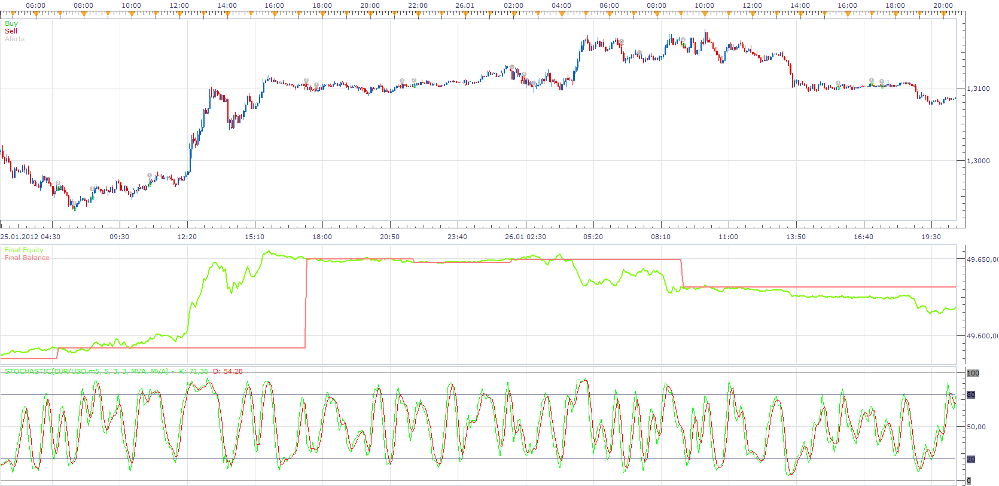

# MTF Stochastic Strategy

> Source: https://fxcodebase.com/code/viewtopic.php?f=31&t=13889  
> Forum: 31 · Topic 13889 · 23 post(s)

---

## MTF Stochastic Strategy

**Apprentice** · Thu Feb 23, 2012 9:31 am

Bullish signal when:

1.	Stochastic k>d in m30 and k< over bought level {80}{and}
2.	Stochastic k>d in m15 and k< over bought level {80}{and}
3.	Stochastic k / d Crossover in m5 and k< over bought level {80}{and}

Bearish signal when:

1.	Stochastic k<d in m30 and k> over sold level{20}
2.	stochastic k<d in m15 and k>over sold level{20}
3.	stochastic k / d CrossUnder in m5 and k>over sold level{20}

 [MTF Stochastic Strategy.lua](files/26688/MTF%20Stochastic%20Strategy.lua)

---

## Re: MTF Stochastic Strategy

**Phil_HK** · Wed Mar 07, 2012 8:05 pm

Apprentice,
Just what I'm looking for, but is it possible to add a Price range (eg Price +/- 20 Pips) for this cross to happen in for entry?

Also possible to increase the timeframes up to 'H2'?

---

## Re: MTF Stochastic Strategy

**Apprentice** · Thu Mar 08, 2012 6:00 am

Price range equals to Bar Range ? Yes.
"H2" Yes, Just select desired time frame from the strategy menu.

---

## Re: MTF Stochastic Strategy

**Phil_HK** · Mon Mar 12, 2012 9:16 pm

Apprentice,
Price range was 1.3100 for example with 20 pips +/- so it covers 1.3080 to 1.3120

---

## Re: MTF Stochastic Strategy

**Apprentice** · Sun Dec 04, 2016 8:19 am

Bump up.

---

## Re: MTF Stochastic Strategy

**arfs9090** · Thu Oct 25, 2018 11:06 pm

Great strategy, was wondering if could be able to add conformation filter for all 3 time frames for price to closed through MVA for entrys and possible another filter to exit trades these MVA would be able to adjust to market conditions and different markets

 Like you have x3 timeframes and able to adjust the overbought/ sold % would like to act as conformation alert when a candle closed through a MVA (would need to be able to adjust what MVA works best) this would be on all timeframes (be able choose all 3 of the timeframes or disable the ones not required for the conformation),So if price is at overbought area on the 3 timeframes and price closes through the MVA would alert you sell and same if at oversold area on the 3 timeframes and price closes through the MVA would alert you buy,and you not sure it can be done to have a filter again price closed through MVA whilst in the trade so not necessary be at overbought/sold
Thanks Arf
--

---

## Re: MTF Stochastic Strategy

**Apprentice** · Fri Oct 26, 2018 4:33 am

You mean, when the price is higher than MA (for a long) and vice versa

---

## Re: MTF Stochastic Strategy

**arfs9090** · Fri Oct 26, 2018 4:39 am

yes that's correct
Arf

---

## Re: MTF Stochastic Strategy

**Apprentice** · Fri Oct 26, 2018 4:57 am

Your request is added to the development list under Id Number 4278

---

## Re: MTF Stochastic Strategy

**Apprentice** · Fri Oct 26, 2018 7:12 am

Try this version.

 [MTF Stochastic Strategy_2.lua](files/121778/MTF%20Stochastic%20Strategy_2.lua)

---

## Re: MTF Stochastic Strategy

**arfs9090** · Mon Oct 29, 2018 11:30 am

> **Apprentice wrote:**
> Try this version.
>
>
> MTF Stochastic Strategy_2.lua

Hi Apprentice is it possible to add some more filters on [download/file.php?id=22541strategy](http://www.fxcodebase.com/code/download/file.php?id=22541strategy) 2 as been getting fake signals
1. A take profit and stop loss using the ATR pip indicator
 2. Also a mange filter (MVA) if in profit, conformation when to the strategy is showing signs of failing.
3. Also a filter (EMA) when Price retraces to a higher t-frame EMA for the area you are looking at and be able to turn and off and the strategy would only start showing alerts when this has been achieved
Price retraces to a higher t-frame EMA on lower t-frame creating the conformation and not having waiting for higher t-frame candle to close for conformation, the strategy and would only start showing alerts only when this has been achieved. And would disable the retracement part to the strategy, when strategy started cycle, this would need to be able to change as price moves past higher t-frame as been getting fake signals noticed getting alert from strategy when the stochastic are not at overbought/sold parameters
Possible something like this strategy
[download/file.php?id=6198](http://www.fxcodebase.com/code/download/file.php?id=6198) as in this topic
 I noticed it’s at close of candle could it be to touch that area and not have to wait for higher t-frame to close
The ATR would be for TP & SL and the setting for each TP & SL able to set timeframe and over what period (how many candles to calculate).
 To add this indicator into the strategy
 [download/file.php?id=4232](http://www.fxcodebase.com/code/download/file.php?id=4232)
And the mange profit to exit trade before getting to TP if started to give signals of a reversal would be same the conformation to enter the trade but box would be listed exit confirm this would again have setting for all 3 timeframes and be able to disable what is not needed
 If so would all that info come in the pop up box
 Symbol Time Direction,Entry ,Stop loss and Take profit
 Example: 5.55PM GBP/USD Short 14000 SL 14100 TP 13750
hope this clear
and would just like to say thanks what you have done already
arf

---

## Re: MTF Stochastic Strategy

**Apprentice** · Tue Oct 30, 2018 5:04 pm

Your request is added to the development list under Id Number 4292

---

## Re: MTF Stochastic Strategy

**arfs9090** · Wed Oct 31, 2018 5:05 am

> **Apprentice wrote:**
> Your request is added to the development list under Id Number 4292

Thanks and can you please look into the stochastic part of the strategy as alerts are coming before all three t-frames are at the set parameters all in sync

Thanks again

---

## Re: MTF Stochastic Strategy

**Apprentice** · Wed Oct 31, 2018 7:33 am

[MTF Stochastic Strategy.arfs9090.lua](files/121893/MTF%20Stochastic%20Strategy.arfs9090.lua)

Done, only part one (ATR stop/limit).

> 2. Also a mange filter (MVA) if in profit, conformation when to the strategy is showing signs of failing.

How it should work? If we already have a position and it is in a profit and there are signs of falling (how to identify them?) then we should check for the additional filter for the new signals?

> 3. Also a filter (EMA) when Price retraces to a higher t-frame EMA for the area you are looking at and be able to turn and off and the strategy would only start showing alerts when this has been achieved
> Price retraces to a higher t-frame EMA on lower t-frame creating the conformation and not having waiting for higher t-frame candle to close for conformation, the strategy and would only start showing alerts only when this has been achieved. And would disable the retracement part to the strategy, when strategy started cycle, this would need to be able to change as price moves past higher t-frame as been getting fake signals noticed getting alert from strategy when the stochastic are not at overbought/sold parameters
> Possible something like this strategy
> download/file.php?id=6198 as in this topic
> I noticed it’s at close of candle could it be to touch that area and not have to wait for higher t-frame to close

I'm not sure what he means by "area you are looking at". It looks like it is impossible to implement.

> And the mange profit to exit trade before getting to TP if started to give signals of a reversal would be same the conformation to enter the trade but box would be listed exit confirm this would again have setting for all 3 timeframes and be able to disable what is not needed
> If so would all that info come in the pop up box
> Symbol Time Direction,Entry ,Stop loss and Take profit
> Example: 5.55PM GBP/USD Short 14000 SL 14100 TP 13750

I need a definition of "signals of a reversal"

---

## Re: MTF Stochastic Strategy

**arfs9090** · Wed Oct 31, 2018 10:12 am

Re; Managing a trade in profit so if the stochastic in the strategy plan is getting to a overbought in a uptrend in a current open position long and and 50 pts away from TP and same for a oversold in downtrend in a current open position short again 40pts away from TP according to parameters set in the strategy and price closes through MVA in a reverse would alert possible trend reversal and pop up box alert would say Exit confirmed

re; So if the 3 t-frames in the strategy plan was 1d & 8hr and 4hr the filter in way of EMA would retrace back to weekly 20 ema this would need to be able to change as price moves and able to set to different t-frames and different ema 's alerts to only begin once this part of the strategy was achieved and be able to turn this filter off

Can you also please look into the stochastic part of the strategy as alerts are coming before all three t-frames are at the set parameters all in sync
Re; need a definition of "signals of a reversal"
Basically the same signals to alert you to get into trade will alert you to exit trade if not reached expected TP level and reaching the overbought /sold parameters set in the strategy

are you able to do the pop up alert box as per:
pop up box
 Symbol Time Direction,Entry ,Stop loss and Take profit
 Example: 5.55PM GBP/USD Short 14000 SL 14100 TP 13750
and if the alert would display the potential trade opportunity on chart as in a red box for the stop loss area and a green box for the take profit according to the ATR levels set this would display to end of day.
I have downloaded new atr filter look how i expected will see how it responds to the charts
hope you understand what i am trying to achieve
thanks so much
arfs

---

## Re: MTF Stochastic Strategy

**Apprentice** · Sat Nov 03, 2018 5:08 am

Your request is added to the development list under Id Number 4297

---

## Re: MTF Stochastic Strategy

**arfs9090** · Sat Nov 03, 2018 8:20 am

> **Apprentice wrote:**
> Your request is added to the development list under Id Number 4297

Hi Apprentice Hope this clarifies your previous response and queries dated 31/10/18

keep getting the false reversal signal, when the candle closes through it, regardless if it’s a reversal candle, for example: stochastic at overbought and previous candle closes above MVA as a buyers candle the alert for strategy comes up down trend, Is the setting to the close of the candle? If not, can it be changed to at close?

Sorry to add to the plan, but it is not recognising if it’s a buyers or sellers candle. Can you add a fast & slow EMA crossover as secondary confirmation? (this is already on the platform MA/EMA crossover, this to be added to all 3 t-frames)

Can this be done, as well of having that as a confirmation of the MVA could use the crossover of a fast and slow EMA? This again would be set to all t-frames and would be able to disable the t-frame if not required, Only when both the fast & slow EMA crossover and closed candle through the MVA and stochastics at OB/OS setting would the strategy recognise

And if the retracement (key Reversal) filter is added that would need to be achieved 1st. This would be in a parameters setting of its own (as price needs to retrace to a higher t-frame EMA) (this is on the platform MA/EMA key reversal already)

Can the stochastic only recognise a reversal trigger at OB/OS areas on each t-frame?

There are 4 conditions to the strategy which will need to appear as available options in each of the four condition boxes and should have prioritisation as listed below:
Each Condition box list of the 4 requirements For example:
Condition 1 MA crossover
Condition 2 Key reversal
Condition 3 Stochastic
Condition 4 Closed MVA
So in condition boxes 1-4 would have a drop down box giving you the 4 options and only when all 4 conditions are met would then alert pop up and calculate the potential trade

What I am trying to achieve from the ATR is for it to automatically calculate the potential trade with the information entered on the parameters of the ATR from the price the alert shows up and if can display on chart as in a red box for the stop loss area and a green box for the take profit on chart to end of day

pop up box
Symbol Time Direction, Entry, Stop loss and Take profit
Example: 5.55PM GBP/USD Short 14000 SL 14100 TP 13750

Hope you can help
Many Thanks Arf

---

## Re: MTF Stochastic Strategy

**Apprentice** · Mon Nov 05, 2018 6:09 am

> Re; Managing a trade in profit so if the stochastic in the strategy plan is getting to a overbought in a uptrend in a current open position long and and 50 pts away from TP and same for a oversold in downtrend in a current open position short again 40pts away from TP according to parameters set in the strategy and price closes through MVA in a reverse would alert possible trend reversal and pop up box alert would say Exit confirmed

But there could be 3 sets of indicators. Should we check them all? Should they all show is signal or just one? I've implemented this check for the first indicator only.

> re; So if the 3 t-frames in the strategy plan was 1d & 8hr and 4hr the filter in way of EMA would retrace back to weekly 20 ema this would need to be able to change as price moves and able to set to different t-frames and different ema 's alerts to only begin once this part of the strategy was achieved and be able to turn this filter off

Should we add another EMA with its own timeframe? And when the price below/above this EMA we should filter out long/short signals?

> Can you also please look into the stochastic part of the strategy as alerts are coming before all three t-frames are at the set parameters all in sync

Please, make sure that "Use This Time Frame" is turned on.

> and if the alert would display the potential trade opportunity on chart as in a red box for the stop loss area and a green box for the take profit according to the ATR levels set this would display to end of day.

he strategy can't draw on the chart. We can make a dedicated indicator for drawing that.

> keep getting the false reversal signal, when the candle closes through it, regardless if it’s a reversal candle, for example: stochastic at overbought and previous candle closes above MVA as a buyers candle the alert for strategy comes up down trend, Is the setting to the close of the candle? If not, can it be changed to at close?

Can you clarify it?

> And if the retracement (key Reversal) filter is added that would need to be achieved 1st.

Are you talking about this indicator? [viewtopic.php?f=17&t=63114](https://fxcodebase.com/code/viewtopic.php?f=17&t=63114)

 [MTF Stochastic Strategy.arfs9090.lua](files/121961/MTF%20Stochastic%20Strategy.arfs9090.lua)

---

## Re: MTF Stochastic Strategy

**arfs9090** · Wed Nov 07, 2018 8:26 am

Hi Apprentice as my last post request i thought the key reversal would help me define a retracement area but on looking how the alert comes is basically a change in price direction (hence the strategy name) is it possible to take this condition out and just add a price alert to the strategy in its own stand-alone box and strategy to start when price has been achieved and or a higher t-frame EMA for long /Short signals if able to add price alert and higher t-frame EMA can both be in same stand - alone box

 Should we add another EMA with its own timeframe? And when the price below/above this EMA we should filter out long/short signals? YES

 Keep getting these error codes and then stops strategy

C:/Program Files (x86)/Candleworks/FXTS2/Strategies/Custom/MTF Stochastic Strategy.arfs9090.lua:350: attempt to index field 'ConfirmIndi' (a nil value)	07/11/2018 10:09:01

C:/Program Files (x86)/Candleworks/FXTS2/Strategies/Custom/MTF Stochastic Strategy.arfs9090.lua:357: attempt to index field 'ConfirmIndi' (a nil value) 07/11/2018 08:25:00

and the the order of conditions entered in condition list box and only then would show potential trade using atr info and display on screen
sorry for all the confusion on my explanations on my part and not checking what the key-reversal strategy done before asking you to add (my bad)

Many thanks Arf

---

## Re: MTF Stochastic Strategy

**Apprentice** · Sun Nov 11, 2018 5:44 am

Your request is added to the development list under Id Number 4309

---

## Re: MTF Stochastic Strategy

**Apprentice** · Mon Nov 12, 2018 12:41 pm

[MTF Stochastic Strategy.arfs9090.lua](files/122075/MTF%20Stochastic%20Strategy.arfs9090.lua)

Added.
Didn't manage to repeat these errors.
Send me a screenshot of the parameters you are using if you still have them.

---

## Re: MTF Stochastic Strategy

**Apprentice** · Mon Nov 19, 2018 7:26 am

Try this version.

 [MTF Stochastic Strategy.arfs9090 v3.lua](files/122200/MTF%20Stochastic%20Strategy.arfs9090%20v3.lua)

---

## Re: MTF Stochastic Strategy

**Apprentice** · Sat Dec 08, 2018 6:43 am

Update.

 [MTF Stochastic Strategy.arfs9090 v3.lua](files/122640/MTF%20Stochastic%20Strategy.arfs9090%20v3.lua)
