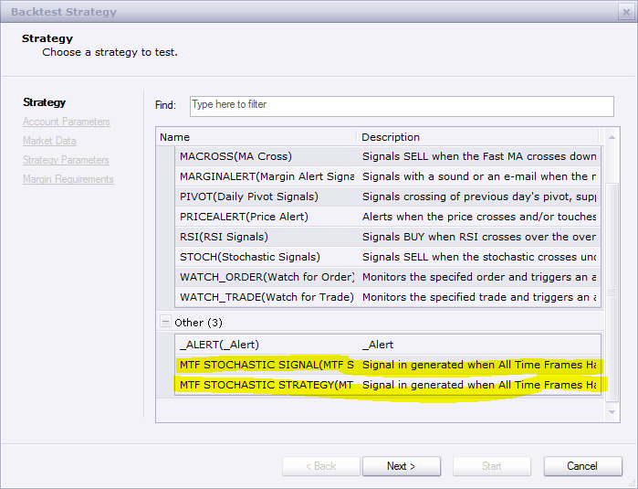

# MTF Stochastic Strategy

> Source: https://fxcodebase.com/code/viewtopic.php?f=31&t=3833  
> Forum: 31 · Topic 3833 · 9 post(s)

---

## MTF Stochastic Strategy

**Apprentice** · Tue Apr 05, 2011 4:18 am

Signal in generated when All Time Frames Have the same indication

 [MTF Stochastic Strategy.lua](files/9370/MTF%20Stochastic%20Strategy.lua)

Unlike Strategy, which gives a signal when the change occurs, From Long to Short and vice versa.
Signal gives a signal every time All time frames give the same indication.

 [MTF Stochastic Signal.lua](files/9370/MTF%20Stochastic%20Signal.lua)

---

## Re: MTF Stochastic Strategy

**Apprentice** · Tue Jun 14, 2011 9:01 am

Update

---

## Re: MTF Stochastic Strategy

**Falkor** · Tue Jul 02, 2013 1:04 am

Hi,

I have installed this strategy but it does not get reflected in the strategy lists. Does this need an update? If so, request you to please update this.

Thank you

---

## Re: MTF Stochastic Strategy

**Apprentice** · Wed Jul 03, 2013 2:29 am

Indicator or Strategy List?

 

---

## Re: MTF Stochastic Strategy

**Falkor** · Wed Jul 10, 2013 8:24 am

Thanks, its showing up on the list now. Probably needed a restart or probably I had missed it entirely.

---

## Re: MTF Stochastic Strategy

**JOKER83** · Tue Nov 03, 2015 5:59 pm

can you make Trade close option of all times
on / off
THANKS

---

## Re: MTF Stochastic Strategy

**mulligan** · Tue Nov 24, 2015 2:16 pm

In using the MTF Stochastic Signal, I get the following error message - MTF Stochastic Signal.lua:151: the second parameter must be the Boolean value. It then pauses the signal. Your help is appreciated.

---

## Re: MTF Stochastic Strategy

**Apprentice** · Thu Nov 26, 2015 4:09 am

Try it now.

---

## Re: MTF Stochastic Strategy

**Apprentice** · Mon Jan 29, 2018 8:46 am

The strategy was revised and updated.
