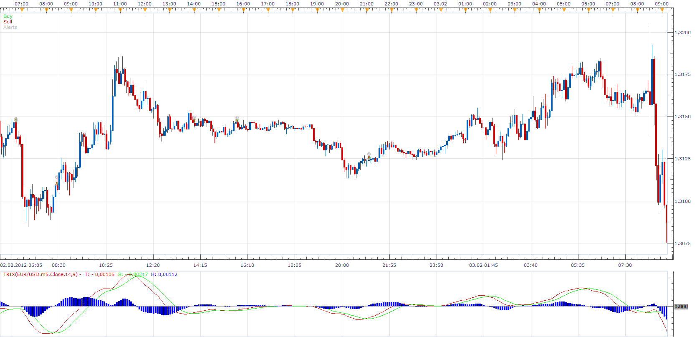

# MTF Trix Strategy

> Source: https://fxcodebase.com/code/viewtopic.php?f=31&t=15474  
> Forum: 31 · Topic 15474 · 2 post(s)

---

## MTF Trix Strategy

**Apprentice** · Sun Apr 01, 2012 5:51 am

Long
Trix histogram on m15, h1 ,h4 > 0
and Trix / Signal line CrossOver on m5

Short
Trix histogram on m15, h1 ,h4 < 0
and Trix / Signal line CrossUnder on m5

Exit Long
Trix histogram on m15, h1 ,h4 < 0
or Trix / Signal line CrossUnder on m5

Exit Short
Trix histogram on m15, h1 ,h4 > 0
or Trix / Signal line CrossOver on m5

 [MTF Trix Strategy.lua](files/29137/MTF%20Trix%20Strategy.lua)

Install Trix Indicator, in order to use this strategy.
[viewtopic.php?f=17&t=1022&hilit=trix](https://fxcodebase.com/code/viewtopic.php?f=17&t=1022&hilit=trix)

---

## Re: MTF Trix Strategy

**Apprentice** · Sun Dec 04, 2016 10:11 am

Bump up.
