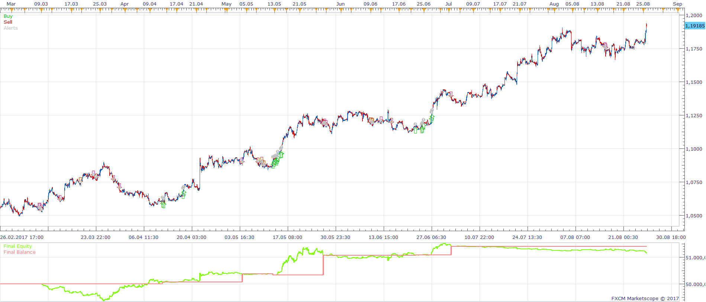
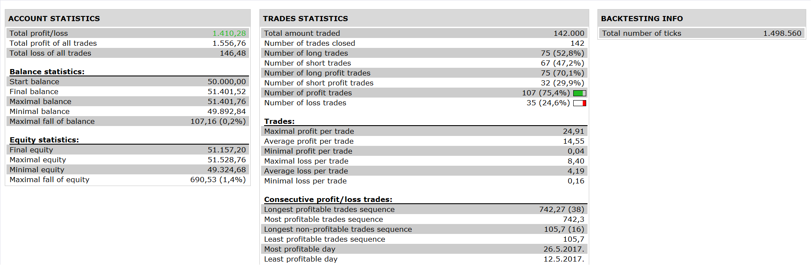

# MTF ZIG ZAG ADX DMI STRATEGY

> Source: https://fxcodebase.com/code/viewtopic.php?f=31&t=65364  
> Forum: 31 · Topic 65364 · 3 post(s)

---

## MTF ZIG ZAG ADX DMI STRATEGY

**Apprentice** · Tue Nov 14, 2017 7:53 am

 

Based on the request.
[viewtopic.php?f=27&t=65360](https://fxcodebase.com/code/viewtopic.php?f=27&t=65360)

buying conditions:
1. zig zag 1=down
2. zig zag 2=down
3 zig zag 3 =down
4.zig zag 4= up
5.adx > entry level and adx < exit level and adx is increasing(adx(period)> adx(period-1)
6. dmi positive > dmi negative

selling conditions:
1. zig zag 1=up
2. zig zag 2=up
3 zig zag 3 =up
4 zig zag 4 =down
4.adx > entry level and adx < exit level and adx is increasing(adx(period)> adx(period-1)
5. dmi negative > dmi positive

 [MTF ZIG ZAG ADX DMI STRATEGY.lua](files/116038/MTF%20ZIG%20ZAG%20ADX%20DMI%20STRATEGY.lua)

The Strategy was revised and updated on January 21, 2019.

---

## Re: MTF ZIG ZAG ADX DMI STRATEGY

**axeas69** · Tue Nov 14, 2017 11:31 am

Hi,
It seems that there is a mistake line 536 with unexpected symbol near ':' as message when I tried to integrate the file.
Please could you check.
Thank you
Axeas

---

## Re: MTF ZIG ZAG ADX DMI STRATEGY

**Apprentice** · Wed Nov 15, 2017 5:42 am

Fixed.
