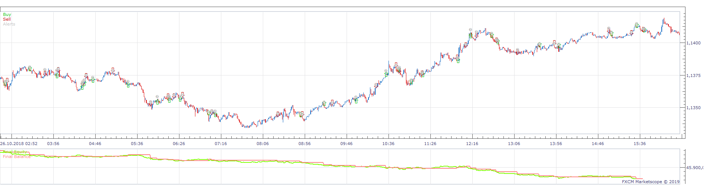
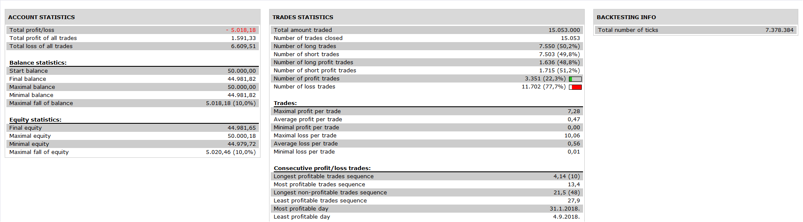
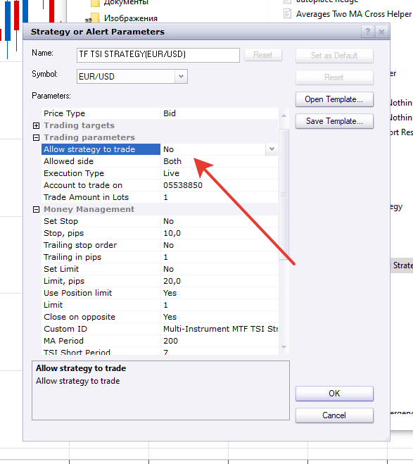

# Multi-Instrument TSI Strategy

> Source: https://fxcodebase.com/code/viewtopic.php?f=31&t=68453  
> Forum: 31 · Topic 68453 · 30 post(s)

---

## Multi-Instrument TSI Strategy

**Apprentice** · Sat May 11, 2019 6:47 am

 

Based on request.
[viewtopic.php?f=27&t=68449](https://fxcodebase.com/code/viewtopic.php?f=27&t=68449)

 [Multi-Instrument TSI Strategy.lua](files/126295/Multi-Instrument%20TSI%20Strategy.lua)

---

## Re: Multi-Instrument TSI Strategy

**Infime** · Thu Aug 22, 2019 1:13 pm

Hi Apprentice,

I visited the all site and I don't find my happinness cause it doesn't exist my (all or a small) strategy code using TSI.
Could you create a new code with my strategy uses TSI and others indicators ? I think and I hope I'm on the good board ...
I explain what I have :
- The TSI (units 7 / 14)
- One MVA (period unit 200 on the 1m time unit)
- One MVA (period unit 250 on the 5m time unit)
- One RLW (unit 14)
The strategy is simple to understand.
1) Trading in buy
* First condition : My MVA (period 250 on the 5m time unit) is increasing.
* Second condition : My MVA (period 200 on the 1m time unit) is broken by the current course in the purchase. So when the course go up.
* Third condition : The TSI is under the level 0
* Fourth condition : My RLW is under the level -80.
BUT before to trade I need one confirmation of the current course. I need to wait the second oversold defined by my TSI (The TSI is under the level 0) et RLW (My RLW is under the level -80).
-> If everything is good, I open a buy position only if the TSI go on to down till it will go up. When it go up, I open a buy position. Only in this case.
-> When I close the position ? I have two imaginary limits and one stop on my TSI : my course of TSI cross the level 15. Good. If the current course go on to purchase, let it increase till the level 34.
If the course don’t reach the level 15 and it go down, close the position at the level 0.
If the course reach the level 15 but don’t reach the level 34 and it go down, close the position at the level 15.
If the course reach the level 34 close the position when the TSI (always) course go down.

2) Trading in sell
* First condition : My MVA (period 250 on the 5m time unit) down.
* Second condition : My MVA (period 200 on the 1m time unit) is broken by the current course in the sell. So when the course down.
* Third condition : The TSI is upper the level 0 and go on to up till it will go down.
* Fourth condition : My RLW is upper the level -20.
BUT before to trade I need one confirmation of the current course. I need to wait the second overbought defined by my TSI (The TSI is upper the level 0) et RLW (My RLW is upper the level -20).
-> If everything is good, I open a sell position only if the TSI go on to up till it will go down. When it go down, I open a sell position. Only in this case.
-> When I close the position ? I have two imaginary stops and one limit on my TSI : my course of TSI cross the level -15. Good. If the current course go on to down, let it down till the level -34.
If the course don’t reach the level -15 and it go up, close the position at the level 0.
If the course reach the level -15 but don’t reach the level -34 and it go up, close the position at the level -15.
If the course reach the level -34 close the position when the TSI (always) course go up.

I hope you’ll understand et could create this new strategy. Thank you for your job !

---

## Re: Multi-Instrument TSI Strategy

**Infime** · Fri Aug 23, 2019 6:52 am

Hi again,

I need to add an explain about the open and close position ;
When I open a position ?
- In buy, when the TSI (under level 0) and the RLW (under level -80) are in the oversold. I buy when the TSI finish to go down and I wait that it just go up to open a position.
I close the position in the cases explained but I wait that the TSI finish to go up and I wait the TSI course just go down then I close the position.
- In sell, when the TSI (upper level 0) and the RLW (under level -20) are in the overbought. I sell when the TSI finish to go up and I wait that it just go down to open a position.
I close the position in the cases explained but I wait that the TSI finish to go down and I wait the TSI course just go up then I close the position.

It's hard to explain the all of strategy.

Thanks a lots !

---

## Re: Multi-Instrument TSI Strategy

**Apprentice** · Mon Sep 02, 2019 6:31 am

Try this version.
[viewtopic.php?f=31&t=68870](https://fxcodebase.com/code/viewtopic.php?f=31&t=68870)
I hope I understand your request.

---

## Re: Multi-Instrument TSI Strategy

**Infime** · Fri Sep 06, 2019 7:11 am

Thank you, I'll try this version and I'll come back if I need to add something !

---

## Re: Multi-Instrument TSI Strategy

**Infime** · Fri Sep 20, 2019 5:50 am

Hi Apprentice,

The TSI strategy is good but not exponential well I'm trying something new and always based on the TSI and more simple
Let's explain the indicators :
1) RLW (14)
2) TSI (7;14)
3) DONCHIAN CHANNEL OF RSI (MA period 14)
- Period of trading in M1.

So, Trading in buy : I need my RLW is under the level -80, my TSI under the level 0 and the middle line of my Donchian Channel of RSI is touching the low line. If these condition are united, I wait the TSI line finish to go down and then I buy when it's just go up.

Trading in sell : I need my RLW is upper the level -20, my TSI upper the level 0 and the middle line of my Donchian Channel of RSI is touching the top line. If these condition are united, I wait the TSI line finish to go up and then I sell when it's just go down.

When close the positions ? When the TSI finish to go up till it go down (for the buy position) and when the TSI finish to go down till it go up (for the sell position).

That's all

But if you can add an option where a second position can be buy or sell in the D1 period trading with the same conditions that the M1 period trading, it's perfect. And only for this, add a stop loss with 150 pip's. I'm scared if the loss is more than ..

Thank you for your attention and I hope it will works well !

---

## Re: Multi-Instrument TSI Strategy

**Infime** · Thu Sep 26, 2019 7:44 am

Sorry Apprentice I need to correct something...

In buy : "...the middle line of my Donchian Channel of RSI is touching the low line" -> The correction is "the middle line of my Donchian Channel of RSI has touched the low line".

In sell : "...the middle line of my Donchian Channel of RSI is touching the top line" -> The correction is "the middle line of my Donchian Channel of RSI has touched the top line".

Thanks a lot !

---

## Re: Multi-Instrument TSI Strategy

**Apprentice** · Sat Sep 28, 2019 4:06 pm

Your request is added to the development list.
Development reference 140.

---

## Re: Multi-Instrument TSI Strategy

**Apprentice** · Fri Oct 04, 2019 5:54 am

[Infime_Strategy.lua](files/129008/Infime_Strategy.lua)

Try this version.

---

## Re: Multi-Instrument TSI Strategy

**Infime** · Fri Oct 04, 2019 11:59 am

Hi,

I checked the strategy but there is a fault (sorry it's mine)...
Look the picture to understand.
In 1 : It's this "In buy : "the middle line of my Donchian Channel of RSI has touched the low line"."
In 2 : It's this "In sell : "the middle line of my Donchian Channel of RSI has touched the top line"."
So, the low and top lines are not the lines that determine the levels (Look the pink lines) ; it's not this. I would like that the middle line (my current course) of my DC of RSI has touched the variation of the DC of RSI (Look the number 1 and 2).

If it has touched these lines, if there was oversold or overbought (Look the I and II), wait that my TSI finish to go down or up (Look the A and B), to buy in A' and close the position to sell in B'.

I think there was just the problem of my DC of RSI

Thanks Apprentice !

---

## Re: Multi-Instrument TSI Strategy

**Apprentice** · Mon Oct 14, 2019 5:10 am

Your request is added to the development list.
Development reference 4873.

---

## Re: Multi-Instrument TSI Strategy

**Apprentice** · Tue Oct 15, 2019 10:51 am

My team to NOT understand the logic.
Can you please provide complete entry/exit rules.
Try to use pseudo logic instead of description.

---

## Re: Multi-Instrument TSI Strategy

**Infime** · Tue Oct 15, 2019 4:01 pm

So, I'll be more simple with another indicator,

1) Time frame M1 :
- TSI (14/28)
- Stochastic , draw an imaginary line at the level 50.

Open a buy position when the lines of stochastics were crossed themself under an imagniry line (under the level 50) and when the TSI begin to go up. Close the position when my TSI finishes to go up.
Open a sell position when the lines of stochastics are crossing themself upper an imagniry line (upper the level 50) and when the TSI begin to go down. Close the position when my TSI finishes to go down.

2) Time frame D1 :
The same but my TSI is on 7/14.

I hope you'll understand, thanks.

---

## Re: Multi-Instrument TSI Strategy

**Apprentice** · Sun Oct 27, 2019 4:43 am

Your request is added to the development list.
Development reference 250.

---

## Re: Multi-Instrument TSI Strategy

**Apprentice** · Wed Oct 30, 2019 5:53 am

[TSI_Strategy_Infime.lua](files/129493/TSI_Strategy_Infime.lua)

Try this version.

---

## Re: Multi-Instrument TSI Strategy

**Infime** · Tue Nov 19, 2019 2:09 pm

Hi Apprentice,

Is it possible to create a strategy with two custom indicators (of your website) and one classic indicator ?
The indicators are : breakout, Profitmatrix and TSI (classic).
Open position in buy when the profitmatrix is green and when the current course is crossing the top line of the breakout in increase.
Close the position when the TSI reverse.
Open position in sell when the profitmatrix is red and when the current course is crossing the bot line of the breakout in decrease.
Close the position when the TSI reverse.

Can you add option for email alert when a sell or buy position is open ?

Thank you very much !

---

## Re: Multi-Instrument TSI Strategy

**Apprentice** · Wed Nov 27, 2019 6:14 am

Can you provide links for breakout and Profitmatrix?
Define TSI reverse?

---

## Re: Multi-Instrument TSI Strategy

**Infime** · Wed Nov 27, 2019 6:54 pm

Hi,

I don't know if it will work with theses links ;

Breakout indicator : [viewtopic.php?f=17&t=966&hilit=breakout](https://fxcodebase.com/code/viewtopic.php?f=17&t=966&hilit=breakout) (breakout.lua) Postby Nikolay.Gekht » Thu May 06, 2010 12:15 am

ProfitMatrix : [viewtopic.php?f=17&t=66586&p=129819&hilit=profit+matrix#p129819](https://fxcodebase.com/code/viewtopic.php?f=17&t=66586&p=129819&hilit=profit+matrix#p129819)
(ProfitMatrix.lua) by Apprentice » Wed Aug 22, 2018 8:36 am

And to close position, I have a normal TSI who increase in buy and decrease in sell. Close the position when the TSI reverse.

Thanks very much !

---

## Re: Multi-Instrument TSI Strategy

**Apprentice** · Thu Nov 28, 2019 4:03 am

Your request is added to the development list.
Development reference 369.

---

## Re: Multi-Instrument TSI Strategy

**Apprentice** · Thu Nov 28, 2019 7:29 am

Try this version.
[viewtopic.php?f=31&t=69168](https://fxcodebase.com/code/viewtopic.php?f=31&t=69168)

---

## Re: Multi-Instrument TSI Strategy

**SANTOSH** · Mon Mar 09, 2020 12:41 pm

Can it be made multi time frame too ?
With two additional options in the menu -
1. Bool to select All time-frames.
2. Bool to select All instruments.

Regards,
Santosh.

---

## Re: Multi-Instrument TSI Strategy

**Apprentice** · Tue Mar 10, 2020 5:51 am

Your request is added to the development list.
Development reference 847.

---

## Re: Multi-Instrument TSI Strategy

**Apprentice** · Wed Mar 11, 2020 5:28 am

Try this Multi-Instrument version.

 [Multi-Instrument MTF TSI Strategy.lua](files/131871/Multi-Instrument%20MTF%20TSI%20Strategy.lua)

---

## Re: Multi-Instrument TSI Strategy

**SANTOSH** · Wed Mar 11, 2020 12:55 pm

Hi all ,
Following errors:
1. The code has no bool for trading .
2. Only show trades and no alerts are shown .
3. Even when , Trade all instruments are TRUE , the alert log shows only Eur usd instrument .

Kindly fix the above .

---

## Re: Multi-Instrument TSI Strategy

**Apprentice** · Fri Mar 13, 2020 5:52 am

Your request is added to the development list.
Development reference 864.

---

## Re: Multi-Instrument TSI Strategy

**Apprentice** · Mon Mar 16, 2020 6:06 am

1.It has
2.It alerts when the trading is disabled.
3. It's not a bug. It shows what tick triggered the trade.

---

## Re: Multi-Instrument TSI Strategy

**SANTOSH** · Mon Mar 16, 2020 9:34 am

Here is the difference :
1. While applying strategy , option for trade bool is present .
2. While backtesting strategy , option for trade bool is not present .\

check below pics for both .

---

## Re: Multi-Instrument TSI Strategy

**Apprentice** · Mon Mar 16, 2020 1:57 pm

In backtesting, By default, this parameter is set to true.
If you set it to false, backtesting makes no sense.

---

## Re: Multi-Instrument TSI Strategy

**SANTOSH** · Mon Mar 16, 2020 2:07 pm

The reason to make bool for trade in backtesting is to see the alerts how it makes in multi- instrument and multiframe .Can you provide it ?

---

## Re: Multi-Instrument TSI Strategy

**Apprentice** · Tue Mar 24, 2020 8:34 am

Can NOT help you on this issue.
