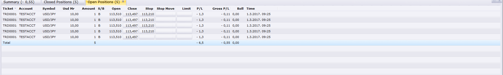
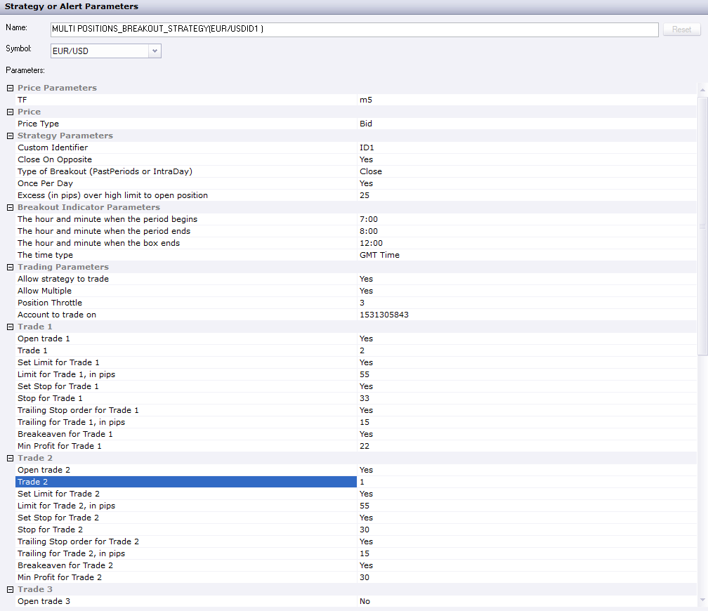

# Multi positions_Breakout_Strategy

> Source: https://fxcodebase.com/code/viewtopic.php?f=31&t=65850  
> Forum: 31 · Topic 65850 · 11 post(s)

---

## Multi positions_Breakout_Strategy

**Apprentice** · Mon Mar 19, 2018 1:43 pm

[Multi positions_Breakout_Strategy.lua](files/118285/Multi%20positions_Breakout_Strategy.lua)

Based on the request.
[viewtopic.php?f=27&t=65842](https://fxcodebase.com/code/viewtopic.php?f=27&t=65842)

---

## Re: Multi positions_Breakout_Strategy

**MC. Trend Trader** · Mon Mar 19, 2018 2:29 pm

Hello
signal comes but no position is opened

---

## Re: Multi positions_Breakout_Strategy

**Apprentice** · Mon Mar 19, 2018 2:49 pm

Was "Open trade" and "Allow strategy to trade" set to yes?

---

## Re: Multi positions_Breakout_Strategy

**MC. Trend Trader** · Mon Mar 19, 2018 3:09 pm

Yes i have Set to yes

---

## Re: Multi positions_Breakout_Strategy

**KusumS** · Mon Mar 19, 2018 10:50 pm

Hi Apprentice,

Thank you and this will be a great enhancement to Breakout strategy.

However, I had the same results and no position was opened. Both "Open trade" and "Allow strategy to trade" set to yes.

Regards

Kusum

---

## Re: Multi positions_Breakout_Strategy

**MC. Trend Trader** · Fri Apr 06, 2018 7:51 am

Hello Apprentice

I have Both "Open trade" and "Allow strategy to trade" set to yes.
Could you please edit the strategy so that positions can be opened.

Thanks in advance
MC. Trend Trader

---

## Re: Multi positions_Breakout_Strategy

**Apprentice** · Thu Apr 12, 2018 4:11 am

Try it now.

---

## Re: Multi positions_Breakout_Strategy

**KusumS** · Mon Apr 23, 2018 11:25 pm

Hi Apprentice,

Thanks for the updated version and multiple positions opens fine on the new version. However, it appears stop-loss does triggers.

Appreciate, if you can have a look when get a chance.

Regards

Kusum

---

## Re: Multi positions_Breakout_Strategy

**KusumS** · Tue May 01, 2018 7:49 pm

Hi Apprentice,

Correction!

I meant to say positions open up without stop-loss though I have set "YES" to stop.

Thanking in advance for your time.

Regards

KusumS

---

## Re: Multi positions_Breakout_Strategy

**Apprentice** · Fri May 18, 2018 5:57 am

Can you share your parameters?

---

## Re: Multi positions_Breakout_Strategy

**KusumS** · Sun May 20, 2018 8:40 pm

*Here is the trading parameters*

Hi Apprentice,

Thank you for your time developing trading tools.

Please see attached is one of template I use. Only problem was it was not installing stop-losses.

Trades triggered as expected.

Your hekp is much appreciated.

Regards

Kusum
