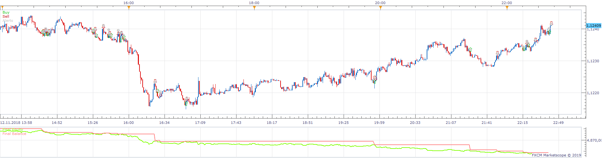
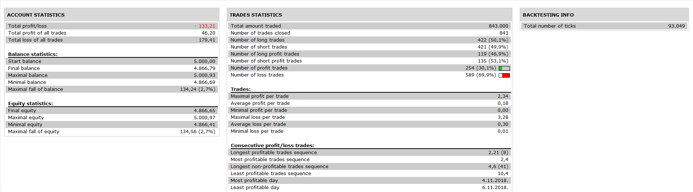

# Multi Z-Score analysis Strategy

> Source: https://fxcodebase.com/code/viewtopic.php?f=31&t=68646  
> Forum: 31 · Topic 68646 · 1 post(s)

---

## Multi Z-Score analysis Strategy

**Apprentice** · Wed Jul 10, 2019 3:55 pm

 

Based on Multi Z-Score analysis.lua
[viewtopic.php?f=17&t=68635](https://fxcodebase.com/code/viewtopic.php?f=17&t=68635)

Open Long
Line /Average Cross Over

Viceversa for Short

 [Multi Z-Score analysis Strategy.lua](files/127296/Multi%20Z-Score%20analysis%20Strategy.lua)
