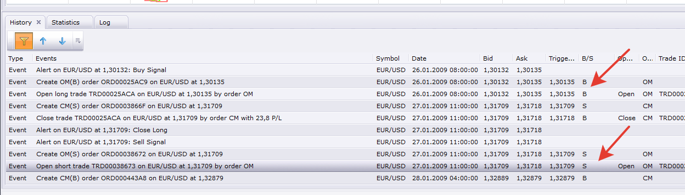

# Multiple CCI Strategy

> Source: https://fxcodebase.com/code/viewtopic.php?f=31&t=63785  
> Forum: 31 · Topic 63785 · 12 post(s)

---

## Multiple CCI Strategy

**Apprentice** · Fri Aug 19, 2016 3:53 am

Based on request.
[viewtopic.php?f=17&t=60474&start=10](https://fxcodebase.com/code/viewtopic.php?f=17&t=60474&start=10)

It allows you to select different cci / level entrys.

 [Multiple CCI Strategy.lua](files/107700/Multiple%20CCI%20Strategy.lua)

 

Will allow you to choose between 5 available actions
If all conditions are met.
Total of 10 actions.

 [Highly adaptable Multiple CCI Strategy version 1.lua](files/107700/Highly%20adaptable%20Multiple%20CCI%20Strategy%20version%201.lua)

 

Will allow you to choose between 5 available actions
For each indicator line Cross Over or Under will allow you to choose one of available actions.
Total of 40 actions.

 [Highly adaptable Multiple CCI Strategy version 2.lua](files/107700/Highly%20adaptable%20Multiple%20CCI%20Strategy%20version%202.lua)

---

## Re: Multiple CCI Strategy

**albertparis** · Fri Aug 19, 2016 7:26 am

Hello, I'm french , my english is bad. you can add in signal type closed postion in addition to other propostion crossover , cross under etc. thank you very much

lien ; [http://74.52.98.35/code/viewtopic.php?f=31&t=63785](http://74.52.98.35/code/viewtopic.php?f=31&t=63785)

---

## Re: Multiple CCI Strategy

**Apprentice** · Thu Aug 25, 2016 5:35 am

Can you describe your idea in more detail.

---

## Re: Multiple CCI Strategy

**Apprentice** · Thu Aug 25, 2016 6:33 am

Major update.

---

## Re: Multiple CCI Strategy

**albertparis** · Thu Aug 25, 2016 7:42 am

this is to merge the two strategies. for a stop on each cci

[http://74.52.98.35/code/viewtopic.php?f ... 175c59a7f1](http://74.52.98.35/code/viewtopic.php?f=31&t=4562&hilit=HIGHLY+ADAPTABLE+CCI+STRATEGY&sid=1902ce6c685e8764963953175c59a7f1)

thank you

---

## Re: Multiple CCI Strategy

**Apprentice** · Mon Aug 29, 2016 4:34 am

Your request is added to the development list, Under Id Number 3610
 If someone is interested to do this task, please contact me.

---

## Re: Multiple CCI Strategy

**Apprentice** · Tue Aug 30, 2016 7:20 am

Highly adaptable Multiple CCI Strategy version 1.lua & Highly adaptable Multiple CCI Strategy version 2.lua added.

---

## Re: Multiple CCI Strategy

**albertparis** · Wed Aug 31, 2016 3:43 am

I thank you for this great work.

---

## Re: Multiple CCI Strategy

**Apprentice** · Sat Jan 27, 2018 5:58 am

The strategy was revised and updated.

---

## Re: Multiple CCI Strategy

**sliova** · Wed May 13, 2020 8:29 am

> **Apprentice wrote:**
> The strategy was revised and updated.

@ Apprentice:

I encountered a very strange problem when using version 1 trading strategy, as follows:

my trading rules:
1, Open short when cci 5 and cci 20 cross under 100 at the same time, or open long when cci 5 and cci 20 cross over -100 at the same time;
2, When open short, if a long position is holding, then close the long position first; vice versa

problem:
After backtesting, it is found that this strategy only open long trades, and there is not any short trades opened. No matter which time frame is used, the same problem is encountered.

Whether it is due to wrong strategy parameter setting or other reasons? Please help me out with this problem, thanks a lot!

---

## Re: Multiple CCI Strategy

**Apprentice** · Wed May 13, 2020 8:54 am

Your request is added to the development list.
Development reference 1288.

---

## Re: Multiple CCI Strategy

**Apprentice** · Thu May 14, 2020 4:20 am

I don't have any issues with it.
