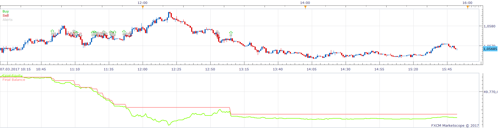
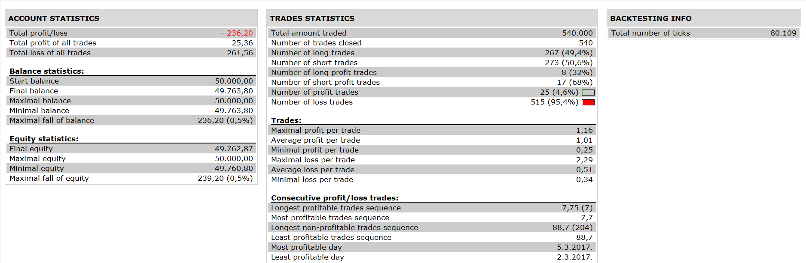

# Murray Math lines strategy

> Source: https://fxcodebase.com/code/viewtopic.php?f=31&t=65388  
> Forum: 31 · Topic 65388 · 1 post(s)

---

## Murray Math lines strategy

**Apprentice** · Wed Nov 22, 2017 6:15 am

 

Based on the request.
[viewtopic.php?f=27&t=65382](https://fxcodebase.com/code/viewtopic.php?f=27&t=65382)

if crossover [1/8] BUY with limit at [2/8] and stop at [0/8]
if crossover [2/8] BUY with limit at [3/8] and stop at [1/8]
if crossover [3/8] BUY with limit at [4/8] and stop at [2/8]
if crossover [4/8] BUY with limit at [5/8] and stop at [3/8]
if crossover [5/8] BUY with limit at [6/8] and stop at [4/8]
if crossover [6/8] BUY with limit at [7/8] and stop at [5/8]
if crossover [7/8] BUY with limit at [8/8] and stop at [6/8]

if cross under [1/8] SELL with limit at [0/8] and stop at [2/8]
if cross under [2/8] SELL with limit at [1/8] and stop at [3/8]
if cross under [3/8] SELL with limit at [2/8] and stop at [4/8]
if cross under [4/8] SELL with limit at [3/8] and stop at [5/8]
if cross under [5/8] SELL with limit at [4/8] and stop at [6/8]
if cross under [6/8] SELL with limit at [5/8] and stop at [7/8]
if cross under [7/8] SELL with limit at [6/8] and stop at [8/8]
Indicator is available here.
[viewtopic.php?f=17&t=608&hilit=Murray+Math+lines](https://fxcodebase.com/code/viewtopic.php?f=17&t=608&hilit=Murray+Math+lines)

 [Murray Math lines strategy.lua](files/116168/Murray%20Math%20lines%20strategy.lua)

The Strategy was revised and updated on January 21, 2019.
