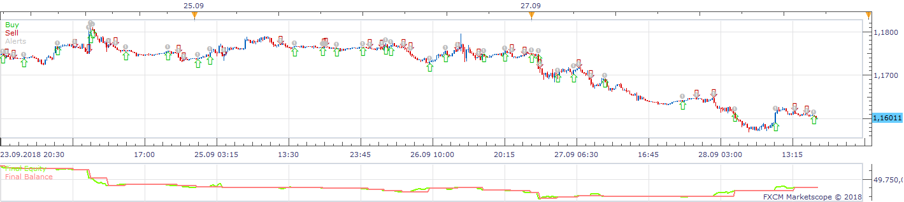
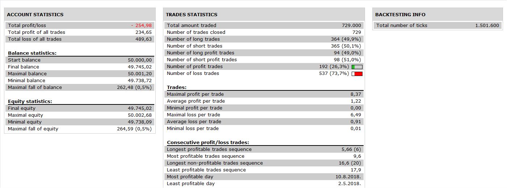

# MVA Difference Strategy

> Source: https://fxcodebase.com/code/viewtopic.php?f=31&t=2352  
> Forum: 31 · Topic 2352 · 5 post(s)

---

## MVA Difference Strategy

**Apprentice** · Wed Oct 06, 2010 11:59 am

 

Buy and Sell signals are generated by simple MVA, Crossover.
Exit Signals are generated by the reduced range, between the moving averages.

 [MVA Difference Strategy.lua](files/5052/MVA%20Difference%20Strategy.lua)

---

## Re: MVA Difference Strategy

**shinobi_brian** · Wed Oct 13, 2010 3:17 pm

Hi, I was wondering whether this was designed to enter trades based on moving average crosses or just when the moving average starts to turn? I had a GBPAUD long trade trigger, but the moving averages I selected were not anywhere near crossing. Result of that trade was -19.7 pips.. I have attached a picture to show you what I mean.

---

## Re: MVA Difference Strategy

**Apprentice** · Wed Oct 13, 2010 4:10 pm

Neither.

Trade closes when the difference between the two moving average begins to decrease.
Or trade remains open until the difference between the moving average increases,
or remains the same.

What this does mean, is that the Long trade can be closed even if two moving averages are still growing.
If a moving average began to approach each other.

Because of poor quality can not look at your example.

---

## Re: MVA Difference Strategy

**Apprentice** · Wed Nov 30, 2016 5:26 am

Bump up.

---

## Re: MVA Difference Strategy

**Apprentice** · Sun Nov 18, 2018 9:06 am

The Strategy was revised and updated on November 18. 2018.
