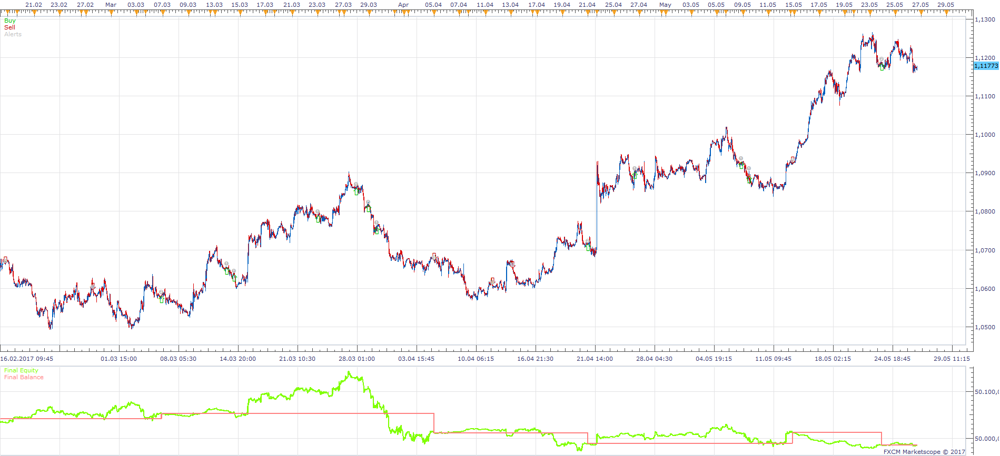
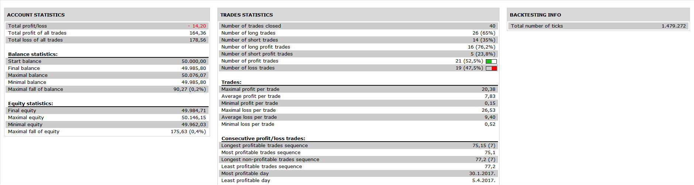

# MVA TDI STRATEGY

> Source: https://fxcodebase.com/code/viewtopic.php?f=31&t=64927  
> Forum: 31 · Topic 64927 · 1 post(s)

---

## MVA TDI STRATEGY

**Apprentice** · Mon Jul 17, 2017 6:09 am

 

Based on the request.
[viewtopic.php?f=27&t=64921&p=113581#p113581](https://fxcodebase.com/code/viewtopic.php?f=27&t=64921&p=113581#p113581)

Open Long: EMA 14[H4]>EMA 50[H4] AND LOWER BAND CROSS OVER BUY LEVEL
Open Short: EMA 14[H4]<EMA 50[H4] AND UPPER BAND CROSS UNDER SELL LEVEL

 [MVA TDI STRATEGY.lua](files/113580/MVA%20TDI%20STRATEGY.lua)

Traders dynamic index is available here.
[viewtopic.php?f=17&t=2069](https://fxcodebase.com/code/viewtopic.php?f=17&t=2069)

The Strategy was revised and updated on January 21, 2019.
